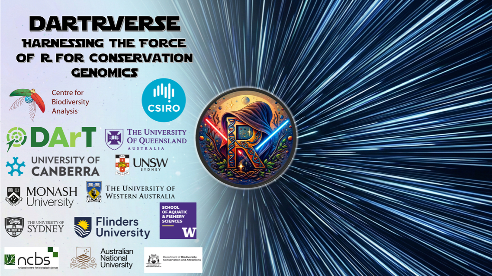
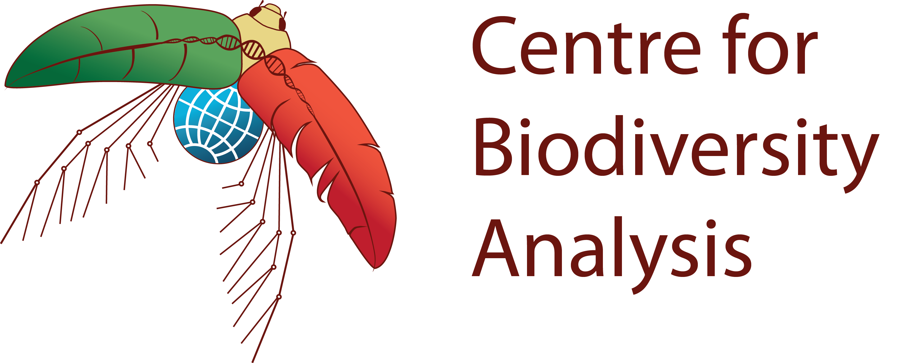
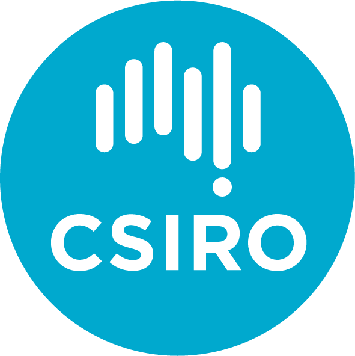

<p align="center">
  
</p>

<h3 align="center">We are grateful to the Generous Sponsors Powering Our Jedi Mission</h3>

<p align="center">
  
  &nbsp;&nbsp;&nbsp;&nbsp;
  
  &nbsp;&nbsp;&nbsp;&nbsp;
  
</p>

---

# kioloa2 — dartR / dartRverse Workshop

Interactive teaching materials for the **dartRverse** conservation-genomics workshop. Each session is a self-contained [`learnr`](https://rstudio.github.io/learnr/) tutorial (interactive R code chunks rendered with `runtime: shiny_prerendered`), with its own data, images, and styling.

## Demo

https://github.com/user-attachments/assets/d0be8724-9ef9-40ee-9312-22d77c76b8da

## How to run these tutorials

There are three ways to work through the material, from lightest to most complete.

> **Note on Posit Cloud.** During the live workshop everything ran on a **Posit Cloud** workspace with all packages and datasets pre-installed. That subscription has now lapsed, so the Posit Cloud option is **no longer available** — use one of the local options below.

### Option 1 — Read and copy from the rendered site (lightest)

The fully rendered tutorials are published here:

**https://green-striped-gecko.github.io/kioloa2/**

You can read every session and **copy-paste the code** into your own RStudio session. The site is read-only and does **not** serve the datasets: any line that loads a file (e.g. `readRDS("data/…")`) needs that session's `data/` folder, which you download from this repository (see Option 2).

### Option 2 — Download a single session and run it locally (recommended)

Each session is self-contained, so you only need the **one folder** for the session you want — not the whole 1.4 GB repo.

1. **Download just that folder.** Easiest is [download-directory.github.io](https://download-directory.github.io/) — paste the folder URL, e.g.
   `https://github.com/green-striped-gecko/kioloa2/tree/main/inst/tutorials/W07`
   and it returns a zip of only that session.
   *Power-user alternative — sparse checkout:*
   ```bash
   git clone --filter=blob:none --sparse https://github.com/green-striped-gecko/kioloa2
   cd kioloa2
   git sparse-checkout set inst/tutorials/W07
   ```
2. **Install dartRverse** (once):
   ```r
   install.packages("dartRverse")
   library(dartRverse)
   ```
3. **Open the session's `.Rmd`** (e.g. `W07.Rmd`) in RStudio, switch the editor to **Visual** mode, and **set the working directory to the session folder** (*Session ▸ Set Working Directory ▸ To Source File Location*). The tutorials load data with relative paths like `data/…`, so this step is essential.
4. Run the code chunk by chunk, or click **Run Document** to launch the interactive `learnr` version.

### Option 3 — Download the entire repository (heaviest)

To get every session at once, clone or download the full repo — note it is **~1.4 GB zipped** (it bundles all datasets, images and binaries for all 18 sessions).

```bash
git clone https://github.com/green-striped-gecko/kioloa2
```

or use the green **Code ▸ Download ZIP** button on GitHub.

## Sessions

`data?` marks sessions that ship a `data/` folder you must download to run them locally (Option 2). A dash means no bundled data (the session needs none, or fetches it from a URL at runtime).

| # | Topic | Presenter(s) | data? |
|---|---|---|:---:|
| — | Getting Started with dartR | The dartR Team | – |
| W01 | Pop Gen in Conservation and Restoration | Laura Bertola & Kate Rick | – |
| W02 | dartR Intro | Arthur Georges, Ching-Ching Lau & Diana Robledo | ✓ |
| W03 | Sex-Linked Markers | Diana Robledo & Floriaan Devloo-Delva | ✓ |
| W04 | Genetic Structure | Bill Sherwin, Floriaan Devloo-Delva & Laura Bertola | ✓ |
| W05 | Calling SNPs | Renee Catullo | – |
| W06 | Small Populations | Diana Robledo & Peter Unmack | ✓ |
| W07 | Effective Population Size | Robin Waples, Luis Mijangos & Bernd Gruber | ✓ |
| W08 | Genetic Structure of Wild Populations to Inform Management | Craig Moritz & Arthur Georges | ✓ |
| W09 | Hidden dartR Powers | Bernd Gruber, Luis Mijangos & Arthur Georges | ✓ |
| W10 | Natural Selection & Adaptation | Luciano Beheregaray & Chris Brauer | ✓ |
| W11 | Landscape Genetics | Robyn Shaw, Cynthia Riginos & Zoe Meziere | ✓ |
| W12 | AI in PopGen & Research | Jonathan Ting, Darya Vanichkina & Celine Frere | ✓ |
| W13 | Sequencing Technologies | Andrzej Kilian | – |
| W14 | Simulations | Bernd Gruber & Luis Mijangos | ✓ |
| W15 | SNPs that Matter | Elise Furlan, Bernd Gruber & collaborators | ✓ |
| W16 | dartRverse (relatedness & parentage) | The dartR Team | ✓ |
| W17 | OneDArT | Andrzej Kilian & Luis Mijangos | – |

## What's inside a session folder

Every session follows the same self-contained layout (assets are scoped per-session, not shared at the repo root). Using **W07** as the example:

```
inst/tutorials/W07/
├── W07.Rmd          ← open THIS in RStudio (the tutorial itself)
├── data/            ← datasets the tutorial loads — DOWNLOAD THIS TOO
│   ├── *.rds        (genlight objects, results)
│   └── *.csv        (metadata, tables)
├── images/          ← figures shown in the tutorial (cosmetic)
├── css/             ← dartR styling, e.g. dartR_style.css (cosmetic)
└── references.bib   ← citations (only some sessions)
```

To run a session locally you only need its **`WNN.Rmd`** and its **`data/`** folder (when the table above marks it `✓`). The `images/` and `css/` folders only affect appearance. A few sessions add extras — e.g. `W04/binaries/`, `W03/literature/`.

Top-level repository map:

```
inst/tutorials/   the 18 session folders — all the teaching material lives here
docs/             rendered site output (served from the gh-pages branch)
R/, DESCRIPTION   vestigial R-package scaffolding — not used by the tutorials
```

## For maintainers — authoring & rendering

Two long-lived branches with distinct jobs (see `howto.txt`):

- **`main`** — author and test the session `.Rmd` files here, then commit.
- **`gh-pages`** — holds the Quarto site (`_quarto.yml`, `index.qmd`, `schedule.qmd`, …). Merge `main`, run `quarto::quarto_render()`, commit, and push to publish.

Always author/test on `main`; render and publish on `gh-pages`.

## License

MIT.
