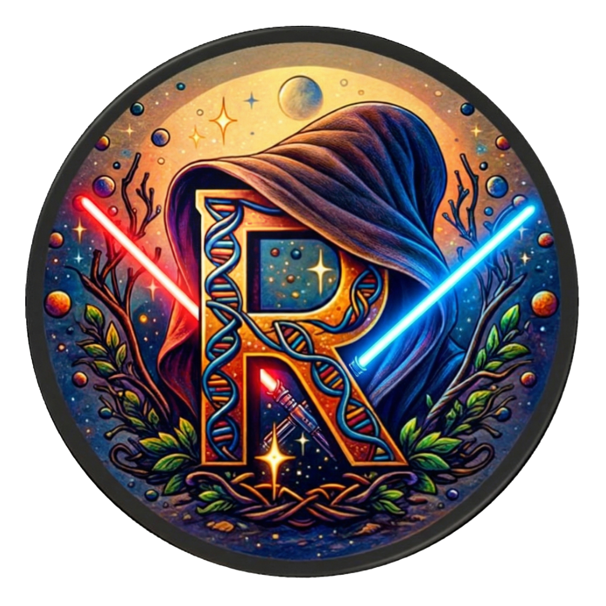

# Welcome!				 {.unnumbered}

Welcome, brave Padawans, to our 5-day galactic odyssey into the ancient realm of **Population Genetics**.				

Our Order is as diverse as the Outer Rim --- Padawans from every corner of the galaxy, each carrying a unique
vision of the Living Force. Here, you'll wear both the student's robe and the teacher's cloak, as together we
deepen our genetic wisdom in service of the galaxy's noblest quest: protecting biodiversity and restoring
ecosystems, so that worlds scarred by the Empire may bloom once more.	

In this Temple, brilliant ideas are celebrated --- but glorious mistakes are honored even more. Every voice adds
new constellations to our shared star map, and Wookiee-level resilience meets genuine sensitivity in equal
measure.		

Our mission? To master the key incantations of population genetics, lightsabers pointed firmly at the R holocron.
Forget dusty datacrons --- this is hands-on Force training. By the final sunrise, you'll be conjuring population
genetics solutions on whatever datasets the galaxy throws at you, with plenty of hyperspace time to test your
powers on your own missions.

Our Jedi mantra: **Cooperation. Flexibility. Dedication.** We travel as one Order --- sharing caf, carrying each
other's scrolls, and igniting a helping glow-stick whenever a fellow Padawan's blade flickers. Code breakdowns
and rogue scripts may ambush us, but our collective humor and Jedi reflexes will blast those obstacles into
space dust.

		

## A big thank you to the developers!

DartR published first by Gruber *et al.* ([2018](https://doi.org/10.1111/1755-0998.12745)), and DartR V2 published by Mijangos *et al.* ([2022](https://doi.org/10.1111/2041-210X.13918))

{width="509"}
