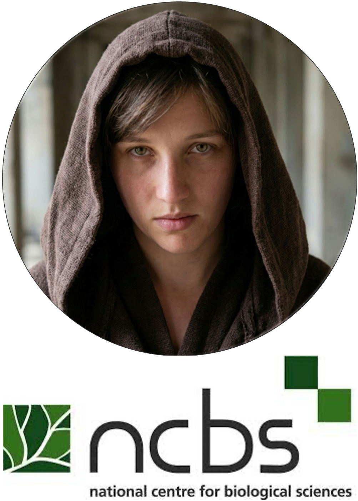
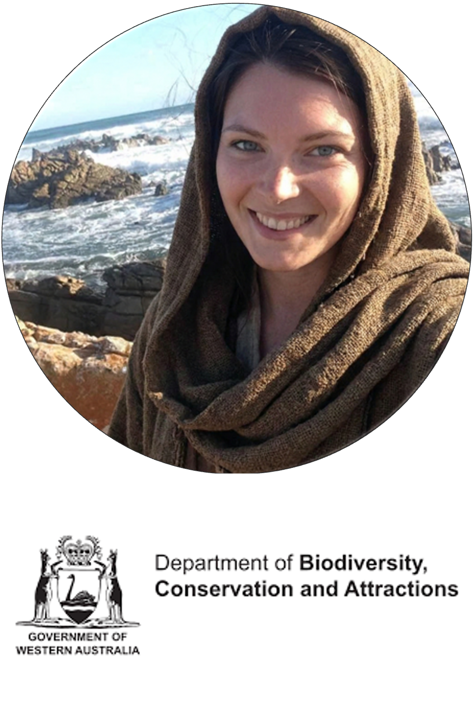

```{r setup, include=FALSE}
library(learnr)
knitr::opts_chunk$set(echo = TRUE, eval = FALSE)
```

## W01 Pop Gen in Conservation and Restoration

Population genetics provides essential tools for understanding biodiversity and informing conservation decisions. In this session we introduce the key concepts that underpin conservation genomics and how genetic data can help guide management and restoration efforts.

Topics include:

- Why genetic diversity matters for conservation  
- How population structure and gene flow affect species persistence  
- The role of genomics in monitoring populations and guiding management  
- Examples where genetic data informs conservation actions such as translocations and reintroductions  

This session sets the conceptual foundation for the workshop and prepares participants to use **R and the dartRverse** for analysing genomic data in later sessions.


{.class width="300" } {.class width="300" }


## Plenary talk 1

#### Harnessing genomic resources for conservation of biodiversity
#### Laura Bertola, NCBS, India


{width=300px}


**Laura Bertola** is a conservation genomics researcher affiliated with the **National Centre for Biological Sciences (NCBS) in Bangalore, India**, where she works on the genomic consequences of small and isolated populations and how genomic data can inform conservation management.

Her research focuses on applying genomic tools such as SNP panels to guide conservation planning for species such as lions and other threatened wildlife. 

Laura has previously worked at Leiden University, the City University of New York, and the University of Copenhagen, and collaborates widely with conservation organizations and wildlife managers.


## Plenary talk 2
#### **From planning to proof**: How SNPs improve translocation outcomes and ongoing metapopulation management
#### Kate Rick, DBCA, Australia

{width=300px}


In a galaxy where biodiversity is declining faster than ever and conservation resources are as scarce as kyber crystals, genomics has emerged as a powerful ally. Modern genetic and genomic tools are now fundamental to guiding conservation decision-making, helping us plan actions, monitor their outcomes, and adapt as conditions change.

Genetics adds depth to traditional demographic data by revealing adaptive potential, inbreeding risks, and the overall genetic fitness of populations – key elements for ensuring long-term resilience and persistence.

In this session, we will explore how genomic insights are shaping both Australian and global conservation programs, from the management of lions on the African savannah to the recovery of the humble (but heroic) golden bandicoot. Case studies will highlight the importance of maintaining intraspecific genetic variation, coordinating metapopulation management across fragmented landscapes, and using genomic evidence to design, source and monitor translocations.

Join us as we show harnessing “the Force” of genomics can strengthen conservation strategies and support species survival across diverse ecosystems. 


**Kate Rick** is a conservation geneticist with the **Department of Biodiversity, Conservation and Attractions (DBCA) in Western Australia**. Her work focuses on applying population genomics to support the conservation and management of threatened Australian wildlife.

Kate completed her **PhD at The University of Western Australia**, where she worked with **Dr Kym Ottewell** in the conservation genetics group. Her doctoral research examined genomic diversity and population structure in threatened mammals to inform conservation management strategies, focusing on the potential for admixture among genetically diverged island populations as a tool for species recovery.


---

## Learning Goals

After this session you should:

- Understand why genetic diversity is important for conservation  
- Recognize how population genetics informs conservation management  
- Be familiar with the types of genomic data used in conservation genomics  
- Be ready to start analysing genomic datasets in R


