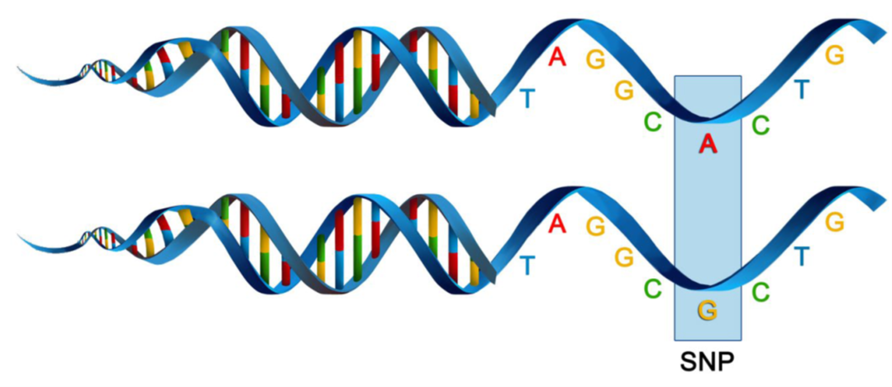
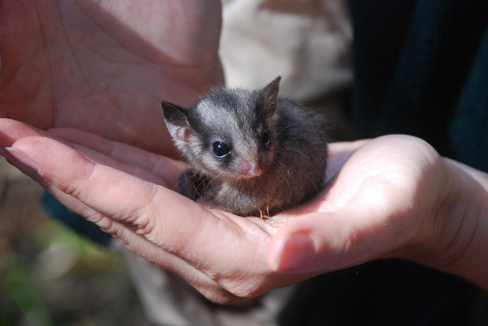
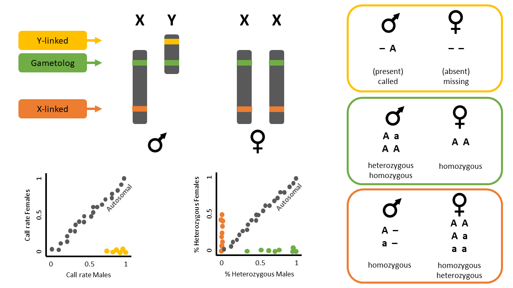

```{r setup, include=FALSE}
library(learnr)
knitr::opts_chunk$set(echo = TRUE, eval = FALSE, cache = TRUE)
```

## W02 dartR Intro, Data Manipulation & Filtering


{.class width="200" height="200"} {.class width="200" height="200"} {.class width="200" height="200"} 
## Introduction

SNPs, or single nucleotide polymorphisms, are single base pair mutations at a nuclear locus (Figure 2). That nuclear locus is represented in the dataset by two sequence tags which, at a heterozygous locus, take on two allelic states, one referred to as the reference state, the other as the alternate or SNP state. 

Because it is extremely rare for a mutation to occur twice at the same site in the genome (perhaps with the exception of Eucalypts), the SNP data are considered to be effectively biallelic. Sites with more than two states that occur rarely are typically eliminated in the quality control steps as they are bundled with multiallelic sites arising from multiple copy sequences (e.g. as would arise from gene duplications) removed during preliminary filtering.

The data can be represented as SNP bases (A, T, C or G), with two states for each individual at each locus in a diploid organisms. Alternatively, because the data are biallelic, it is computationally convenient to code the data as 0 for homozyogotes for one allele, 1 for heterozygotes, and 2 for homozygotes of the other allele. The reference allele is arbitrarily taken to be the most common allele, so 0 is the score for homozygous reference, and 2 is the score for homozygous alternate or SNP state. NA indicates that the SNP could not be scored.

SNP data when using `dartR` are held in a genlight object that is defined in R package `adegenet` (Jombart, 2008; Jombart and Ahmed, 2011). The locus metadata included in the genlight object are those provided as part of your Diversity Arrays Technology report. These metadata are obtained from the Diversity Arrays Technology csv file when it is read in to the genlight object. The locus metadata are held in an R data.frame that is associated with the SNP data as part of the genlight object.

### What you'll do in this tutorial:

-   Data structure
-   Interrogation
-   Subsetting
-   Basic Filtering

### Learning outcomes

1.  Learn the basic usage of dartRverse
2.  Understand how genlight object stores SNPs and metadata
3.  Learn how to filter SNP data

## *Required packages*

```{r, warning=FALSE, message=FALSE}
library(dartRverse)
library(dartR.sexlinked)
```

## `dartR` Fundamentals

To help us get our head around data interrogation, subsetting, and basic filtering we are going to work through a worked example using a test dataset.

```{r output=FALSE}
# dartR comes with a built in test dataset called testset.gl. 
# We first examine the contents of testset.gl
testset.gl
```

::: callout-note
### Discussion time

{.class width="48" height="48"} This is referring to the `testset.gl` data set you have interrogated above.

How many individuals have been genotyped?

How many SNP loci have been scored?

What is the percentage of missing data?
:::

```{r output=FALSE}
# Next let us copy the contents of testset.gl to another genlight object called gl.
gl <- testset.gl
# Use adegenet accessors to interrogate the genlight object further
nInd(gl)
nLoc(gl)
nPop(gl)
popNames(gl)
indNames(gl)
locNames(gl)
```

Now you have a better appreciation of the contents of genlight object gl. `pop(gl)` is a vector of population names against each individual. Note that it is distinguished from `popNames(gl)` which just lists the unique names.

```{r}
# So if you want to tablulate the number of individuals in each population, use
table(pop(gl))
```

We have learned that typing the name of the genlight object gives its attributes. How do we examine the genotypes in a genlight object. This is done by converting it to a matrix.

```{r}
as.matrix(gl)[1:7,1:5]
```

*What do you see? Is it what you expected for the coding of the SNP scores?*

### Reporting

Lets start over with a focus on reporting.

```{r results='hide',fig.keep='all'}
# Copy the original testset.gl
gl <- testset.gl
# Set the global verbosity to 3 – this will result in some detailed comments 
#  as you run each # script
gl.set.verbosity(3)
# Now lets use a report function to report the call rate for genlight object gl
gl.report.callrate(gl)
```

::: callout-tip
Note that the call rate is reported against locus. This is the default. Both a tabulated result and a graph is produced. You can use both to determine a suitable threshold for filtering on callrate.
:::

*What threshold do you think might be appropriate?*

Now let's report the call rate for genlight object `gl` by **individual**.

```{r results='hide',fig.keep='all'}
gl.report.callrate(gl,method="ind")
```

Can you see the difference. Again, both a tabulated result and a graph is produced. You can use both to determine a suitable threshold for filtering on callrate. What threshold do you think might be appropriate?

*What about reproducibility?*

```{r results='hide',fig.keep='all'}
gl.report.reproducibility(gl)
```

::: callout-tip
Recall that DArT runs a series of technical replicates as part of its routine workflow. This enables an assessment of the quality of data associated with each locus. What threshold do you think might be appropriate for a filter of reproducability?
:::

### Filtering

Now let's try some filtering. Return to call rate.

```{r}
# First look at a report to decide a threshold
gl.report.callrate(gl,method="ind")

# Then filter using that threshold
gl <- gl.filter.callrate(gl, method="ind", threshold=0.80)

# Use a smear plot for a visual assessment of the effectiveness of filtering
gl <- testset.gl
gl.smearplot(gl)

```

::: callout-tip
Note the whitespace, which indicates missing data.
:::

```{r results='hide',fig.keep='all'}
# Filter on callrate by locus, then on individual
gl <- gl.filter.callrate(gl,verbose=0)
gl <- gl.filter.callrate(gl, method= "ind", threshold=0.80, verbose=0)

# Examine the smearplot again
gl.smearplot(gl)
```

*What has happened. What do you conclude?*

## Filtering out sex-linked markers

For this exercise we will use the data of the Leadbeater's possum (LBP). This data is included in the package `dartR.sexlinked`



### Load data

```{r results='hide'}
LBP                   # Explore the dataset
LBP@n.loc             # Number of SNPs
length(LBP@ind.names) # Number of individuals

```

::: callout-note
### Discussion time

{.class width="48" height="48"}

How many SNPs and individuals does the LBP genlight object have?
:::

### Run `gl.report.sexlinked`

This function identifies sex-linked and autosomal loci present in a SNP dataset (i.e., genlight object) using individuals with known sex. It identifies five types of loci: w-linked or y-linked, sex-biased, z-linked or x-linked, gametologous and autosomal.

::: callout-tip
The genlight object must contain in `gl@other$ind.metrics` a column named `id`, and a column named `sex` in which individuals with known-sex are assigned `M` for male, or `F` for female. The function ignores individuals that are assigned anything else or nothing at all (unknown-sex).
:::

::: callout-caution
### Check

{#id .class width="48" height="48"} Check that `ind.metrics` has the necessary columns:
:::

```{r output=FALSE}
head(LBP@other$ind.metrics)
```

```{r}
knitr::kable(head(LBP@other$ind.metrics)) 
```

::: callout-caution
### Check

{.class width="48" height="48"} Check the manual of function `gl.report.sexlinked` to investigate its other requirements:

```{r eval = FALSE, echo = TRUE}
help(gl.report.sexlinked)
```
:::

Run the function to identify sex-linked loci in the LBP genlight object:

```{r}
out <- gl.report.sexlinked(LBP, system = "xy")
```

::: callout-note
### Discussion time

{.class width="48" height="48"}

**Question:** Why are we using "xy"?

**Question:** How many males and females does the dataset contain?

**Question:** How many sex-linked loci were found?

The output consists of two plots, plus a table. Examine the plots.

**Question:** What do the colours mean in the plots? Look at the figure below for a hint.


:::

### Output dataframe

Now check the output table

```{r output=FALSE}
out

```

```{r}
knitr::kable(head(out, n = 7))
```

*only showing the first 7 rows*

### Run `gl.drop.sexlinked`

Remove the sex-linked loci from the LBP genlight object:

```{r output=FALSE}
new.gl <- gl.drop.sexlinked(LBP, system = "xy")
new.gl
new.gl@n.loc
```

::: callout-note
### Discussion time

{.class width="48" height="48"} How many SNPs are there left after removing sex-linked loci?
:::

## More filtering

**Knock yourself out trying all the different report and filtering functions**

::: callout-tip
Remember to use them as pairs -- report function to decide a threshold, filter function to apply the threshold (where appropriate)
:::

Below are two tables with a number of report and filter functions you can try.

### Report functions

| Report functions | description |
|----|----|
| gl.report.callrate | *summarises CallRate values* |
| gl.report.reproducibility | *summarises repAvg (SNP) or reproducibility (SilicoDArT) values.* |
| gl. report.monomorphs | *provides a count of polymorphic and monomorphic loci* |
| gl.report.secondaries | *provides a count of loci that are secondaries, that is, loci that reside on the one sequence tag.* |
| gl.report.rdepth | *reports the estimate of average read depth for each locus* |
| gl.report.hamming | *reports on Hamming distances between sequence tags* |
| gl.report.overshoot | *reports loci for which the SNP has been trimmed along with the adaptor sequence* |
| gl.report.taglength | *reports a frequency tabulation of sequence tag lengths* |
| gl.report.sexlinked | *reports the number and type of loci likely to be in sex chromosomes* |

: {.striped .bordered}

### Filtering functions

| Filter functions | description |
|----|----|
| gl.filter.callrate | *filter out loci or individuals for which the call rate (rate of non-missing values) is less than a specified threshold, say threshold = 0.95* |
| gl.filter.reproducibility | *filter out loci for which the reproducibility (strictly repeatability) is less than a specified threshold, say threshold = 0.99* |
| gl. filter.monomorphs | *provides a count of polymorphic and monomorphic loci* |
| gl.filter.allna | *filter out loci that are all missing values (NA)* |
| gl.filter.secondaries | *filter out SNPs that share a sequence tag, except one retained at random* $$or the best based on reproducibility (RepAvg) and information content (AvgPIC)$$. |
| gl.filter.rdepth | *filter out loci with exceptionally low or high read depth (coverage)* |
| gl.filter.hamming | *filter out loci that differ from each other by less than a specified number of base pairs* |
| gl.filter.overshoot | *filter out loci where the SNP location lies outside the trimmed sequence tag* |
| gl.filter.taglength | *filter out loci for which the tag length is less that a threshold* |
| gl.filter.sexlinked | *filter out loci that are likely to be in sex chromosomes* |

: {.striped .bordered}

::::: callout-note
### Exercise

How about trying it with a different dataset?

::: download_btn
```{r, echo=FALSE, warning=FALSE}
library(downloadthis)


  download_file(path = './data/sample_data_2row.csv',
    output_name = "sample_data_2Row.csv",
    output_extension = ".csv",
    button_label = "Download SNP data (2 row)",
    button_type = "default",
    has_icon = TRUE,
    icon = "fa fa-file-csv"
  )

```
:::

::: download_btn
```{r, echo=FALSE, warning=FALSE}
library(downloadthis)


  download_file(path = './data/sample_metadata.csv',
    output_name = "sample_metadata.csv",
    output_extension = ".csv",
    button_label = "Download metadata",
    button_type = "default",
    has_icon = TRUE,
    icon = "fa fa-file-csv"
  )

```
:::

```{r output=FALSE}
# how to load a genlight object
gl <- gl.read.dart(filename="./data/sample_data_2row.csv", 
                   ind.metafile="./data/sample_metadata.csv")
```

You can even try it with your own data.
:::::

## *Further Study*

For more tuturials see the [ebook](http://georges.biomatix.org/storage/app/media/Tutorial_5_dartR_Basic_Filtering_1-Jun-2025.pdf).

Check out the other functions contained in package `dartR.sexlinked`. What do they do?

Keep your eyes peeled for Session 8!

### Additional Readings

@gruber2018

@mijangos2022

@jombart2015

@robledo2023
