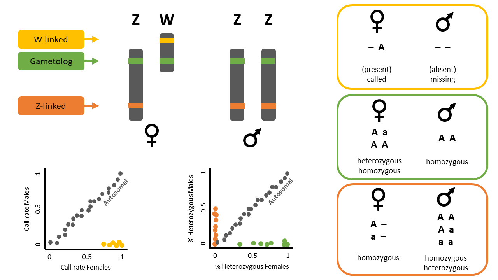

```{r setup, include=FALSE}
library(learnr)
knitr::opts_chunk$set(echo = TRUE, eval = FALSE)
```

## W03 Sex-Linked Markers

```{r klippy, echo=FALSE, include=TRUE}
klippy::klippy(position="right", color="black")
```

*Session Presenters*


## Required packages

```{r, warning=FALSE, message=FALSE}
library(dartRverse)
library(dartR.sexlinked)
library(dartR.base)
#install.packages('directlabels') #for pcoa
```

## Session overview

In this tutorial you will read about sex-linked loci. We will go over one example dataset and you will complete one exercise afterwards.

-   Introduction
-   Example with ZW/ZZ system - The Eastern Yellow Robin
    -   Example 1: Identifying sex-linked loci and using them for sexing
    -   Example 2: Observing the effects of not removing sex-linked loci on population genetic analyses
        -   2.1. Differences in PCoA
        -   2.2. Differences in genetic diversity and fixation indices
-   Exercises
    -   Exercise 1: Your own data
    -   Exercise 2: The Leadbeater's possum (XX/XY)
    -   Exercise 3: The Bull shark (XX/XY) - large dataset
    -   Exercise 4: The Blue shark (XX/XY) - large dataset
-   References

## Introduction

Many population genetic studies assume autosomal loci. Therefore, it is best practice to exclude sex-linked loci from SNP datasets. Failing to remove these loci can lead to skewed estimates of **genetic diversity**—such as heterozygosity, fixation indices (like FIS), polymorphism, and allelic richness—especially when the sample has an uneven sex ratio or when there are differences in diversity between sex chromosomes and autosomes. Identifying **population structure** also improves when sex-linked loci are excluded, since these markers can obscure patterns shaped by evolutionary forces like gene flow, selection, and drift. Similarly, **parentage analyses**, which rely on autosomal Mendelian inheritance, can be compromised by sex-linked loci, leading to apparent mismatches between true parent-offspring pairs. Therefore, *accurately identifying sex-linked loci is essential for reliable genetic analysis and informed management decisions.*

On the other hand, identifying sex-linked markers can be valuable for determining the sex of individuals in species without sexual dimorphism, and for uncovering sex-specific ecological or evolutionary patterns.

Sex-linked markers are those that are inherited differently between the sexes, usually because they are present in sex chromosomes. In animal species, the two most common chromosomal sex-determination systems are ZW and XY. In the ZW system, typical for birds and some reptiles and insects, females are heterogametic (ZW) and males are homogametic (ZZ). On the contrary, in an XY system, typical for mammals and some insects, males are the heterogametic sex with one X and one Y chromosome, and females are the homogametic sex with two X chromosomes.

Sex-linked markers can be classified into three types (**Figure 1**):

-   W-linked or Y-linked loci
-   Z-linked or X-linked loci
-   Gametologs



### Example Data - ZW/ZZ

The following exercises can be done with the dataset included in the `dartR.sexlinked` package (that of the beautiful Eastern Yellow Robin, EYR; **Figure 2**; Robledo-Ruiz et al. 2023).

{width="349"}

### Example 1: Identify sex-linked loci and use them for sexing

{.class width="48" height="48"}

Imagine you have a genetic dataset in which you have the sexes of most individuals but not all. You are also not sure about the sexes you have recorded for some individuals during fieldwork (human error exists!). Because you know a lot about sex-linked loci, you want to see if you can identify some in order to help you double-check sexes.

### Load data

Start by calling the dataset and exploring it.

```{r}
data("EYR")
EYR                   # Explore the dataset
EYR@n.loc             # Number of SNPs
length(EYR@ind.names) # Number of individuals
```

### Search for sex-linked loci

The function `gl.report.sexlinked` identifies sex-linked and autosomal loci present in a SNP dataset (genlight object) using individuals with known sex. It identifies five types of loci: w-linked or y-linked, sex-biased, z-linked or x-linked, gametologous and autosomal.

::: callout-tip
*The genlight object must contain in* `gl@other$ind.metrics` *a column named* `id`*, and a column named* `sex` *in which individuals with known-sex are assigned* `M` *for male, or* `F` *for female. The function ignores individuals that are assigned anything else or nothing at all (unknown-sex).*
:::

Check that `ind.metrics` has the necessary columns:

```{r}
knitr::kable(EYR@other$ind.metrics[1:10,])
```

*only showing first 10 rows*

Run the function to identify sex-linked loci in the EYR genlight object:

```{r}
out <- gl.report.sexlinked(EYR, system = "zw")
```

::: callout-note
#### Question time

**Question:** How many males and females does the dataset contain?

**Question:** How many sex-linked loci were found?

**Question:** Why are there two plots?

**Question:** What does each point in the plots represent?

**Question:** What do the colours in the plots mean? Look at **Figure 1** for a hint. What about the blue dots?
:::

### Sexing individuals with unknown sex

The `dartR.sexlinked` package has more functions that can be useful when a dataset has some missing sex data.

::: callout-note
#### Question time

**Question:** How many individuals does the `EYR` genlight object contain?

**Question:** How many males and females were detected by function `gl.report.sexlinked`? Are there individuals with unknown sex?
:::

Find the id of the individual that is not sexed:

```{r}
EYR@other$ind.metrics[!(EYR@other$ind.metrics$sex %in% c("M", "F")), ]
```

Use the sex-linked loci you have identified to infer the sex of that individual by running function `infer.sex`.

This function uses the output of function `gl.keep.sexlinked` to infer the sex of *all* individuals in the dataset. It uses 3 types of sex-linked loci (W-/Y-linked, Z-/X-linked, and gametologs), assigns a preliminary genetic sex for each type of sex-linked loci available, and outputs an `agreed sex`:

```{r}
EYR_sexLinked <- gl.keep.sexlinked(EYR, system = "zw") # save sex-linked loci
inferred.sexes <- gl.infer.sex(gl_sexlinked = EYR_sexLinked, 
                               system = "zw", seed = 124) # use sex-linked loci
```

The function outputs a table with assigned sexes based on sex-linked loci:

```{r}
head(inferred.sexes, 10) 
```

Examine the output table. There are four assigned sexes per individual: one according to w-linked loci, one according to z-linked loci, one according to gametologs, and one final `agreed sex`.

::: callout-note
#### Question time

**Question:** What `agreed sex` was assigned to the individual with missing sex?

**Question:** Can you find individuals for which the `agreed sex` is uncertain (i.e., has an asterisk '\*')? How would you decide which is their correct sex?
:::

## Example 2: Observe the effects of not removing sex-linked loci on population genetic analyses

{.class width="48" height="48"}

Imagine you are analyzing the genetic data of a species and you want to look at its population structure and genetic diversity. You start by filtering your beautiful set of SNPs. Because you are a rigorous scientist, you want to test whether using function `gl.drop.sexlinked` to properly filter out sex-linked loci changes the results of the populations analyses. So you: (1) process your SNP dataset by applying only standard filters (from here on "sloppy filtering") and run analyses, and (2) process the dataset by filtering out sex-linked loci first, applying standard filters second (from here on "correct filtering"), and then run analyses.

Use the EYR dataset or your own data to report:

1.  Do you see any changes in a population structure analysis (PCoA) when you filter out sex-linked markers versus when you do not?

2.  Do you see any differences in genetic diversity and fixation indices when you filter out sex-linked markers versus when you do not?

### Standard filtering

**Filtering SNPs only with standard filters ("sloppy filtering")**

Let's apply only standard filters (read depth, call rate, and MAC):

```{r, message=FALSE, warning=FALSE}
# Filter for read depth
gl.report.rdepth(EYR)
EYR.sloppy <- gl.filter.rdepth(EYR, lower = 3, upper = 11, verbose = 0)

# Filter for loci call rate
gl.report.callrate(EYR.sloppy, method = "loc")
EYR.sloppy <- gl.filter.callrate(EYR.sloppy, method = "loc",  threshold = 0.75, verbose = 0, recalc = TRUE)

# Filter for individual call rate
gl.report.callrate(EYR.sloppy, method = "ind")
EYR.sloppy <- gl.filter.callrate(EYR.sloppy, method = "ind", threshold = 0.65, verbose = 0, recalc = TRUE)

# Filter for MAC (= 3)
gl.report.maf(EYR.sloppy)
EYR.sloppy <- gl.filter.maf(EYR.sloppy, threshold = 3, verbose = 0, recalc = TRUE)
```

### Sex-linked filtering & standard Filtering

**Filtering SNPs for sex-linked loci and then with standard filters ("correct filtering")**

Let's remove sex-linked markers and then apply standard filters:

```{r, message=FALSE, warning=FALSE}
# Filter for sex-linked loci
EYR.correct <- gl.drop.sexlinked(EYR, system = "zw")  

# Filter for read depth
EYR.correct <- gl.filter.rdepth(EYR.correct, lower = 3, upper = 11, verbose = 0)

# Filter for loci call rate
gl.report.callrate(EYR.correct, method = "loc")
EYR.correct <- dartR.base::gl.filter.callrate(EYR.correct, method = "loc",  threshold = 0.75, verbose = 0, recalc = TRUE)

# Filter for individual call rate
gl.report.callrate(EYR.correct, method = "ind")
EYR.correct <- gl.filter.callrate(EYR.correct, method = "ind", threshold = 0.65, verbose = 0, recalc = TRUE)

# Filter for MAC (= 3)
gl.report.maf(EYR.correct)
EYR.correct <- dartR.base::gl.filter.maf(EYR.correct, threshold = 3, verbose = 0, recalc = TRUE)
```

### Filtering differences in PCoA

**Differences in PCoA between "sloppily filtered" dataset (only standard filters), vs "correctly filtered" dataset (gl.drop.sexlinked and standard filters)**

```{r, results="hold", warning=FALSE, message=FALSE}
# Sloppy
PCA.sloppy <- gl.pcoa(EYR.sloppy, verbose = 0)
pcplot_sloppy <- gl.pcoa.plot(PCA.sloppy, EYR.sloppy, xaxis = 1, yaxis = 2)

# Correct
PCA.correct <- gl.pcoa(EYR.correct, verbose = 0)
pcplot_correct <- gl.pcoa.plot(PCA.correct, EYR.correct, xaxis = 1, yaxis = 2)
```

::: callout-note
#### Question time

**Question:** Do the PCoA plots look different? Why?
:::

### Filtering differences in genetic diversity and fixation indices

**Differences in genetic diversity and fixation indices between "sloppily filtered" dataset vs "correctly filtered" dataset**

Let's check some basic stats:

```{r, warning=FALSE}
basic.sloppy  <- utils.basic.stats(EYR.sloppy)
basic.correct <- utils.basic.stats(EYR.correct)
basic.sloppy$overall
basic.correct$overall
```

::: callout-note
#### Question time

**Question:** Why are observed Heterozygosity (Ho) and expected Heterozygosity (He) slightly higher for the "sloppily filtered" dataset?

**Hint:** Look at the second plot produced by function `gl.report.sexlinked`.
:::

Calculate FST fixation indices between populations:

```{r, warning=FALSE}
gl.fst.pop(EYR.sloppy, verbose = 0)
gl.fst.pop(EYR.correct, verbose = 0)
```

::: callout-note
#### Question time

**Question:** Which dataset has higher FST estimates overall?
:::

## Exercises

::: callout-note
{.class width="48" height="48"}

Imagine you are analyzing the genetic data of a population and you want to look at its genetic structure and genetic diversity. You get to work by filtering your beautiful set of SNPs. Because you are a rigorous, you want to test whether using function `gl.keep.sexlinked` to properly filter out sex-linked loci changes the results of the populations analyses. So you: (1) process your SNP dataset by applying standard filters and run analyses, and (2) process the dataset by filtering out sex-linked loci first, applying standard filters second, and then run analyses.

Choose one of the following datasets (or your own data) and report:

1.  How many sex-linked markers are present?

2.  How many individuals had a wrong sexID?

3.  Do you see any changes in your PCA/structure analyses when you filtered out sex-linked markers versus when you did not?

4.  Do you see any differences in genetic diversity and fixation indices when you filtered out sex-linked markers versus when you did not?
:::

{.class width="350" height="200"} {.class width="350" height="200"}

{.class width="350" height="200"} {.class width="350" height="200"}

### Exercise data 1 - Your own data

::: callout-tip
**HINT**

You can have a look at the exercise data below for inspiration.
:::

### Exercise data 2 - XX/XY - The Leadbeater's possum

Data from @robledo2023


#### Load data

```{r, results="hold"}
data("LBP")
# load('./data/EYR.rda')
LBP@n.loc
table(LBP@pop)
table(LBP@other$ind.metrics$pop)
table(LBP@other$ind.metrics$sex, useNA = "ifany")
```

#### 1. Number of sex-linked markers?

```{r, results="hold"}
slm <- dartR.sexlinked::gl.keep.sexlinked(x = LBP, system = "xy")
```

#### 2. Individuals with wrong sexID?

```{r, results="hold"}
sexID <- dartR.sexlinked::gl.infer.sex(slm, system = "xy", seed = 124)
knitr::kable(head(sexID))

sum(LBP$other$ind.metrics$sex != sexID$agreed.sex, na.rm = TRUE)
```

::: callout-note
#### Exercise

{.class width="48" height="48"}

Can you tell which misidentified sexes are due to uncertain genetic sex (indicated with \*)?

**HINT** Try using `grep(pattern = "\\*", x = sexID$agreed.sex)`
:::

### Exercise data 3 - Bull shark

Data from @devloodelva_rivers_2023.


#### Load data

```{r}
print(load("./data/Bull_shark_DArTseq_genlight_for_sex-linked_markers.Rdata"))

data.gl@n.loc
table(data.gl@pop)
table(data.gl@other$ind.metrics$pop)
table(data.gl@other$ind.metrics$sex, useNA = "ifany")
```

#### 1. Number of sex-linked markers?

```{r, results="hold"}
ncores <- min(4, parallel::detectCores())
#still takes some minutes to run
resbull <- dartR.sexlinked::gl.keep.sexlinked(x = data.gl, system = "xy", ncores = ncores)
```

#### 2. Individuals with wrong sexID

```{r, results="hold"}
sexID <- dartR.sexlinked::gl.infer.sex(resbull, system = "xy", seed = 124)
knitr::kable(head(sexID))

agreed.sex <- sub(pattern = "\\*", replacement = "", x = sexID$agreed.sex) # remove asterisk
sum(data.gl$other$ind.metrics$sex != agreed.sex, na.rm = TRUE)
```

### Exercise data 4 - Blue shark

Data from @nikolic_stepping_2023.


#### Load data

```{r}
print(load("./data/Blue_shark_DArTseq_genlight_for_sex-linked_markers.Rdata"))

data.gl@n.loc
table(data.gl@pop)
table(data.gl@other$ind.metrics$pop)
table(data.gl@other$ind.metrics$sex, useNA = "ifany")
```

#### 1. Number of sex-linked markers?

```{r, results="hold"}
##check if you can increase the number of cores
# ncores <- min(4,parallel::detectCores())
# resblue <- dartR.sexlinked::gl.keep.sexlinked(x = data.gl, system = "xy", ncores = ncores)
# saveRDS(resblue, file = "./data/resblue.rds")

##load results from previous run
resblue <- readRDS("./data/resblue.rds")
```

#### 2. Individuals with wrong sexID?

```{r, results="hold"}
sexID <- dartR.sexlinked::gl.infer.sex(resblue, system = "xy", seed = 124)
knitr::kable(head(sexID))

agreed.sex <- sub(pattern = "\\*", replacement = "", x = sexID$agreed.sex) # remove asterisk
sum(data.gl$other$ind.metrics$sex != agreed.sex, na.rm = TRUE)
```

## Further Study

### Readings

@robledo2023

@devloodelva_slm_2024
