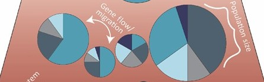
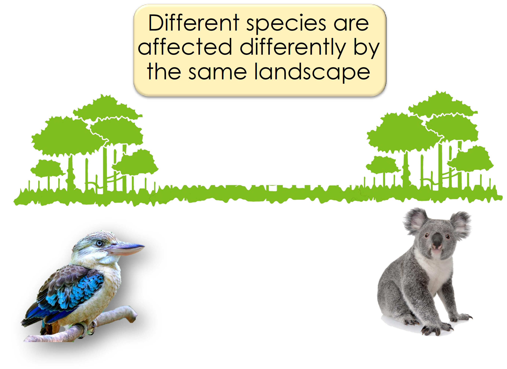
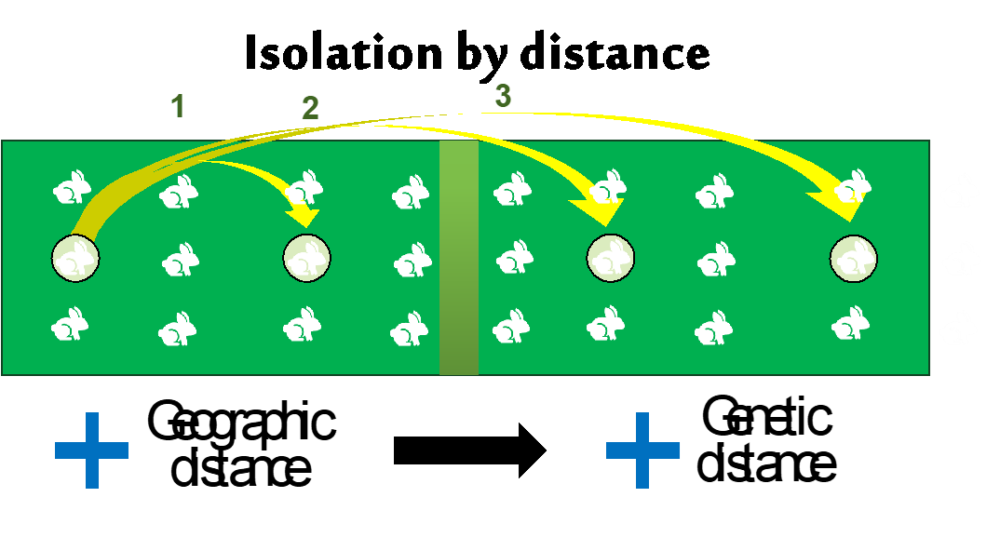
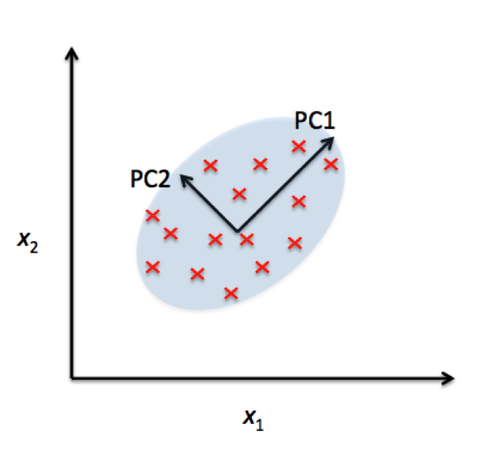
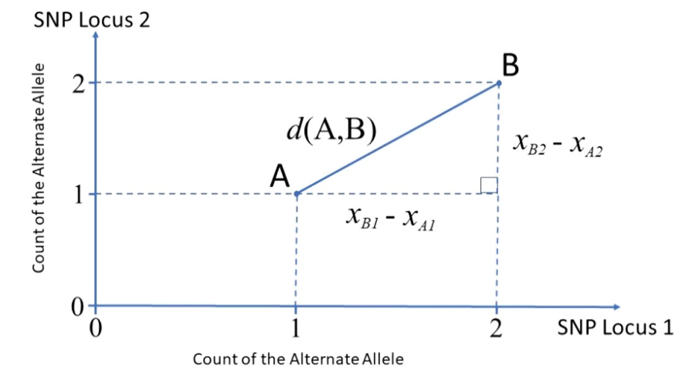
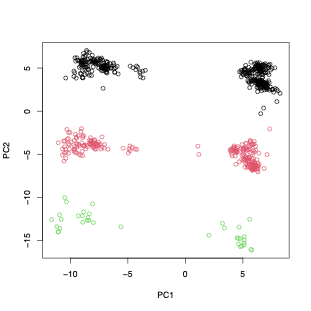

## W04 Genetic Structure {.unnumbered}

```{r setup, include=FALSE}
library(learnr)
knitr::opts_chunk$set(echo = TRUE, eval =TRUE, cache=TRUE)
```

```{r klippy, echo=FALSE, include=TRUE}
klippy::klippy(position="right", color="black")
```

*Session Presenters*

<div style="display:flex; justify-content:space-evenly; flex-wrap:wrap; align-items:center; width:100%;">


</div>

## Required packages

As always we need to have dartRverse installed and loaded. In addition you need to have dartR.popgen installed.

```{r, warning=FALSE, message=FALSE,eval=TRUE}
# install.packages("leaflet.minicharts")
# install.packages("iterpc")
library(dartRverse)
```

## W04 Genetic Structure {.unnumbered}

### Workflow

In this tutorial you will learn about genetic structure analyses. We will go over several analytical techniques with one example dataset and you will complete one exercise afterwards. Here you will learn differences between the analytical techniques and how to identify bias in your data.

-   Introduction
-   Example with possum data
    -   PCA
    -   STRUCTURE
    -   faststructure
    -   sNMF
    -   PopCluster
-   Exercises
    -   Exercise 1: Your own data
    -   Exercise 2: Kinship bias
    -   Exercise 3: Structural variants bias
    -   Exercise 4: Uneven sampling design
-   References

## Introduction - Uncovering Population Structure

*Why population structure matters*



-   What is a “population” in population genetics?

-   Genetic structure defined – how allele frequencies vary among groups.

-   Key drivers: effective population size, gene flow/immigration, natural selection, drift.

-   Isolation-by-distance & sampling design – avoiding spurious structure.

-   Why we care: management units, inbreeding, local adaptation, introgression.





#### Analytical toolkit

|  |  |  |
|------------------------|------------------------|------------------------|
| **Approach** | **Purpose** | **dartR entry point** |
| **PCoA / PCA** | Quick multivariate overview | `gl.pcoa()`, `gl.pcoa.plot()` |
| **STRUCTURE** | Bayesian clustering | `gl.run.structure()`, `gl.plot.structure()`, `gl.map.structure()`,`gl.read.structure()` |
| **fastSTRUCTURE** | Fast variational STRUCTURE (Mac/Linux) | `gl.run.faststructure()`, `gl.plot.faststructure()` |
| **sNMF** | Sparse non-negative matrix factorisation | `gl.run.snmf()`, `gl.plot.snmf()`, `gl.map.snmf()` |
| **POPCLUSTER** | Ultra-fast admixture inference | `gl.run.popcluster()`, `gl.plot.popcluster()`, `gl.map.popcluster()` |

### Example

To help us understand our analytical toolkit better let's start with a simple example using a simulated dataset.

The dataset contains 10 populations of 30 individuals each and 1000 loci and is part of the dartRverse package.

To get an overview of the dataset, we use the function: `gl.map.interactive` which plots the individuals on a map. Please note the genlight/dartR object needs to have valid lat long coordinates for each individual to be able to do so.

```{r, eval=FALSE}
table(pop(possums.gl)) #check the individuals and the populations

gl.map.interactive(possums.gl)
```

The populations are fairly independent but are linked by some immigration, so a typical Metapopulation scenario. The populations are named A to J and follow more or less an isolation by distance. So population next to each other (e.g. B and C) are fairly well mixed and populations further apart from the rest (e.g. D) are more isolated.

### PCA

Principal Component Analysis (PCA) is a powerful statistical technique used for dimensionality reduction, data visualization, and feature extraction. In many real-world datasets, like our SNP datasets, data can have a very high number of features or dimensions. PCA helps by transforming the data into a new coordinate system where most of the variability in the data can be captured in fewer dimensions.

At its core, PCA identifies the directions (called principal components) along which the variation in the data is highest. These directions are orthogonal (perpendicular) to each other and are ranked by how much variance they capture from the original data. By projecting data onto the top few principal components, we can often retain the most important information while discarding noise or less useful details.





**Great paper on PCA**: [Distances and their visualization in studies of spatial-temporal genetic variation using single nucleotide polymorphisms (SNPs)](https://www.biorxiv.org/content/10.1101/2023.03.22.533737v3.abstract)

```{r}
# Undertake a PCA on the raw data
pc <- gl.pcoa(possums.gl, verbose = 3)
```

```{r, message=FALSE, results='hide'}
# Plot the first two dimensions of the PCA
pc_a1a2 <- gl.pcoa.plot(glPca = pc, x = possums.gl)

# Plot the first and third dimensions of the PCA
pc_a1a3 <- gl.pcoa.plot(glPca = pc, x = possums.gl, xaxis = 1, yaxis = 3)

# Plot the first three dimensions of the PCA
pc_a1a3 <- gl.pcoa.plot(glPca = pc, x = possums.gl, xaxis = 1, yaxis = 2, zaxis = 3)
```

#### Select one cluster

```{r}
# Select only the data from one cluster in the primary PCA
temp <- gl.drop.pop(x = possums.gl, pop.list = c('D', 'A', 'E', 'F', 'H'))
# Plot the first two dimensions of the secondary PCA
pc <- gl.pcoa(temp, verbose = 3)
pc_plot <- gl.pcoa.plot(glPca =  pc, x = temp)
```

#### What can go wrong

PCA is a hypothesis generating tool, not a tool for definitive decisions of the structure of populations.

Missing data causes distortion, which can lead to misinterpretation.

dartR, that uses the `adgenet` package for its pca, fills missing data with the global average.

You can choose alternative methods of filling in the missing data prior to running your pca using the `gl.impute` function.

Structure variants can also turn up on a PCA, like an inversion.



PCA is sample size dependent - but this is more for the top two dimensions not all the informative dimensions.

### Structure and FastStructure (Bayesian clustering models)

Structure attempts to find the number of populations or sources (K ) at which population genetics parameters (i.e. Hardy–Weinberg equilibrium within populations and linkage equilibrium between loci) are maximized.

#### Admixture Model

-   **Definition**: The admixture model assumes that individuals can have ancestry from multiple populations. This means that the genetic makeup of an individual can be a mixture of two or more populations. This model is particularly useful for analyzing genetic data from populations that are known to have mixed or where there is gene flow between populations.

-   **Application**: It is applied when there is historical or recent admixture between populations, and it allows for the estimation of individual ancestry proportions from each of the inferred clusters. For example, an individual might be 50% from population A, 30% from population B, and 20% from population C under the admixture model.

-   **Utility**: The admixture model can uncover complex patterns of genetic structure that are not apparent under the assumption of discrete, non-overlapping populations.

#### No-Admixture Model

-   **Definition**: The no-admixture model assumes that individuals have ancestry from only one population. This model is particularly useful for analyzing genetic data from populations that are known to be isolated from one another.

-   **Application**: This model is used in situations where populations are relatively well-defined and isolated, with little to no gene flow between them. It simplifies the analysis by considering that an individual's entire genetic information originates from one of the K clusters without any mixture.

-   **Utility**: The no-admixture model is useful for identifying distinct populations and their members, especially in cases where populations are clearly separated geographically or temporally.

To run STRUCTURE from within R, we need to download the non-GUI executable (the version without frontend) for your operating system $$e.g windows, mac or linux$$. You can download STRUCTURE for your OS from <http://web.stanford.edu/group/pritchardlab/structure_software/release_versions/v2.3.4/html/structure.html>.

The possible arguments are listed below:

| parameter | description |
|------------------------------------|------------------------------------|
| k.range | vector of values to for maxpop in multiple runs. If set to NULL, a single STRUCTURE run is conducted with maxpops groups. If specified, do not also specify maxpops. |
| num.k.rep | number of replicates for each value in k.range. |
| label | label to use for input and output files |
| delete.files | logical. Delete all files when STRUCTURE is finished? |
| exec | name of executable for STRUCTURE. Defaults to "structure". |
| burnin | number of iterations for MCMC burnin. |
| numreps | number of MCMC replicates. |
| noadmix | logical. No admixture? |
| freqscorr | logical. Correlated frequencies? |
| randomize | randomize. |
| pop.prior | a character specifying which population prior model to use: "locprior" or "usepopinfo". |
| locpriorinit | parameterizes locprior parameter r - how informative the populations are. Only used when pop.prior = "locprior". |
| maxlocprior | specifies range of locprior parameter r. Only used when pop.prior = "locprior". |
| gensback | integer defining the number of generations back to test for immigrant ancestry. Only used when pop.prior = "usepopinfo". |
| migrprior | numeric between 0 and 1 listing migration prior. Only used when pop.prior = "usepopinfo". |
| popflag | a vector of integers (0, 1) or logicals identifiying whether or not to use strata information. Only used when pop.prior = "usepopinfo". |
| pops | vector of population labels to be used in place of numbers in STRUCTURE file. |

### Running STRUCTURE

```{r, eval=FALSE}
structure_file <- if (Sys.info()[["sysname"]] == "Windows") {
  "./binaries/winbinaries/structure.exe"
} else if (Sys.info()[["sysname"]] == "Darwin") {
  "./binaries/macbinaries/structure"
} else {"./binaries/structure"}

srnoad <- gl.run.structure(possums.gl, k.range = 2:7, num.k.rep = 2, 
                           exec = structure_file,plot.out = FALSE,
                           burnin = 500, numreps = 1000, 
                           noadmix = TRUE)
```

#### Structure Results

Okay now that we got that out of our way lets see how to interpret the results of the structure run. However, to really trust our results we would want to run `gl.run.structure` with larger burn in and number of reps, more like burnin=50000 and numreps=100000. But this takes a while, so we will not be doing that today.

#### Evanno Plots

The Evanno method is a statistical approach used to determine the most likely number of genetic clusters (K) present in a dataset analyzed by STRUCTURE software. STRUCTURE is a computational tool used for inferring population structure using genetic data. Identifying the correct number of clusters (K) is crucial for accurately interpreting genetic data in the context of population structure, evolutionary biology, and conservation genetics. The Evanno method specifically addresses the challenge of choosing the optimal K by analyzing the rate of change in the likelihood of data between successive K values, rather than just relying on the maximum likelihood. This is done through the calculation of ΔK, a quantity based on the second order rate of change of the likelihood function with respect to K. The method suggests that the value of K corresponding to the highest ΔK should be considered the most likely number of clusters present in the dataset.

The Evanno method is a method to determine the most likely number of populations. It is based on the second order rate of change of the likelihood function with respect to K. The method is implemented in the `gl.evanno` function.

```{r, eval=FALSE}
ev <- gl.evanno(srnoad)
```

#### Plotting the results (Q matrix)

The Q matrix represents the estimated ancestry proportions of individuals across different inferred genetic clusters. STRUCTURE aims to identify K clusters (populations) that best explain the patterns of genetic variation observed in the data, with K either being predefined by the user or determined using methods like the Evanno method.

The Q matrix is essentially a matrix where each row corresponds to an individual in the dataset, and each column represents one of the K inferred genetic clusters. The entries in the matrix are the estimated proportions (ranging from 0 to 1) of each individual's genome that originated from each cluster. The sum of an individual's ancestry proportions across all K clusters equals 1.

The values in the Q matrix can be interpreted as the fraction of an individual's ancestry that comes from each of the K clusters. The Q matrix is often visualized using bar plots or stacked bar graphs, where each individual's ancestry proportions are shown as segments of a bar colored differently for each cluster.

To get a plot for a certain level you need to specify K or at least a range of K.

```{r, eval=FALSE}
qmatnoad <- gl.plot.structure(srnoad, K = 3:5)
head(qmatnoad[[1]])
```

#### A "spatial" structure plot

```{r structure map, eval=FALSE}
gm <- gl.map.structure(qmat = qmatnoad, x = possums.gl, K = 5, scalex = 1, scaley = 0.5 )
```

### Faststructure

Faststructure is a faster implementation of the structure algorithm. Be aware though it is named Fast'structure' it is a fairly different implementation of the original approach, hence the results might differ from the original STRUCTURE. The method is based on a variational Bayesian framework and is designed to be faster and more scalable than the original STRUCTURE software. It is particularly useful for analyzing large datasets with many individuals and/or many SNPs (\>5000). One of the most important differences is that there is no no-admixture model in Faststructure, but you can run two models that allow for "complex" situations (logistic prior) and situations where the ancestry is more evenly distributed (simple prior). Also the way how to identify K differ between the methods. We will run the previous examples with both settings and compare the results.

The method is now implemented in the `gl.run.faststructure` function. Unfortunately noone to my knowledge has compiled Faststructure for windows, so it is only available for Linux and Mac. We also need to have plink installed as this is the required input format for faststructure.

#### Running Faststructure with simple prior

```{r, eval = FALSE, echo=T}
if (Sys.info()[["sysname"]] == "Windows") {
   print("fastStructure is not built fow Windows")
} else if (Sys.info()[["sysname"]] == "Darwin") {
  faststructure_file <- "./binaries/macbinaries/fastStructure"
  plink_file <- "./binaries/macbinaries/"
} else {
  faststructure_file <- "./binaries/fastStructure"
  plink_path <- "./binaries/"
  }

my_fast <- gl.run.faststructure(possums.gl,
                                k.range = 2:4,
                                num.k.rep = 1,
                                exec = faststructure_file,
                                exec.plink = plink_path, output = tempdir())

gl.plot.faststructure(sr = my_fast,k.range = 3, border_ind = 0)
```

Here we can check the marginal likelihoods for the different K values. The recommended K is then the one with the highest marginal likelihood at the lowest K possible. So here we would decide on K=4. As before we can plot the Q matrix and the spatial structure plot.

### sNMF

sNMF is a fast alternative to conventional, model-based population structure analysis that uses matrix factorization to handle large, modern SNP datasets for inference of individual ancestry coefficients.

```{r, results='hide', fig.keep='all'}
my_snmf <- gl.run.snmf(possums.gl, minK = 2, maxK = 7, rep = 2, regularization = 10)

gl.plot.snmf(snmf.result = my_snmf, plot.K = 3, border.ind = 0)
```

### PopCluster

PopCluster assumes the mixture model and adopts a simulated annealing algorithm to make a maximum likelihood clustering analysis, partitioning the sampled individuals into a predefined number of clusters.

```{r, message=FALSE}
#popcluster_path <- if (Sys.info()[["sysname"]] == "Windows") {
#  "./binaries/winbinaries/"
#} else if (Sys.info()[["sysname"]] == "Darwin") {
#  "./binaries/macbinaries/"
#} else {"./binaries/"}

popcluster_path <- gl.download.binary("popcluster")

my_popcluster <- gl.run.popcluster(x = possums.gl, minK = 2, maxK = 7, rep = 2, popcluster.path = popcluster_path)

my_plot_popcluster <- gl.plot.popcluster(my_popcluster,plot.K = 3)

gl.map.popcluster(x = possums.gl, qmat =  my_plot_popcluster)
```

## EXERCISES

### Exercise data 1 - Your own data


::: callout-tip
### **HINT**

You can have a look at the exercise data below for inspiration.
:::

### Exercise data 2: School shark - kinship bias

Data from @devloodelva_schoolshark_2019


```{r}
schoolshark.gl <- readRDS("data/school_shark.rds")
table(pop(schoolshark.gl))
```

#### PCA

Lets take at a look at the pca.

```{r}
# Undertake a PCA on the raw data
class(schoolshark.gl)<- "dartR"
schoolshark.gl <- gl.gen2fbm(schoolshark.gl)
pc <- gl.pcoa(schoolshark.gl, verbose = 3)
```

```{r, message=FALSE, results='hide'}
# Plot the first two dimensions of the PCA
pc_a1a2 <- gl.pcoa.plot(glPca = pc, x = schoolshark.gl)

# Plot the first and third dimensions of the PCA
pc_a1a3 <- gl.pcoa.plot(glPca = pc, x = schoolshark.gl, xaxis = 1, yaxis = 3)

# Plot the first three dimensions of the PCA
pc_a1a3 <- gl.pcoa.plot(glPca = pc, x = schoolshark.gl, xaxis = 1, yaxis = 2, zaxis = 3)
```

::: callout-note
### Exercise 2

{.class width="48" height="48"}

1.  Do other analytical tools have the same issue as this PCA?

2.  How would you deal with the bias from this data?
:::

::: callout-tip
### **HINT**

You can identify individuals driving the pattern, by looking at the rownames of PC2

`sort(pc$scores[,2])`
:::

### Exercise data 3: Blue shark - Structural variant bias

Data from @nikolic_stepping_2023.


```{r, eval=FALSE}
blueshark.gl <- readRDS("data/blue_shark.rds")

table(pop(blueshark.gl))
```

#### PCA

Lets take at a look at the pca

```{r, eval=FALSE}
# Undertake a PCA on the raw data
class(blueshark.gl)<- "dartR"
blueshark.gl <- gl.gen2fbm(blueshark.gl)
pc <- gl.pcoa(blueshark.gl, verbose = 3)
```

```{r, message=FALSE, results='hide', , eval=FALSE}
# Plot the first two dimensions of the PCA
pc_a1a2 <- gl.pcoa.plot(glPca = pc, x = blueshark.gl)

# Plot the first and third dimensions of the PCA
pc_a1a3 <- gl.pcoa.plot(glPca = pc, x = blueshark.gl, xaxis = 1, yaxis = 3)

# Plot the first three dimensions of the PCA
pc_a1a3 <- gl.pcoa.plot(glPca = pc, x = blueshark.gl, xaxis = 1, yaxis = 2, zaxis = 3)
```

Lets have a look at which markers are contributing to the differentiation along PC1

```{r}
plot(pc$loadings[,1])
```

::: callout-note
### Exercise 3

{.class width="48" height="48"}

These closely located markers would indicate a chromosomal inversion.

1.  How would you remove bias due to structural variants?

2.  Would you consider the observed signal an artefact or a signature of genetic structure?
:::

::: callout-tip
### **HINT**

Try removing markers on chromosome 7:

`blueshark_noSV.gl <- blueshark.gl[,blueshark.gl$chromosome != "JBBMRE010000007_1"]`
:::

### Exercise data 4: Bull shark - Uneven sampling design

Data from @devloodelva_rivers_2023.


```{r}
bullshark.gl <- readRDS("data/bull_shark.rds")

table(pop(bullshark.gl))
```

#### PCA

Lets take at a look at the PCA

```{r, eval=FALSE}
class(bullshark.gl)<- "dartR"
bullshark.gl <- gl.gen2fbm(bullshark.gl)
# Undertake a PCA on the raw data
pc <- gl.pcoa(bullshark.gl, verbose = 3)
```

```{r, message=FALSE, results='hide', eval=FALSE}
# Plot the first two dimensions of the PCA
pc_a1a2 <- gl.pcoa.plot(glPca = pc, x = bullshark.gl)

# Plot the first and third dimensions of the PCA
pc_a1a3 <- gl.pcoa.plot(glPca = pc, x = bullshark.gl, xaxis = 1, yaxis = 3)

# Plot the first and third dimensions of the PCA
pc_a3a4 <- gl.pcoa.plot(glPca = pc, x = bullshark.gl, xaxis = 3, yaxis = 4)
```

#### STRUCTURE

WARNING, the STRUCTURE analysis take a long time. Instead, load the output data

```{r, eval=FALSE}
structure_file <- ifelse(Sys.info()["sysname"] == "Windows",
                         './binaries/winbinaries/structure.exe', './binaries/structure')
bullshark_srnoad <- gl.run.structure(bullshark.gl, k.range = 2:7, num.k.rep = 2, 
                           exec = structure_file,plot.out = FALSE,
                           burnin = 500, numreps = 1000, 
                           noadmix = TRUE)
saveRDS(bullshark_srnoad, file = "data/bull_shark_structure.rds")
```

plot the STRUCTURE output

```{r}
bullshark_srnoad <- readRDS("data/bull_shark_structure.rds")

qmatnoad <- gl.plot.structure(bullshark_srnoad, K = 3:7)
head(qmatnoad[[1]])
```

#### sNMF

```{r, results='hide', fig.keep='all'}
my_snmf <- gl.run.snmf(bullshark.gl, minK = 2, maxK = 7, rep = 2, regularization = 10)

gl.plot.snmf(snmf.result = my_snmf, plot.K = 7, border.ind = 0)
```

::: callout-note
### Exercise 4

{.class width="48" height="48"}

1.  How would you remove the bias due to uneven sampling design?

2.  Can you interpret a population with sample size n = 1?

3.  Which analytical tools are better at handling uneven sampling design?
:::

::: callout-tip
### **HINT**

You might to to randomly subsample individuals from the Indo-West Pacific groups:

`id.sub <- c(bullshark.gl$ind.names[bullshark.gl$pop %in%  c("E-PAC", "W-ATL", "E-ATL", "Japan", "Fiji")], sample(bullshark.gl$ind.names[bullshark.gl$pop %in%  c("W-IO", "N-IO", "E-IO", "W-PAC")], size = 60))`

`bullshark_subset.gl <- bullshark.gl[bullshark.gl$ind.names %in% id.sub,]`
:::

## Winding up

### Discussion time

1.  Where did you see evidence of bias in the structure analyses?

2.  How did you deal with the bias?

3.  Which analysis was better at dealing with your bias?

## *Further Study*

### Readings

• Evanno et al. 2005 – Detecting the number of clusters (ΔK).

• Lawson et al. 2018 – How not to over-interpret STRUCTURE/ADMIXTURE plots.

• Wang 2017 – Common pitfalls when using STRUCTURE.

• Raj et al. 2014 – fastSTRUCTURE.

• Frichot et al. 2014 – sNMF.

• Wang 2022 – POPCLUSTER.

• Kopelman et al. 2015 – CLUMPAK.

• Jakobsson & Rosenberg 2007 – CLUMPP.
