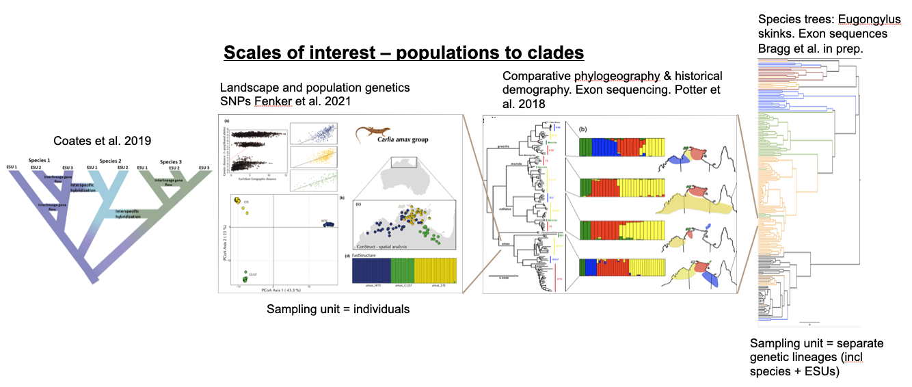
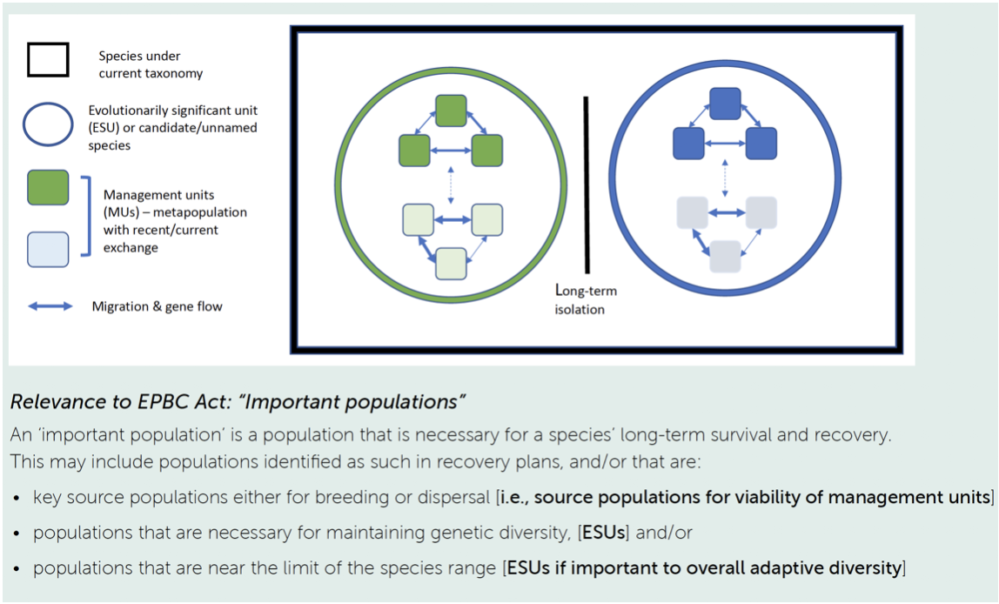
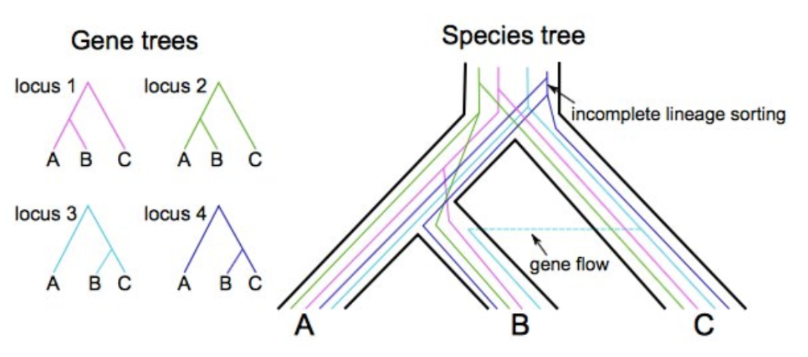
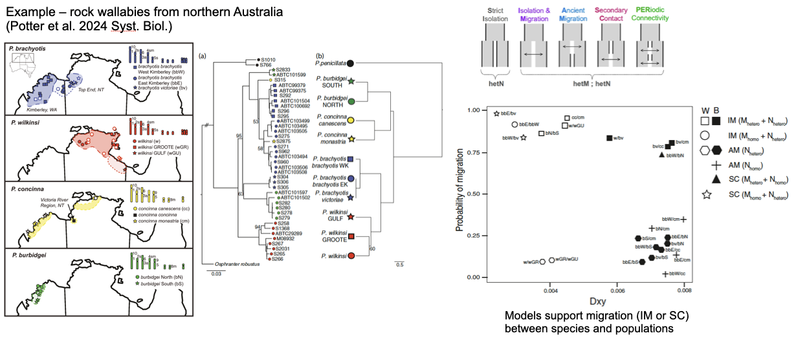
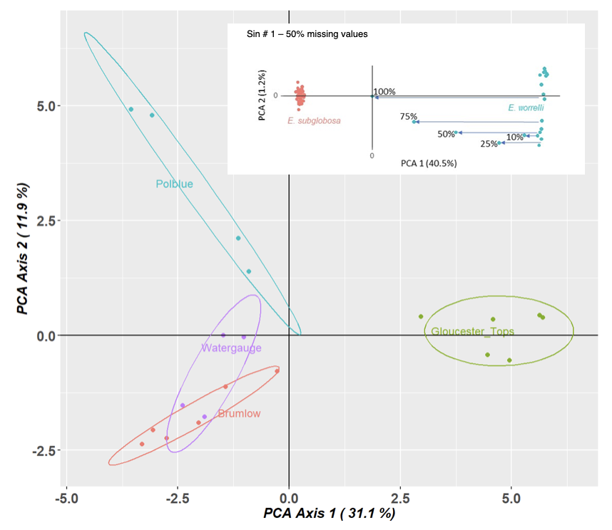
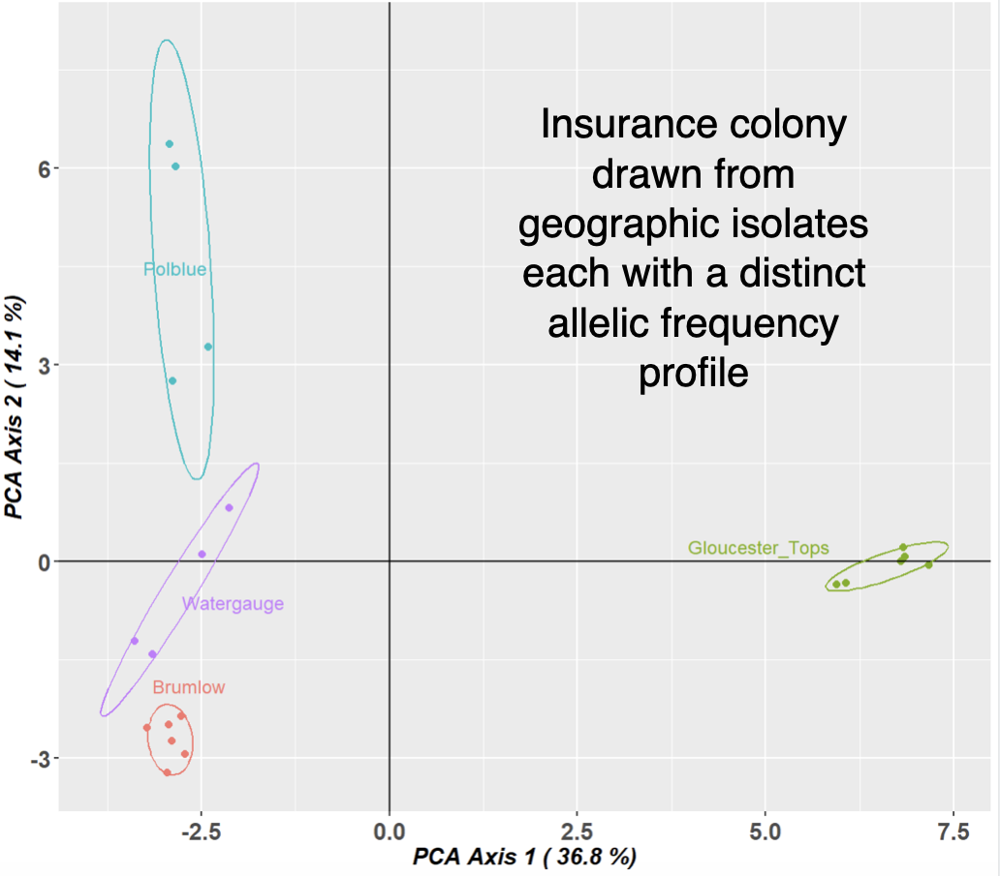
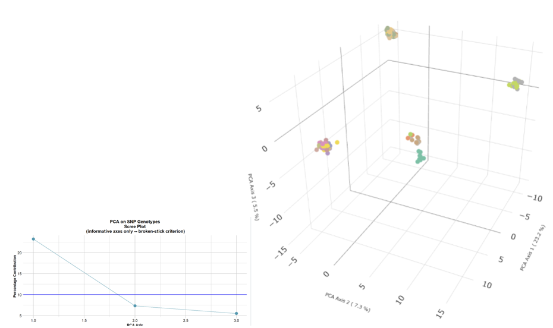
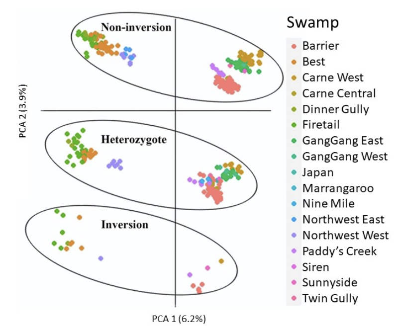
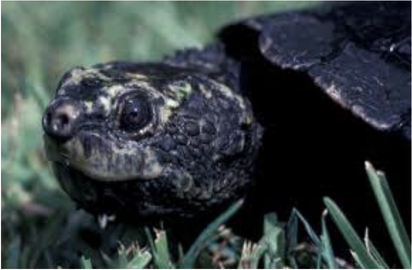
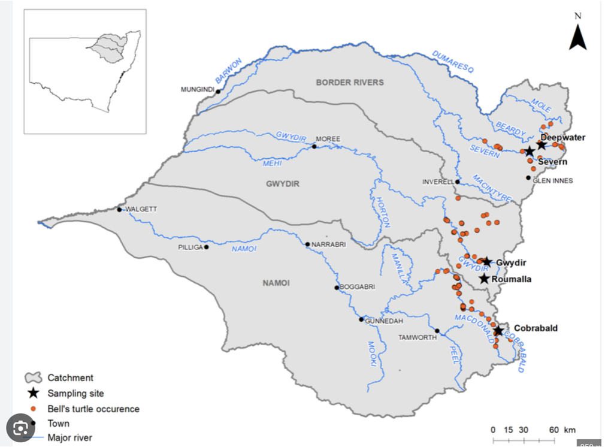

```{r setup, include=FALSE}
library(learnr)
knitr::opts_chunk$set(echo = TRUE, eval = TRUE, cache=TRUE)
```

## W08 Genetic Divergence & Phylogenetics {.unnumbered}

{.class width="200" height="200"}
{.class width="200" height="200"}

## Introduction

In this session we are going to cover some of the basic analyses that
can be taken to inform management when faced with threatened species
showing genetic structure across their natural range. The central
considerations are how to draw from those populations to establish
captive insurance colonies, and how to plan releases to boost declining
populations.

We have heard of some real-world examples on lions by Laura Pertola and
small Australian mammals by Kate Rick. In this session, we will cover
some of the considerations for defining management units, ESUs and other
userful designations. Craig will cover the theory and practice of
population divergence. We will then look a PCA in a little more detail
as one of the most powerful tools for examining structure within large
SNP datasets. We will run through the seven deadly sins of classical PCA
that allow the technique to be used with confidence.

Please refer to the article Georges, A., Mijangos, L., Patel, H.,
Aitkens, M. and Gruber, B. 2023. Distances and their visualization in
studies of spatial-temporal genetic variation using single nucleotide
polymorphisms (SNPs). BioxRiv
<https://doi.org/10.1101/2023.03.22.533737>.

We move on to the example of the Broad Toothed Rat in the Barrington
Tops region of NSW, not so much as a definitive study, but as a sandpit
to explore some of the analyses that can be applied to a structured wild
population.

We finish with an Exercise using data from the endangered Western
Sawshell Turtle of the Murray Darling River Basin.

A central question in both of these studies is when there is strong
genetic structure across the landscape, does this imply separate
management of the distinct genetic units, and if so, at what scale.

### Prerequisites

No prerequisites required. This is a very basic treatment

### Workflow

1.  Genetic structure and SNPs, defining units relevant to management.

2.  The seven deadly sins of classical PCA

3.  Jump into the sandpit with the Broad Toothed Rat

4.  Exercise with the Western Sawshell Turtle

5.  Discussion

### Learning outcomes

-   Population divergence models

-   Usage of PCA

-   To correctly identify population structure

## The why & how of population divergence models

{width="1000"}

### Analysing the history of divergence and gene flow is key to defining conservation units within species

{width="600"}

### Sampling matters for species with limited dispersal!

{width="400"}

-   Restricted dispersal -\> isolation by distance

-   Spatially cluster sampling yields biased estimates of population
    parameters, clustering etc.

### Why not use SNP-based phylogenies to estimate divergence times?

{width="300"}

1.  Gene trees differ from species trees: Average divergence is \> split
    time due to deep coalescence of lineages. Difference increases with
    Na

2.  SNP-based analyses overestimate divergence unless \# invariant sites
    is known

See Leache et al. 2015 Syst. Biol.

### Approaches to modeling divergence histories -- population models and the multispecies coalescent

{width="300"}

A.  2 population model at mutation-migration equilibrium (e.g MIGRATE)

B.  2 population Isolation with Migration (IM) model

C.  Multispecies coalescent models +/- migration

### Navigating the morass of methods...

{width="600"}

### Fitting population divergence models

{width="300"}

-   All models are wrong...
-   Which one(s) best fit your data?
-   Methods: dadi, moments, DILS
-   Example: Marine populations

### Example: rock wallabies from northern Australia (Potter et al. 2024 Syst. Biol.)

{width="900"}

-   Phylogenetic discordance suggests current or historical gene flow
    among species

-   Models support migration (IM or SC) between species and populations

### *Take home messages*

-   Well-distributed population sampling is important! Often this is
    iterative.
-   SNP based phylogenies, PCAs etc are useful as heuristics and to
    develop hypotheses BUT...
-   Coalescent-based population methods should be used to estimate
    population divergence histories
-   Comparing alternative models of divergence is useful BUT...
-   Remember all models are wrong...

## Seven sins of classical PCA

### 1. Missing values

{width="404"}

{width="401"}

### 2. Inappropriate distance metric

**PCA vs PCoA**

You can substitute the standardized covariance matrix used by PCA with
any standardized distance metric (Gower, 1966).

**dartR coding**

-   0, homozygous reference allele (DArT set this as the most common
    allele)
-   1, heterozygous
-   2, homozygous alternate allele

Relative distances between individuals must not depend on the arbitrary
choice of reference and alternate allele. Prudent to check this.

### 3. Including close relatives

{width="500"}

### 4. Choosing two dimensions for convenience

{width="539"}

-   Separation is definitive. Proximity is ambiguous.

-   Identify informative dimensions (Broken-Stick Criterion) Explicitly
    choose what information willing to discard

### 5. Confounding % explained with biological importance

**Sin 5: "PC1 explains X% across datasets, a comparable across studies
measure of"strength of structure"**

But % variance depends on loci, scaling, LD pruning, MAF filters, sample
composition. Use the Tracy-Widom framework, and by default in dartR, the
broken-stick criterion to distinguish signal from noise.

**AND**

PCA and PCoA compute % explained in fundamentally different ways and so
are not comparable.

### 6. Structural variants and gross linkage

{width="500"}

Weird inexplicable patterns -- 2 or 3 replicated sets of aggregations If
two patterns -- sex linkage?

If 2 or 3, large structural variant?

### 7. Over-interpretation

*Sin 7: Treating PCs as direct evidence for specific processes, discrete
groups, or biological mechanisms when PCA is fundamentally a
variance-maximizing projection showing patterns.*

@NovembreStephen2008

@McVean2009

### *BOTTOM LINE*

*Care to avoid the seven sins. PCA is an incredible tool that lends
itself to SNP analysis. But it is a hypothesis generating tool only and
must be followed by more definitive analyses.*

## Worked Example: Broad Toothed Rat

{width="617"}

-   Insurance breeding colony established

-   Sampled using cheek swabs

-   Genotyped using DArTseq

-   Advice on who to breed with whom to maximize genetic diversity in
    the offspring

-   Opportunity for us to explore genetic diversity in the source
    population

### *Required packages*

```{r, warning=FALSE, message=FALSE}
library(dartRverse)
```

**Step 1 Load in the data:**

```{r}
gl.set.verbosity(3)
gl <- gl.load(file="./data/Mastocomys.Rdata")
```

**Step 2 Interrogate:**

```{r}
gl
popNames(gl)
indNames(gl)
table(pop(gl))
gl@other$latlong
```

**Step 3 Examine geography:**

```{r}
gl.map.interactive(gl)
```

**Step 4 Filtering:**

```{r}
gl.report.callrate(gl)
```

```{r}
gl.filter.callrate(gl, threshold=0.5)
```

**Step 5 Exploratory visualization:**

```{r}
pca <- gl.pcoa(gl)
gl.pcoa.plot(pca,gl,ellipse=TRUE, plevel=0.67)
```

```{r}
gl <- gl.impute(gl) 
pca <- gl.pcoa(gl) # 2 informative axes
gl.pcoa.plot(pca,gl,ellipse=TRUE, plevel=0.67)
```

**Step 6 Analysis:**

```{r}
# F Statistics
gl.report.fstat(gl)
```

```{r}
# Allelic Richness
r1 <- gl.report.allelerich(gl)
```

```{r}
# Allelic Richness Simulation
r1 <- gl.report.allelerich(gl)

r2 <- gl.report.nall(  x = gl,  simlevels = seq(1, nInd(gl), 5),  reps = 10,  plot.colors.pop = gl.colors("dis"),  ncores = 2)
```

```{r}
# Private Alleles
r1 <- gl.report.pa(gl)
```

**Step 7. Interpetation**

-   PCA indicates a high degree of population structure
-   This is borne out by the FST analysis
-   Allelic diversity is a little low, not exceptionally, and not
    differentially
-   Each subpopulation has a high frequency of private alleles

**Working Hypothesis:** The Barrington Tops populations likely represent
a former widespread and connected population, subsequently fragmented
with differential loss and retention of alleles under the influence of
drift.

**Future Work:** - Increase sample sizes to better capture allelic
profiles - Calculate $N_e$ to assess likelihood of population
persistence - Plot $N_e$ through time to see if there is evidence of a
bottleneck

Kate Rick: Strong structure does not necessarily mean separate
management of divergent groups.

Maximizing the Barrington Tops population potential to adapt and persist
may require cross-breeding and distributed release.

**Management** (subject to findings of future work) Sampling should be
from across the sites in Barrington Tops, cross-breeding should be
undertaken to capture allelic diversity, and strategic re-release across
sites is likely to be a well-supported strategy.

## Worked Example: Western Sawshell Turtle

{width="200"}{width="300"}

Not cute as mustard, EPBC Act:Endangered; Headwaters of the
Murray-Darling Basin -- Namoi, Gwydir and Border Rivers subdrainage
basins

-   Insurance breeding colony established

-   Sampled using skin biopsy

-   Genotyped using DArTseq

-   Is the colony representative of the genetic diversity of wild
    populations

-   Advice on who to breed with whom to maximize genetic diversity in
    the offspring for release

**Exercise: Western Sawshell Turtle**

Step 1. Load in the data (Myuchelys.Rdata)

Step 2. Interrogate the data

Step 3. Examine geographically

Step 4. Filtering -- craft a regime

Step 5. Exploratory visualization

Step 6. Analysis

Step 7. Interpretation

### *Required packages*

```{r, warning=FALSE, message=FALSE}
library(dartRverse)
```

**Step 1 Load in the data:**

```{r}
gl.set.verbosity(3)
gl <- gl.load(file="./data/Myuchelys.Rdata")
```

**Step 2 Interrogate:**

```{r}
gl
popNames(gl)
indNames(gl)
table(pop(gl))
gl@other$latlon
```

**Step 3 Examine geography:**

```{r}
gl.map.interactive(gl)
```

**Step 4 Craft a Filtering Regime:**

First let us do a smear plot of individuals (vertical) against loci
(horizontal)

```{r}
gl.smearplot(gl)
```

Note that missing values are in grey, so they give an indication of how
dense your data set is (as opposed to being littered with gaps). Then we
craft a filtering regime.

Unfortunately, we do not have the sexes in this dataset, so we cannot
filter on sex linkage, which would be our first port of call. So lets
start with call rate.

```{r}
gl.report.callrate(gl)
```

The distribution of call rate values indicates a need for filtering, and
based on that distribution we pick a threshold of 0.95.

Any loci with less than 95% scored across individuals will be discarded.

```{r}
gl.filter.callrate(gl, threshold=0.95)
```

Next we filter on callrate by individual.

```{r}
gl.report.callrate(gl,method="ind")
```

No individuals have an unacceptable call rate so we do not filter any
out.

```{r}
gl.report.rdepth(gl)
```

Filter on read depth, selecting 5x as a minimum.

```{r}
gl.filter.rdepth(gl, lower=5)
```

Then report on reproducibility. Recall that DArT run technical
replicates to check the reliability of calls.

```{r}
gl.report.reproducibility(gl)
```

There are quite a few loci that show poor reproducibility. So lets
filter out those with a reproducibility of less than 99%

```{r}
gl.filter.reproducibility(gl, threshold=0.99)
```

```{r}
gl.smearplot(gl)
```

**Step 5 Exploratory visualization:**

```{r}
pca <- gl.pcoa(gl)
gl.pcoa.plot(pca,gl,ellipse=TRUE, plevel=0.95)
```

Note: You might be tempted to filter out all loci that are less than
100% reliable, but this can cause an ascertainment bias. In particular,
loci that are heterozygous will be called with less certainty, and so
filtering that is too stringent will preferentially remove more
polymophic sites.

Now lets visualize the structure with PCA. Note that we do not need to
impute because the missing value rate is only 0.6%, unlikely to cause
appreciable distortion.

```{r}
gl.pcoa.plot(pca,gl,xaxis=1, yaxis=3, ellipse = TRUE, plevel=0.95)
```

Four nice clusters in the space defined by the top two dimensions. Note
however that, by the split stick criterion, there are three informative
dimensions. Separation can be believed, but proximity is ambiguous. So
the proximity of the two drainages within the border rivers region may
not be sustained when we examine the third dimension.

```{r, eval=FALSE}
gl.pcoa.plot(pca,gl,xaxis=1, yaxis=3,interactive=TRUE)
```

And indeed it is not. Why do we look at PC axis 1 and 2, then PC axis 1
and 3. Why not 3 and 4. First of all, axis 4 was not informative, and
will likely be misleading if we do not scale the axes. Second, if you
plot 1 vs 2 and 1 vs 3, you can flop 1 vs 3 back into the page and
better visualize the 3D structure in the dataset.

Better still, you can plot the data in 3D and then manually apply a
rotation of the axes to better show the separation of sites.

```{r}
gl.pcoa.plot(pca,gl,xaxis=1, yaxis=2, zaxis=3)
```

All good. Four aggregations that can be distinguished by their allelic
profiles folloing ordination and dimension reduction.

**Step 6 Analysis:**

F Statistics

```{r}
# F Statistics
gl.report.fstat(gl)
```

The structure in the PCA is reflected in the Fst values.

0--0.05: little differentiation 0.05--0.15: low--moderate 0.15--0.25:
moderate \> 0.25: high / very high

Border Nth vs South : low-moderate Rest : Moderate

What about allelic richness.

```{r}
# Allelic Richness
r1 <- gl.report.allelerich(gl)
```

Nothing spectacular there.

```{r}
gl.report.heterozygosity(gl)
```

Again, not a lot in that. No strong evidence of inbreeding depression in
any of the four aggregations.

```{r}
gl.report.diversity(gl)
```

```{r}
# Private Alleles
r1 <- gl.report.pa(gl)
```

Again, not a lot to see there, though there seems to be a discrepency
between q=0 and the results from gl.report.heterozygosity. Coders?

Lets see where these four populations sit in relation to expectation
build on the global trend in allelic richness against population size.
This takes some time to run, so maybe do this at another time.

```{r}
# Allelic Richness Simulation
r2 <- gl.report.nall(  x = gl,  simlevels = seq(1, nInd(gl), 5),  reps = 10,  plot.colors.pop = gl.colors("dis"),  ncores = 2)
```

**Questions:**

-   Is there structure in the dataset evident in the PCA?
-   Is this borne out by FST analysis?
-   Are there discrete management units evident?
-   Are any of these showing evidence of critical loss of genetic
    diversity/inbreeding?
-   What are the lessons/advice for management?


