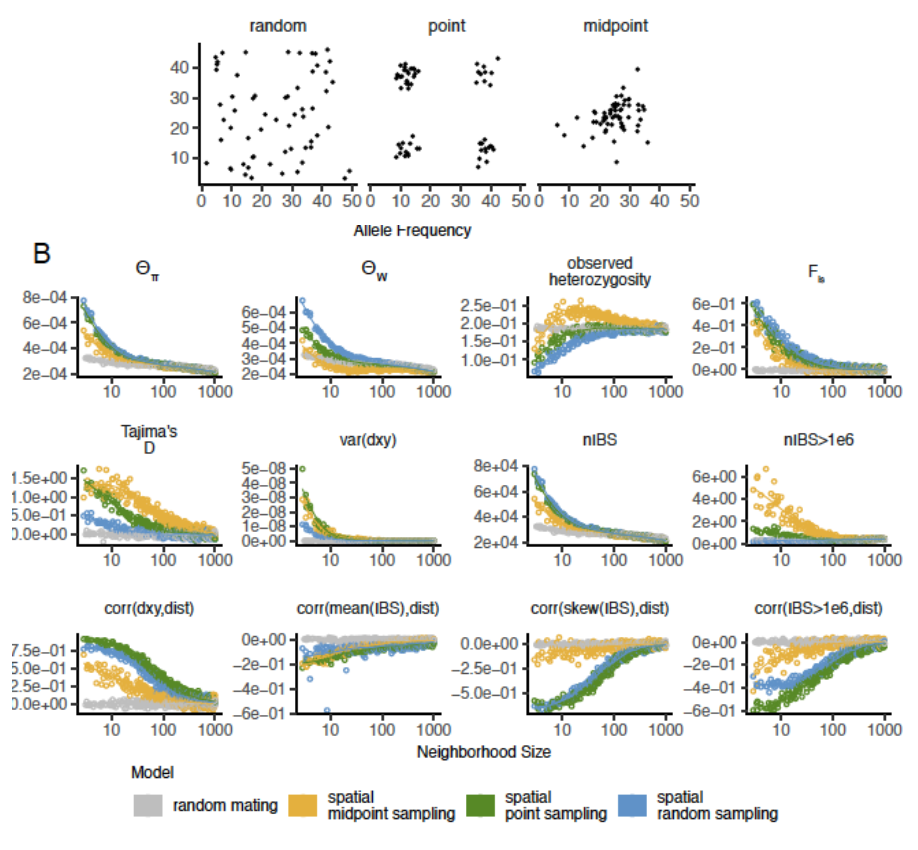
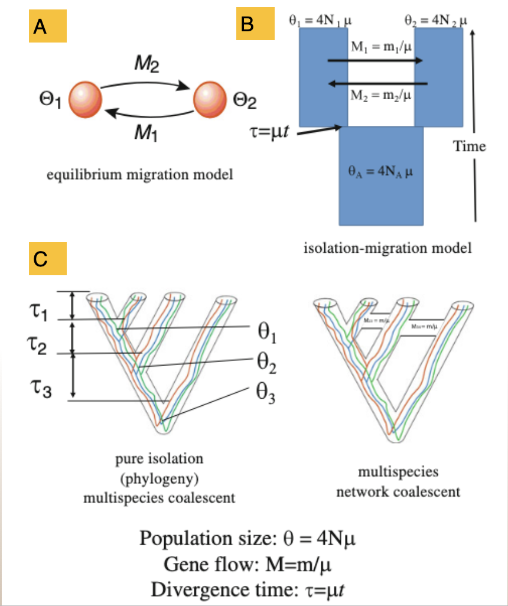
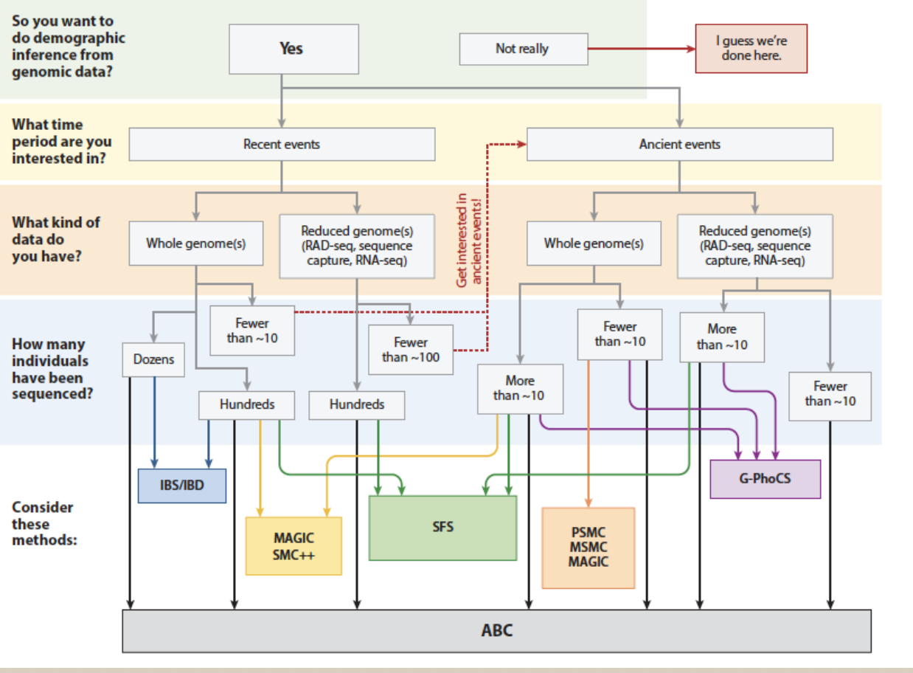
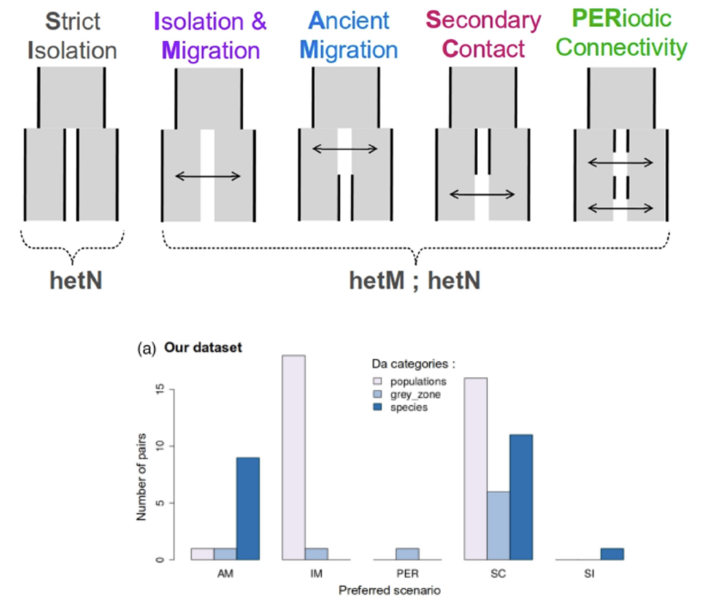
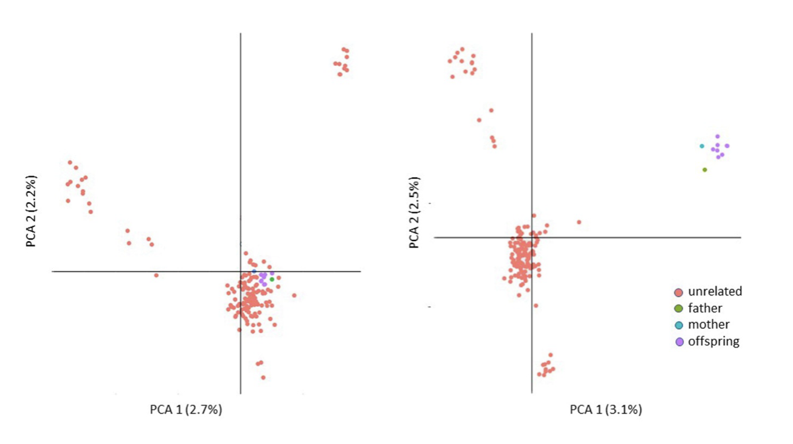
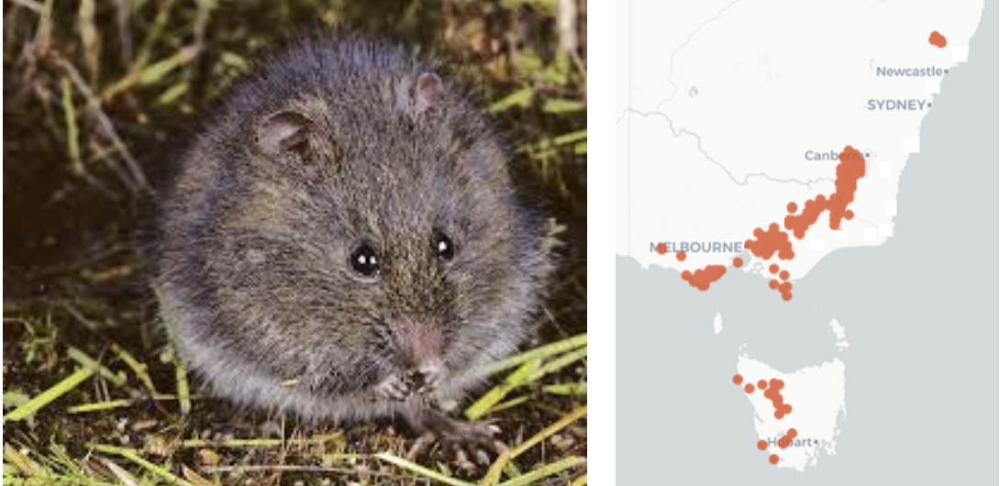

```{r setup, include=FALSE}
library(learnr)
knitr::opts_chunk$set(echo = TRUE, eval = FALSE, cache=TRUE)
```


## W08 Genetic Divergence & Phylogenetics {.unnumbered}

{.class width="200" height="200"} {.class width="200" height="200"}

## Introduction

Population structure emerges when physical or behavioral barriers arise. If this isolation persists, genetic divergence begins, eventually leading to speciation. In this session, we will present **"the why & how of population divergence models"** and **"Seven Deadly Sins of Classical PCA"**.

## Session summary


1.  Population divergence

2.  Seven sins of classical PCA

3.  Hands-on

### Learning outcomes

-   Population divergence models

-   Usage of PCA

-   To correctly identify population structure

## The why & how of population divergence models

{width="1000"}

### Analysing the history of divergence and gene flow is key to defining conservation units within species

{width="600"}

### Sampling matters for species with limited dispersal!

{width="400"}

-   Restricted dispersal -\> isolation by distance

-   Spatially cluster sampling yields biased estimates of population parameters, clustering etc.

### Why not use SNP-based phylogenies to estimate divergence times?

{width="300"}

1.  Gene trees differ from species trees: Average divergence is \> split time due to deep coalescence of lineages. Difference increases with Na

2.  SNP-based analyses overestimate divergence unless \# invariant sites is known

See Leache et al. 2015 Syst. Biol.

### Approaches to modeling divergence histories -- population models and the multispecies coalescent

{width="300"}

A.  2 population model at mutation-migration equilibrium (e.g MIGRATE)

B.  2 population Isolation with Migration (IM) model

C.  Multispecies coalescent models +/- migration

### Navigating the morass of methods...

{width="600"}

### Fitting population divergence models

{width="300"}

-   All models are wrong...
-   Which one(s) best fit your data?
-   Methods: dadi, moments, DILS
-   Example: Marine populations

### Example: rock wallabies from northern Australia (Potter et al. 2024 Syst. Biol.)

{width="900"}

-   Phylogenetic discordance suggests current or historical gene flow among species

-   Models support migration (IM or SC) between species and populations

### *Take home messages*

-   Well-distributed population sampling is important! Often this is iterative.
-   SNP based phylogenies, PCAs etc are useful as heuristics and to develop hypotheses BUT...
-   Coalescent-based population methods should be used to estimate population divergence histories
-   Comparing alternative models of divergence is useful BUT...
-   Remember all models are wrong...

## Seven sins of classical PCA

### 1. Missing values

{width="404"}

{width="401"}

### 2. Inappropriate distance metric

**PCA vs PCoA**

You can substitute the standardized covariance matrix used by PCA with any standardized distance metric (Gower, 1966).

**dartR coding**

-   0, homozygous reference allele (DArT set this as the most common allele)
-   1, heterozygous
-   2, homozygous alternate allele

Relative distances between individuals must not depend on the arbitrary choice of reference and alternate allele. Prudent to check this.

### 3. Including close relatives

{width="500"}

### 4. Choosing two dimensions for convenience

{width="539"}

-   Separation is definitive. Proximity is ambiguous.

-   Identify informative dimensions (Broken-Stick Criterion) Explicitly choose what information willing to discard

### 5. Confounding % explained with biological importance

**Sin 5: "PC1 explains X% across datasets, a comparable across studies measure of"strength of structure"**

But % variance depends on loci, scaling, LD pruning, MAF filters, sample composition. Use the Tracy-Widom framework, and by default in dartR, the broken-stick criterion to distinguish signal from noise.

**AND**

PCA and PCoA compute % explained in fundamentally different ways and so are not comparable.

### 6. Structural variants and gross linkage

{width="500"}

Weird inexplicable patterns -- 2 or 3 replicated sets of aggregations If two patterns -- sex linkage?

If 2 or 3, large structural variant?

### 7. Over-interpretation

*Sin 7: Treating PCs as direct evidence for specific processes, discrete groups, or biological mechanisms when PCA is fundamentally a variance-maximizing projection showing patterns.*

@NovembreStephen2008

@McVean2009

### *BOTTOM LINE*

*Care to avoid the seven sins. PCA is an incredible tool that lends itself to SNP analysis. But it is a hypothesis generating tool only and must be followed by more definitive analyses.*

## Worked Example: Broad Toothed Rat

{width="617"}

-   Insurance breeding colony established

-   Sampled using cheek swabs

-   Genotyped using DArTseq

-   Advice on who to breed with whom to maximize genetic diversity in the offspring

-   Opportunity for us to explore genetic diversity in the source population

## *Required packages*

```{r, warning=FALSE, message=FALSE}
library(dartRverse)
```

**Step 1 Load in the data:**

```{r}
gl.set.verbosity(3)
gl <- gl.load(file="./data/Mastocomys.Rdata")
```

**Step 2 Interrogate:**

```{r}
gl
popNames(gl)
indNames(gl)
table(pop(gl))
gl@other$latlong
```

**Step 3 Examine geography:**

```{r}
gl.map.interactive(gl)
```

**Step 4 Filtering:**

```{r}
gl.report.callrate(gl)
```

```{r}
gl.filter.callrate(gl, threshold=0.5)
```

**Step 5 Exploratory visualization:**

```{r}
pca <- gl.pcoa(gl)
gl.pcoa.plot(pca,gl,ellipse=TRUE, plevel=0.67)
```

```{r}
gl <- gl.impute(gl) 
pca <- gl.pcoa(gl) # 2 informative axes
gl.pcoa.plot(pca,gl,ellipse=TRUE, plevel=0.67)
```

**Step 6 Analysis:**

```{r}
# F Statistics
gl.report.fstat(gl)
```

```{r}
# Allelic Richness
r1 <- gl.report.allelerich(gl)
```

```{r}
# Allelic Richness Simulation
r1 <- gl.report.allelerich(gl)

r2 <- gl.report.nall(  x = gl,  simlevels = seq(1, nInd(gl), 5),  reps = 10,  plot.colors.pop = gl.colors("dis"),  ncores = 2)
```

```{r}
# Private Alleles
r1 <- gl.report.pa(gl)
```

**Step 7. Interpetation**

-   PCA indicates a high degree of population structure
-   This is borne out by the FST analysis
-   Allelic diversity is a little low, not exceptionally, and not differentially
-   Each subpopulation has a high frequency of private alleles

**Working Hypothesis:** The Barrington Tops populations likely represent a former widespread and connected population, subsequently fragmented with differential loss and retention of alleles under the influence of drift.

**Future Work:** Increase sample sizes to better capture allelic profiles Calculate Ne to assess likelihood of population persistence Plot Ne through time to see if there is evidence of a bottleneck

Management (subject to findings of future work) Sampling from across the sites in Barrington Tops, cross-breeding to capture allelic diversity, and re-release across sites is likely to be a well-supported strategy.

Establishment of captive insurance colonies that maintain the genetic structure of the current wild population is likely to simply continue the decline of genetic diversity through drift.

## Worked Example: Western Sawshell Turtle

{width="200"}{width="300"}

Not cute as mustard, EPBC Act:Endangered; Headwaters of the Murray-Darling Basin -- Namoi, Gwydir and Border Rivers subdrainage basins

-   Insurance breeding colony established

-   Sampled using skin biopsy

-   Genotyped using DArTseq

-   Is the colony representative of the genetic diversity of wild populations

-   Advice on who to breed with whom to maximize genetic diversity in the offspring for release

**Hands-on:**

Step 1. Load in the data (Myuchelys.Rdata)

Step 2. Interrogate the data

Step 3. Examine geographically

Step 4. Filtering -- craft a regime

Step 5. Exploratory visualization

Step 6. Analysis

Step 7. Interpretation

**Question:**

-   Is there structure in the dataset evident in the PCA?
-   Is this borne out by FST analysis?
-   Are there discrete management units evident?
-   Are any of these showing evidence of critical loss of genetic diversity/inbreeding?
-   What are the lessons/advice for management?

### Conclusion

### Where have we come?
