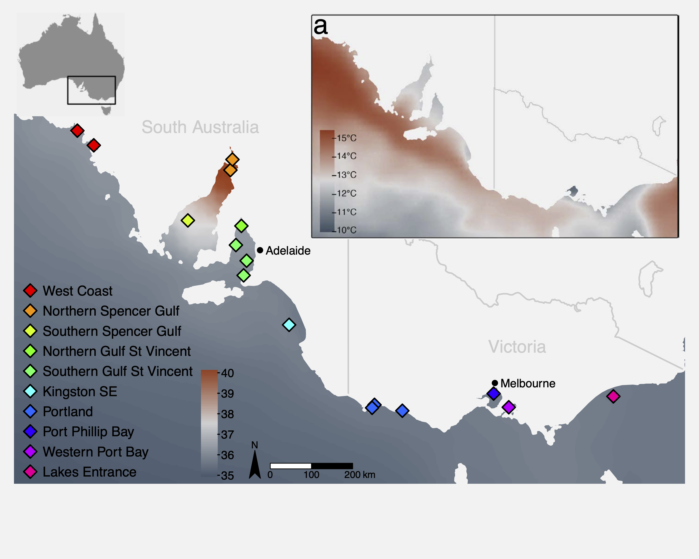
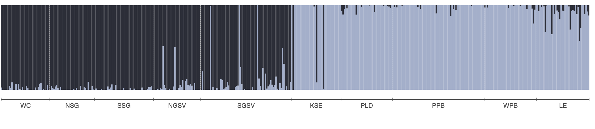

```{r setup, include=FALSE}
library(learnr)
knitr::opts_chunk$set(echo = TRUE, eval = FALSE)
```

## W10 Natural Selection & Adaptation {.unnumbered}

<div style="display:flex; justify-content:space-evenly; flex-wrap:wrap; align-items:center; width:100%;">


</div>

## Learning outcomes

In this session we will learn how to detect signatures of local adaptation in genomic data using Genotype-Environment Association (GEA) analyses, with a focus on Redundancy Analysis (RDA). By the end of the session you should be able to:

-   Understand the logic of GEA analysis and why it can help identify loci under natural selection
-   Prepare and visualise environmental data for use in GEA
-   Understand the importance of accounting for population structure as a confounding variable
-   Run a partial RDA to identify genotype-environment associations
-   Test model significance and quantify explained variance
-   Identify candidate adaptive loci using the `rdadapt` approach
-   Visualise candidate loci in genomic and ordination space

## Introduction

### Adaptation in the ocean: why does it matter for conservation?

Understanding how populations adapt to their local environment is a central question in conservation biology. Populations that have evolved in response to specific environmental conditions such as high temperature or salinity may harbour unique genetic variation that allows them to persist under those conditions. As environments change, whether through climate change, pollution, or habitat modification, the capacity of populations to adapt becomes critical to their long-term survival.

Identifying loci under natural selection allows us to:

-   Identify environmental gradients imposing selection
-   Characterise the genetic basis of local adaptation
-   Delineate adaptive units that may need consideration in management plans
-   Predict which populations are most vulnerable to environmental change
-   Prioritise populations for conservation interventions

------------------------------------------------------------------------

### Genotype-Environment Association (GEA) analysis

GEA approaches test for statistical associations between population allele frequencies (or individual genotypes) and environmental variables across sampling locations. The underlying logic is simple: if a locus is under selection by a particular environmental variable, we expect allele frequencies at that locus to co-vary with that variable across the landscape.

A key challenge is that genetic differentiation driven by **neutral processes** (drift, isolation by distance) also creates correlations between allele frequencies and geography. Because many environmental variables are themselves spatially structured, neutral genetic structure can generate spurious GEA signals. Accounting for this confounding is an essential part of GEA analyses and interpretation.

------------------------------------------------------------------------

### Why Redundancy Analysis (RDA) for GEA?

**Redundancy Analysis (RDA)** is a multivariate constrained ordination method that models the relationship between a matrix of response variables (e.g. SNP allele counts/frequencies) and a matrix of explanatory variables (environmental predictors). Conceptually, it’s multivariate multiple regression + ordination: it first fits allele-frequency variation as a function of environment, then summarizes the fitted (environment-explained) genetic variation into a small number of canonical axes that represent combinations of environmental variables.

Compared to univariate GEA methods, RDA offers several advantages:

-   Tests all SNPs and all environmental variables simultaneously
-   Detects SNPs responding to *combinations* of environmental variables (multilocus, multivariate signals)
-   Can condition out confounding variation (e.g. population structure) via **partial RDA**
-   Uses well-established permutation-based significance tests
-   Produces interpretable ordination plots linking loci, individuals, and predictors

In a partial RDA, we include a representation of neutral structure as **conditioning variables** (using `Condition()` in the vegan formula interface). This effectively removes variance attributable to neutral population structure before testing for environment–genotype associations, helping reduce confounding when structure and environment are spatially correlated.

------------------------------------------------------------------------

### RDA compared to other common GEA approaches

**Univariate association tests (e.g. GLM; LFMM; Bayenv2)**

Strengths:

-   Can have good power in some settings.
-   Flexible per-locus inference.
-   Familiar/intuitive outputs (p-values/q-values).

Weaknesses:

-   Can exhibit relatively high false-positive rates under strong isolation-by-distance/hierarchical population structure.
-   Evaluating each SNP against one environmental predictor at a time implicitly treats predictors as independent drivers of selection.

**Constrained ordination-based multivariate methods (e.g. CCA, RDA/dbRDA)**

Strengths:

-   Constrained ordinations strike a good balance of high detection + low false-positive rates, even under strong IBD/structure.
-   Because the axes are explicitly built from environmental predictors, they are ordered to represent the strongest environment-associated genetic gradients, making adaptive signals easier to isolate and interpret.

Weaknesses:

-   If neutral structure is correlated with environment, constrained ordinations can still flag spurious associations unless you condition on structure (partial RDA) or otherwise account for it.
-   RDA captures linear genotype–environment relationships; strongly nonlinear responses may be missed or require transformations/splines or alternative methods.
-   Highly correlated predictors can make coefficients/loadings harder to interpret; results depend on appropriate standardisation and careful predictor selection.

Forester et al. (2018) found that constrained ordinations, and especially RDA, most consistently balanced power and false positives across a wide range of demographies, sampling designs, sample sizes, and selection strengths, outperforming other multivariate approaches like Random Forest in their simulations.

Further reading:

**Forester, BR, Lasky, JR, Wagner, HH, & Urban, DL. (2018). Comparing methods for detecting multilocus adaptation with multivariate genotype‐environment associations. *Molecular Ecology*, 27(9), 2215–2233.**

------------------------------------------------------------------------

### The study system: Australasian snapper in southern Australia

This tutorial uses a ddRAD-seq dataset of **Australasian snapper** (*Chrysophrys auratus*) sampled across the South Australian coastline, a region encompassing strong environmental gradients in temperature, salinity, primary productivity, and carbonate chemistry. The dataset includes:

-   **448 individuals** from 16 sampling sites
-   **14,699 SNPs** (we will use a subset of those here)
-   Environmental data extracted from **Bio-ORACLE** marine climate layers

The sampling spans two oceanographic regions (west and east of Investigator Strait) with strong environmental heterogeneity, both among, and within regions. This provides an ideal system to examine the effects of environmental gradients on genetic variation. Further information about the study system and the data can be found in the attached paper:

**Brauer, CJ, Bertram, A, Sandoval-Castillo, J, Fowler, A, Bell, J, Hamer, P, Wellenreuther, M, & Beheregaray, LB. (*In press*). Environmental gradients decouple demographic and adaptive connectivity in a highly mobile coastal marine species. *Molecular Ecology*.**

{width="99%"}

------------------------------------------------------------------------

## Session overview

### **Step 1: Environmental data**

-   What environmental data should I use?
-   Key environmental data sources
-   Load and inspect environmental variables
-   Understand variable redundancy, collinearity and VIF filtering
-   Visualise environmental data

### **Step 2: Genomic data preparation**

-   Population allele frequencies
-   Imputation of missing genotypes
-   Estimating and controlling for population structure

### **Step 3: Partial RDA**

-   Running the constrained ordination
-   How much variation is explained?
-   Testing model and term significance
-   Interpreting and plotting the ordination

### **Step 4: Identifying candidate loci**

-   The `rdadapt` genome scan approach
-   Q-value thresholding
-   Manhattan plot of candidate loci

### **Step 5: Candidate loci RDA**

-   Individual-level RDA with candidate SNPs only
-   Interpreting the adaptive landscape

### **Wrap-up**

-   Discussion
-   Where have we come?

## Setup

```{r start, include=FALSE}
library(learnr)
library(vegan)
library(ggplot2)
library(dplyr)
library(tidyr)
library(usdm)
library(robust)
library(qvalue)
library(ggmanh)
library(RColorBrewer)
library(terra)
library(rnaturalearth)
library(rnaturalearthdata)
knitr::opts_chunk$set(echo = TRUE, eval = FALSE)
tutorial_options(exercise.eval = FALSE)

# load pre-processed tutorial data
GEA_dat      <- readRDS("data/GEA_dat.rds")
snapper.AF   <- GEA_dat$allele_freq    # population allele frequencies
env_raw      <- GEA_dat$env_raw        # raw environmental data
env_var_df   <- GEA_dat$env_scaled     # z-score scaled environmental data
omega.xy     <- GEA_dat$omega          # pop structure correction (BayPass MDS)
grouped_popmap <- GEA_dat$metadat      # individual-level metadata
genome_info  <- GEA_dat$genome_coords  # SNP genomic coordinates
ind_snps     <- GEA_dat$ind_snps       # individual genotype matrix (all SNPs)
```

To run the tutorial you will need the following packages installed. If you do not have them, install with `install.packages()` or, for Bioconductor packages, `BiocManager::install()`.

```{r loadlibs, warning=FALSE, message=FALSE}
library(vegan)              # RDA, permutation tests
library(ggplot2)            # visualisation
library(dplyr)              # data manipulation
library(tidyr)              # data reshaping
library(usdm)               # VIF filtering
library(robust)             # robust covariance (rdadapt)
library(qvalue)             # FDR-corrected q-values (rdadapt)
library(ggmanh)             # Manhattan plots
library(RColorBrewer)       # colour palettes
library(terra)              # raster handling (environmental maps)
library(rnaturalearth)      # coastline data (environmental maps)
library(rnaturalearthdata)  # medium-resolution map data
```

We also load the pre-processed tutorial dataset. This `.rds` file contains a list with all the data objects needed for the session. To keep computation times manageable, `allele_freq` and `ind_snps` contain a **subset of \~2,000 SNPs** rather than the full 14,699 used in the paper. See the box below for a description of each data component.

```{r loaddata}
GEA_dat      <- readRDS("data/GEA_dat.rds")
snapper.AF   <- GEA_dat$allele_freq    # population allele frequencies
env_raw      <- GEA_dat$env_raw        # raw environmental data
env_var_df   <- GEA_dat$env_scaled     # z-score scaled environmental data
omega.xy     <- GEA_dat$omega          # pop structure correction (BayPass MDS)
grouped_popmap <- GEA_dat$metadat      # individual-level metadata
genome_info  <- GEA_dat$genome_coords  # SNP genomic coordinates
ind_snps     <- GEA_dat$ind_snps       # individual genotype matrix (all SNPs)
```

::: callout
#### What's in GEA_dat?

-   **`allele_freq`**: A matrix of population-level minor allele frequencies. Rows are the 16 site groups, columns are SNPs (a subset of the full 14,699 for this tutorial). Each cell is the frequency of the minor allele at that SNP in that population.

-   **`env_raw`**: A data frame of raw (unscaled) environmental values extracted from Bio-ORACLE marine climate layers at each site. Columns are `pop`, `site`, and five environmental variables.

-   **`env_scaled`**: The same environmental data, z-score standardised (mean = 0, SD = 1). Used as predictors in the RDA.

-   **`omega`**: A 2-column matrix of MDS coordinates derived from the BayPass covariance matrix (Ω). These represent the dominant axes of neutral genetic structure and are used as the conditioning variable in partial RDA.

-   **`metadat`**: Individual-level metadata including sample ID, site, region, and spatial coordinates.

-   **`genome_coords`**: A data frame mapping the genomic location (chromosome, position), to the generic SNP names. Used for the Manhattan plot.

-   **`ind_snps`**: An individual-level genotype matrix (counts of the reference allele: 0, 1, or 2) for all SNPs. Rows are individuals, columns are SNPs.
:::

------------------------------------------------------------------------

## Step 1: Environmental data

:::: callout
::: {style="border: 1px solid #b0b0b0; border-radius: 5px; padding: 12px 16px; background-color: #e8f4f8; margin-bottom: 10px;"}
#### **Decision time: what environmental data should I use?**

The choice of environmental variables is one of the most consequential decisions in a GEA analysis. Including irrelevant predictors wastes statistical power; missing the key drivers means you will fail to detect real signals. Some key considerations include:

**Start with biology**

-   What do you know about the ecology and physiology of your species? Which environmental axes are most likely to impose selection?
-   Are there existing hypotheses or published SDMs that might help identify key drivers of distribution, fitness, or other measures of performance?
-   What do closely related or co-distributed species respond to? Population-level thermal tolerance studies? Transplant experiments?

**Data considerations**

-   What environmental data is available for my region?
-   Is there meaningful environmental variation across your sampling design? A variable that is spatially homogeneous across your sites cannot explain genetic variation.
-   What is the spatial resolution? For example, a 1° grid won't be informative at fine spatial-scales.
-   Is the temporal window appropriate? Annual means smooth out seasonal extremes that may be the actual selective agent; consider seasonal summaries, minima, maxima, range etc.
-   If raw data are unavailable, think about potential **surrogates or proxies** (e.g. sea surface temperature as a proxy for thermal stress; depth as a proxy for light availability), or **derived variables** (PCA scores, climatic indices, anomalies).
:::
::::

### Key environmental data sources

The table below lists some common global and Australian-specific sources for terrestrial, marine, and freshwater environmental data. Most are freely available as raster layers that can be imported directly into R.

| Dataset | Domain | Key variables | Link |
|:---|:---|:---|:---|
| **WorldClim v2** | Terrestrial | 19 bioclimatic variables (BIO1--BIO19): temperature and precipitation means, seasonality, extremes | [worldclim.org](https://www.worldclim.org/) |
| **CHELSA v2** | Terrestrial | High-resolution (30 arc-sec) climate; bioclim variables + additional land-surface layers; also future projections | [chelsa-climate.org](https://chelsa-climate.org/) |
| **Bio-ORACLE v2** | Marine | Sea surface and benthic layers: temperature, salinity, oxygen, pH, currents, primary production, nutrients | [bio-oracle.org](https://www.bio-oracle.org/) |
| **MARSPEC** | Marine | Ocean climate: sea surface temperature, salinity, bathymetry, wave energy | [marspec.org](http://www.marspec.org/) |
| **TerraClimate** | Terrestrial | Monthly climate and water balance (1958--present); good for interannual variation | [climatologylab.org/terraclimate](https://www.climatologylab.org/terraclimate.html) |
| **HydroSHEDS** | Freshwater | Global hydrographic data including catchment boundaries, river networks, and lakes. | [hydrosheds.org](https://www.hydrosheds.org) |
| **Geoscience Australia** | Physical | Geology, topography, soils, 1-second DEM | [ga.gov.au](https://www.ga.gov.au/) |
| **National Environmental Stream Attributes** | Freshwater | natural and anthropogenic characteristics of the stream and catchment environment | [ecat.ga.gov.au](https://ecat.ga.gov.au/geonetwork/srv/eng/catalog.search#/metadata/75066) |
| **TERN (Terrestrial Ecosystem Research Network)** | Terrestrial | Vegetation, soil moisture, flux tower data, land cover | [tern.org.au](https://www.tern.org.au/) |
| **CSIRO Data Access Portal** | Australian | Marine, atmospheric, and environmental datasets | [data.csiro.au](https://data.csiro.au/) |
| **NASA EarthData / MODIS** | Global | Land surface temperature, NDVI, albedo, fire, ocean colour | [earthdata.nasa.gov](https://earthdata.nasa.gov/) |
| **Google Earth Engine** | Global | Cloud-based access to thousands of datasets; scalable extraction | [earthengine.google.com](https://earthengine.google.com/) |

::: callout
#### Practical tip: accessing Bio-ORACLE in R

Bio-ORACLE layers can be downloaded and extracted directly using the `sdmpredictors` package. The environmental data for this session has already been downloaded and formatted, but the workflow below shows the full pipeline from downloading layers to extracting values at your sampling sites.

```{r biooracle_demo, eval=FALSE}
library(sdmpredictors)
library(raster)

# Step 1: Tell R where to save the downloaded raster files.
# Choose a relatively permanent location as layers are large and you don't want to re-download 
# them every session.
# Mac/Linux example:
options(sdmpredictors_datadir = "~/spatial_data/sdmpredictors")
# Windows example:
# options(sdmpredictors_datadir = "C:/Users/yourname/spatial_data/sdmpredictors")

# Step 2: Browse available layers.
# This returns a data frame — open it in the RStudio viewer to explore.
all_layers <- list_layers(c("Bio-ORACLE"))
View(all_layers)  # columns include layer_code, name, description, units

# Step 3: Download the layers you want.
# Files are saved to sdmpredictors_datadir and re-used on subsequent calls.
env_stack <- load_layers(c("BO22_tempmin_ss",    # minimum sea surface temperature
                           "BO22_salinitymean_ss", # mean sea surface salinity
                           "BO22_ph",              # sea surface pH
                           "BO22_calcite",         # calcite concentration
                           "BO22_ppmin_ss"))        # minimum primary production

# Step 4: (Optional but recommended) Crop to your study region.
# This speeds up extraction and reduces memory use.
study_extent <- extent(130, 155, -42, -28)   # xmin, xmax, ymin, ymax
env_stack <- crop(env_stack, study_extent)

# Step 5: Define your sampling site coordinates.
# Must be a data frame or matrix with longitude (x) first, latitude (y) second.
site_coords <- data.frame(
  site = c("site_A", "site_B", "site_C"),
  lon  = c(134.1,    136.5,    138.2),
  lat  = c(-32.6,    -34.1,    -35.3)
)

# Step 6: Extract environmental values at each site.
env_vals <- raster::extract(env_stack, site_coords[, c("lon", "lat")])

# Combine with site metadata
env_dat <- cbind(site_coords, as.data.frame(env_vals))
head(env_dat)
```

For **terrestrial or freshwater** studies, the `geodata` package works similarly with WorldClim and CHELSA:

```{r geodata_demo, eval=FALSE}
library(geodata)

# Download WorldClim bioclimatic variables at 2.5 arc-minute resolution
# (saved to a local directory of your choice)
wc <- worldclim_global(var = "bio", res = 2.5,
path = "~/spatial_data/worldclim")

# wc is a SpatRaster (terra), you can extract with terra::extract()
library(terra)
site_v <- vect(site_coords, geom = c("lon", "lat"), crs = "EPSG:4326")
env_vals_land <- terra::extract(wc, site_v)
```
:::

### Inspecting the environmental predictors

The environmental data for this study comes from **Bio-ORACLE** (Assis et al. 2018), a publicly available suite of marine climate rasters. We extracted values at the centroid of each sampling group using the `raster::extract()` function. The five variables retained after VIF filtering were:

| Variable               | Description                                |
|:-----------------------|:-------------------------------------------|
| `BO22_tempmin_ss`      | Minimum sea surface temperature (°C)       |
| `BO22_calcite`         | Surface calcite concentration (mol m⁻³)    |
| `BO22_ph`              | Sea surface pH                             |
| `BO22_salinitymean_ss` | Mean sea surface salinity (PSU)            |
| `BO22_ppmin_ss`        | Minimum primary production (g C m⁻² day⁻¹) |

Let us start by looking at the raw environmental data:

```{r env_inspect, exercise=TRUE, exercise.setup="step1-setup", class.chunk="gold-panel"}
# inspect the environmental data
head(env_raw)

# summary of each variable
summary(env_raw[, 3:7])
```

### Mapping the environmental predictors

Before moving on to variable selection, it is useful to visualise where these environmental gradients occur across the study region. The code below loads two Bio-ORACLE rasters, crops them to southeastern Australia, masks out the land, and plots simple maps.

```{r env_maps_setup, eval=TRUE, echo=FALSE, message=FALSE, warning=FALSE}
library(terra)
library(rnaturalearth)
library(rnaturalearthdata)
```

```{r env_maps, exercise=TRUE, exercise.setup="env_maps_setup", class.chunk="gold-panel", exercise.timelimit=60, fig.width=9, fig.height=6}
# Load the pre-processed Bio-ORACLE raster stack for the study region
env_rasters <- rast("data/env_rasters.tif")

# Get the Australian coastline and mask out land areas
aus_coast <- ne_countries(scale = "medium", country = "australia", returnclass = "sf")
aus_vect  <- vect(aus_coast)
env_sea         <- mask(env_rasters, aus_vect, inverse = TRUE)
names(env_sea)  <- names(env_rasters)   # mask() drops layer names; restore them

# Plot both maps side by side
par(mfrow = c(1, 2))

plot(env_sea$BO22_tempmin_ss,
     main = "Min. sea surface temperature (°C)",
     col  = hcl.colors(100, "RdYlBu", rev = TRUE))
plot(aus_vect, add = TRUE, col = "grey85", border = "grey60")

plot(env_sea$BO22_salinitymean_ss,
     main = "Mean sea surface salinity (PSU)",
     col  = hcl.colors(100, "YlGnBu"))
plot(aus_vect, add = TRUE, col = "grey85", border = "grey60")

par(mfrow = c(1, 1))
```

::: callout
#### Exercise

The `env_rasters.tif` file contains 31 Bio-ORACLE layers. Try modifying the code above to map a different variable — for example `BO22_ph` (sea surface pH), `BO22_calcite` (calcite concentration), or `BO_bathymean` (mean bathymetry). To see all available layers run `names(env_rasters)`.
:::

### Why VIF filtering?

Environmental variables are often highly correlated with each other. Including collinear predictors in an RDA (or any regression model) can lead to unstable estimates and reduced statistical power. We use **Variance Inflation Factor (VIF)** analysis to identify and remove redundant predictors.

The workflow is:

1.  Remove predictors with pairwise correlation above a threshold (`vifcor`, threshold r = 0.7)
2.  Iteratively remove predictors with VIF above a threshold (`vifstep`, threshold VIF = 10)

The code below illustrates this filtering on the raw environmental data. We started with 27 Bio-ORACLE variables and retained 5 after correlation and VIF filtering.

```{r vif_demo}
# Step 1: Remove variables with pairwise r > 0.7
v1 <- vifcor(env_raw[, 3:ncol(env_raw)], th = 0.7)
env_filtered <- exclude(env_raw[, 3:ncol(env_raw)], v1)

# Step 2: Remove variables with VIF > 10
v2 <- vifstep(env_filtered, th = 10)
retained_env <- exclude(env_filtered, v2)

names(retained_env)
```

```{r step1-setup, eval=TRUE, echo=FALSE, message=FALSE, warning=FALSE}
library(vegan)
library(ggplot2)
library(dplyr)
library(tidyr)
library(usdm)
library(RColorBrewer)

GEA_dat      <- readRDS("data/GEA_dat.rds")
snapper.AF   <- GEA_dat$allele_freq
env_raw      <- GEA_dat$env_raw
env_var_df   <- GEA_dat$env_scaled
omega.xy     <- GEA_dat$omega
grouped_popmap <- GEA_dat$metadat
genome_info  <- GEA_dat$genome_coords
ind_snps     <- GEA_dat$ind_snps
```

### Visualising environmental gradients: the z-score heatmap

After selecting the five retained variables, we z-score standardise them (mean = 0, SD = 1). This puts all variables on the same scale, making it easy to compare gradients visually. We then plot a heatmap of z-scores across all sampling sites.

```{r env_heatmap_ex, exercise=TRUE, exercise.setup="step1-setup", class.chunk="gold-panel"}
# define the order of sites (south to north, west to east)
row_order <- rev(c("WC1","WC2","NSG1","NSG2","SSG","NGSV",
                   "SGSV1","SGSV2","SGSV3","KSE",
                   "PLD1","PLD2","PLD3","PPB","WPB","LE"))

col_order <- c("BO22_tempmin_ss","BO22_salinitymean_ss","BO22_ppmin_ss",
               "BO22_ph","BO22_calcite")

# reshape and set factor levels
plot_df <- env_var_df %>%
  pivot_longer(cols = all_of(col_order),
               names_to  = "variable",
               values_to = "z") %>%
  mutate(site     = factor(site,     levels = row_order),
         variable = factor(variable, levels = col_order))

# heatmap
ggplot(plot_df, aes(variable, site, fill = z)) +
  geom_tile() +
  scale_fill_gradient2(low = "blue", mid = "white", high = "red",
                       midpoint = 0, name = "Z-score") +
  labs(x = NULL, y = NULL) +
  theme_minimal(base_size = 12) +
  theme(axis.text.x = element_text(angle = 45, hjust = 1))
```

Run the code and look at the resulting heatmap. You should see clear environmental gradients across the sampling sites.

::: callout
#### Exercise

1.  Which sites have the highest minimum sea surface temperature (`BO22_tempmin_ss`)? Which have the lowest?
2.  Try changing the colour gradient by replacing the `scale_fill_gradient2()` call with a different palette. For example, you might use `scale_fill_viridis_c(option="magma")`.
:::

Once you are happy with the heatmap, we can save it to file using `ggsave()`.

```{r env_heatmap_save}
row_order <- rev(c("WC1","WC2","NSG1","NSG2","SSG","NGSV",
                   "SGSV1","SGSV2","SGSV3","KSE",
                   "PLD1","PLD2","PLD3","PPB","WPB","LE"))
col_order <- c("BO22_tempmin_ss","BO22_salinitymean_ss","BO22_ppmin_ss",
               "BO22_ph","BO22_calcite")

plot_df <- env_var_df %>%
  pivot_longer(cols = all_of(col_order),
               names_to  = "variable",
               values_to = "z") %>%
  mutate(site     = factor(site,     levels = row_order),
         variable = factor(variable, levels = col_order))

env_heatmap <- ggplot(plot_df, aes(variable, site, fill = z)) +
  geom_tile() +
  scale_fill_gradient2(low = "blue", mid = "white", high = "red",
                       midpoint = 0, name = "Z-score") +
  labs(x = NULL, y = NULL) +
  theme_minimal(base_size = 12) +
  theme(axis.text.x = element_text(angle = 45, hjust = 1))

ggsave(plot = env_heatmap, filename = "env_zscore_heatmap.pdf",
       width = 6, height = 6, units = "in")
```

------------------------------------------------------------------------

## Step 2: Genomic data preparation

### Population allele frequencies

We are going to run our RDA using population **allele frequencies**. Each row in the response matrix represents a population (sampling site), and each column represents a SNP.

:::: callout
::: {style="border: 1px solid #b0b0b0; border-radius: 5px; padding: 12px 16px; background-color: #e8f4f8; margin-bottom: 10px;"}
#### **Decision time: what do we do about missing data?**

Ordination analyses (including RDA) cannot handle missing data...

How can we impute missing data?

1.  remove loci with missing data?

2.  remove individuals with missing data?

3.  impute missing data, ok how?

    -   most common genotype across all data?

    -   most common genotype per site/population/other?

    -   based on population allele frequencies characterised using snmf (admixture)?
:::
::::

The allele frequency matrix we will use, `snapper.AF` was generated from a `genlight` object. We used the `melfuR::impute_genotypes` function to impute missing genotypes based on population structure characterised using the `LEA::snmf` function (snmf is similar to Structure and Admixture). Allele frequencies were then calculated using the `adegenet::makefreq()` function. You can install the melfuR package from my GitHub, [`melfuR`](https://github.com/pygmyperch/melfuR). Imputation with ADMIXTURE K=2 was used to fill missing genotypes before computing allele frequencies. This is important because RDA cannot handle missing data. Below is an ADMIXTURE plot for K=2 to give you a feel for the population structure in the data, and example code for genotype imputation and allele frequency estimation:

{width="100%"}

```{r, echo=TRUE, eval=FALSE}
# Impute genotypes based on K=2 populations
imputed_gl <- melfuR::impute_genotypes(snapper_gl, K = 2)

# get population allele frequencies
snapper_gp <- genind2genpop(gl2gi(imputed_gl))
snapper.AF <- makefreq(snapper_gp, missing="0")

# get minor allele frequencies
snapper.AF <- snapper.AF[,seq(2,ncol(snapper.AF),2)]
colnames(snapper.AF) <- locNames(snapper_gp)
rownames(snapper.AF) <- levels(imputed_gl@pop)

```

For this session we will use the `snapper.AF` object that contains our subset of 2000 loci.

```{r allele_freq_inspect, exercise=TRUE, exercise.setup="step1-setup", class.chunk="gold-panel"}
# inspect the allele frequency matrix
dim(snapper.AF)         # rows = populations, columns = SNPs
snapper.AF[1:5, 1:8]    # first few rows and columns
range(snapper.AF)       # should be between 0 and 1
```

### Accounting for population structure

A critical challenge in GEA analysis is that neutral genetic differentiation --- driven by genetic drift, isolation by distance, and demographic history ---\
generates correlations between allele frequencies and geography. Because many environmental variables are spatially structured, this creates **spurious GEA signals**. The first decision is therefore whether you need to control for this at all.

:::: callout
::: {style="border: 1px solid #b0b0b0; border-radius: 5px; padding: 12px 16px; background-color: #e8f4f8; margin-bottom: 10px;"}
#### Decision time: do I need to control for spatial population structure?

If your sampling design already limits spatial autocorrelation (e.g. a single panmictic population, or a randomised design across a very small area), neutral structure might not be much of a problem. For other datasets (including this one) the answer is **yes**.

Once you decide to control for structure, you have several options for representing it as a conditioning variable in your partial RDA:

| Approach | Notes |
|----|----|
| Raw XY coordinates (or polynomial/MDS thereof) | Simple; captures IBD but assumes a geographic model of structure |
| Principal Coordinates of Neighbourhood Matrix (PCNM) | `vegan::pcnm()`; models spatial autocorrelation at multiple scales |
| Moran's Eigenvector Maps (MEM) | `memgene` package; similar to PCNM but more flexible |
| F~ST~-based distance matrix | Direct measure of differentiation; can be over conservative in masking adaptive signal |
| Admixture Q-values | Cluster membership proportions from STRUCTURE/ADMIXTURE; good if discrete structure is present, similar to F~ST~ may mask adaptive signal |
| Population allele frequency covariance matrix (BayPass Ω) | Genome-wide covariance estimated without prior population assignment; most general |

The choice matters. Overly simplistic spatial variables (e.g. raw XY) can fail to capture complex demographic history, inflating false positives. Overly conservative variables (e.g. many MEM axes) can absorb genuine adaptive signal, deflating true positives. See Forester et al. (2018) and Capblancq & Forester (2021) for a deeper examination of these approaches.
:::
::::

The standard solution in partial RDA is to include some representation of neutral population structure as a **conditioning variable**. This removes the shared variance between the genomic and environmental data that is attributable to neutral processes, leaving only the environment-specific signal.

**In this analysis**, we use the **BayPass covariance matrix (Ω)** as our measure of population structure. BayPass is a hierarchical Bayesian method that directly estimates the genome-wide covariance structure among populations, without requiring prior population assignments. We then reduce the Ω matrix to two dimensions using multidimensional scaling (MDS). For this tutorial the BayPass analysis has already been run and the result is stored in `GEA_dat$omega` - a 16 × 2 matrix with one row per sampling site, and we can use it directly in the RDA.

------------------------------------------------------------------------

## Step 3: Partial RDA

### Running the constrained ordination

We are now ready to run the partial RDA. The model is:

**snapper allele frequencies \~ environmental variables \| population structure (Ω)**

The `Condition()` term in the vegan formula removes the variance explained by `omega.xy` before fitting the environmental predictors. This is the "partial" component of the partial RDA.

```{r rda_run}
# Partial RDA: allele frequencies ~ env | population structure
rda_mod <- vegan::rda(
  snapper.AF ~ BO22_tempmin_ss + BO22_calcite + BO22_ph +
    BO22_salinitymean_ss + BO22_ppmin_ss +
    Condition(omega.xy),
  data = env_var_df
)

# Summary of the model
rda_mod
```

The output shows several variance components:

-   **Total inertia**: total variance in the allele frequency matrix
-   **Conditioned (= "partial")**: variance explained by `omega.xy` (removed)
-   **Constrained**: variance explained by the environmental predictors *after* conditioning
-   **Unconstrained**: residual variance

```{r rda_exercise, exercise=TRUE, exercise.setup="rda-setup", class.chunk="gold-panel"}
# Run the partial RDA
rda_mod <- vegan::rda(
  snapper.AF ~ BO22_tempmin_ss + BO22_calcite + BO22_ph +
    BO22_salinitymean_ss + BO22_ppmin_ss +
    Condition(omega.xy),
  data = env_var_df
)

rda_mod
```

```{r rda-setup, eval=TRUE, echo=FALSE, message=FALSE, warning=FALSE}
library(vegan)
library(ggplot2)
library(dplyr)
library(tidyr)
library(RColorBrewer)
library(robust)
library(qvalue)

GEA_dat      <- readRDS("data/GEA_dat.rds")
snapper.AF   <- GEA_dat$allele_freq
env_raw      <- GEA_dat$env_raw
env_var_df   <- GEA_dat$env_scaled
omega.xy     <- GEA_dat$omega
grouped_popmap <- GEA_dat$metadat
genome_info  <- GEA_dat$genome_coords
ind_snps     <- GEA_dat$ind_snps

# pre-compute RDA so plotting exercises don't require re-running
rda_mod <- vegan::rda(
  snapper.AF ~ BO22_tempmin_ss + BO22_calcite + BO22_ph +
    BO22_salinitymean_ss + BO22_ppmin_ss +
    Condition(omega.xy),
  data = env_var_df
)

locs <- data.frame(location = env_var_df$site)
loc.factor <- factor(locs$location, levels = unique(env_var_df$site))
loc_colors <- colorRampPalette(RColorBrewer::brewer.pal(10, "RdBu"))(nlevels(loc.factor))
names(loc_colors) <- levels(loc.factor)
```

### How much variation is explained?

A key question is: how much of the genetic variation can be attributed to the environment, after accounting for population structure? We use the adjusted R² as a measure of effect size:

```{r rda_r2, exercise=TRUE, exercise.setup="rda-setup", class.chunk="gold-panel"}
# Adjusted R-squared: variance explained by environment after conditioning
RsquareAdj(rda_mod)$adj.r.squared

# proportion of that constrained variance that is explained by each RDA axis
eigenvals(rda_mod) / sum(eigenvals(rda_mod))*100
screeplot(rda_mod)
```

### Testing significance

We can test model significance and the marginal contribution of each predictor using permutation tests. The `vegan::anova.cca()` function permutes rows of the response matrix to generate a null distribution:

```{r rda_sig}
# Test overall model significance
mod_perm    <- anova.cca(rda_mod, nperm = 999)

# Test marginal effect of each predictor (holding others constant)
margin_perm <- anova.cca(rda_mod, by = "margin", nperm = 999)

mod_perm
margin_perm
```

:::: callout
::: {style="border: 1px solid #b0b0b0; border-radius: 5px; padding: 12px 16px; background-color: #e8f4f8; margin-bottom: 10px;"}
#### How should we interpret the permutation tests?

The **overall model test** (`mod_perm`) is the key validity check: it asks whether the constrained axes collectively explain more variation than expected under random permutation. If this is significant, the environmental predictors jointly structure allele frequency variation.

The **marginal tests** (`margin_perm`, `by = "margin"`) ask a different, narrower question: does this variable explain additional, unique constrained variation once all other predictors are already in the model? A biologically meaningful predictor can be non-significant in this test because its signal may be shared with one or more other predictors. This is common even after correlation and VIF filtering because, although these filters reduce collinearity, they do not guarantee predictors represent independent ecological gradients.

Importantly, non-significant marginal tests do not imply model failure. The overall model test evaluates whether the constrained component is real; marginal tests mainly help interpretation by showing which predictors add clearly separable information versus which are largely overlapping. In RDA-based GEA, we typically filter predictors based on collinearity control and ecological relevance, and treat marginal p-values as a guide to redundancy rather than as a requirement to drop variables from the full model.
:::
::::

### Plotting the RDA biplot

The RDA biplot shows:

-   **Points**: sampling sites (rows of `snapper.AF`), projected onto the constrained axes
-   **Arrows**: environmental predictors - the direction and length indicate the strength and direction of the gradient
-   Sites near each other have similar allele frequency profiles; sites near an arrow tip have high values for that variable

```{r rda_plot, exercise=TRUE, exercise.setup="rda-setup", class.chunk="gold-panel", fig.width=6, fig.height=6}
# axis labels showing proportion of constrained variance
x.lab <- paste0("RDA1 (", round(rda_mod$CCA$eig[1]/sum(rda_mod$CCA$eig)*100, 2), "%)")
y.lab <- paste0("RDA2 (", round(rda_mod$CCA$eig[2]/sum(rda_mod$CCA$eig)*100, 2), "%)")

# short labels for env variables
env_labels <- c("Temp.min", "Calcite", "pH", "Salinity", "PrimProd.min")

# biplot
plot(rda_mod, choices = c(1, 2), type = "n", xlab = x.lab, ylab = y.lab)
with(locs, points(rda_mod, display = "sites", col = loc_colors[location],
                  pch = 16, cex = 1.4))
text(rda_mod, "bp", choices = c(1, 2), labels = env_labels, col = "blue", cex = 0.7)
legend("bottomright", legend = names(loc_colors), col = loc_colors,
       pch = 16, pt.cex = 1, cex = 0.75, box.lty = 0)
```

Once you are satisfied with the plot, save it:

```{r rda_save}
x.lab <- paste0("RDA1 (", round(rda_mod$CCA$eig[1]/sum(rda_mod$CCA$eig)*100, 2), "%)")
y.lab <- paste0("RDA2 (", round(rda_mod$CCA$eig[2]/sum(rda_mod$CCA$eig)*100, 2), "%)")
env_labels <- c("Temp.min", "Calcite", "pH", "Salinity", "Prod.min")

pdf(file = "rda_mod.pdf", height = 6, width = 6)
plot(rda_mod, choices = c(1, 2), type = "n", xlab = x.lab, ylab = y.lab)
with(locs, points(rda_mod, display = "sites", col = loc_colors[location],
                  pch = 16, cex = 1.4))
text(rda_mod, "bp", choices = c(1, 2), labels = env_labels, col = "blue", cex = 0.7)
legend("bottomright", legend = names(loc_colors), col = loc_colors,
       pch = 16, pt.cex = 1, cex = 0.75, box.lty = 0)
dev.off()
```

::: callout
#### Discussion

Looking at the biplot:

-   Which environmental gradients separate populations most strongly along RDA1?
-   How do the RDA1 and RDA2 environmental gradients relate to the spatial distribution of samples on the map (hint: think about coastal vs embayments)?
-   Are there populations that appear to be candidates along either axis? What do you know about those sites?
-   What does it mean when two environmental arrows point in similar directions?
:::

Arrow lengths in a biplot are **not** fixed properties of the variables. Rather, they reflect each variable's contribution *to the specific axes being displayed*. A short arrow in the RDA1 vs RDA2 plot simply means that variable explains little of the constrained variance captured by those two axes; it may still have a strong signal on RDA3. Compare the arrow positions and lengths in the RDA1 vs RDA3 biplot:

```{r rda_plot_13, exercise=TRUE, exercise.setup="rda-setup", class.chunk="gold-panel", fig.width=6, fig.height=6}
x.lab <- paste0("RDA1 (", round(rda_mod$CCA$eig[1]/sum(rda_mod$CCA$eig)*100, 2), "%)")
z.lab <- paste0("RDA3 (", round(rda_mod$CCA$eig[3]/sum(rda_mod$CCA$eig)*100, 2), "%)")
env_labels <- c("Temp.min", "Calcite", "pH", "Salinity", "PrimProd.min")

plot(rda_mod, choices = c(1, 3), type = "n", xlab = x.lab, ylab = z.lab)
with(locs, points(rda_mod, display = "sites", col = loc_colors[location],
                  pch = 16, cex = 1.4))
text(rda_mod, "bp", choices = c(1, 3), labels = env_labels, col = "blue", cex = 0.7)
legend("bottomright", legend = names(loc_colors), col = loc_colors,
       pch = 16, pt.cex = 1, cex = 0.75, box.lty = 0)
```

To see all three axes simultaneously, we can use an interactive 3D biplot. This makes it easier to visualise how the environmental variables and sites relate to each other along different axes:

```{r rda_3d, exercise=TRUE, exercise.setup="rda-setup", class.chunk="gold-panel", exercise.timelimit=60}
library(plotly)

# Extract site and biplot scores for axes 1–3
  site_sc <- as.data.frame(scores(rda_mod, display = "sites", choices = 1:3))
  bp_sc   <- as.data.frame(scores(rda_mod, display = "bp",    choices = 1:3))
  env_labels <- c("Temp.min", "Calcite", "pH", "Salinity", "PrimProd.min")

  # Scale arrows to extend clearly beyond the site cloud
  sc    <- max(abs(site_sc)) / max(abs(bp_sc)) * 1.1
  bp_sc <- bp_sc * sc

  # Axis labels (% constrained variance)
  ax_pct <- round(rda_mod$CCA$eig[1:3] / sum(rda_mod$CCA$eig) * 100, 2)

  # Build all arrow shafts as one trace using NA separators between segments
  arrow_x <- arrow_y <- arrow_z <- c()
  for (i in seq_len(nrow(bp_sc))) {
    arrow_x <- c(arrow_x, 0, bp_sc[i, 1], NA)
    arrow_y <- c(arrow_y, 0, bp_sc[i, 2], NA)
    arrow_z <- c(arrow_z, 0, bp_sc[i, 3], NA)
  }

    # Compute bounding box over sites + arrow tips
  all_x <- c(site_sc$RDA1, bp_sc$RDA1)                                                                                                                          
  all_y <- c(site_sc$RDA2, bp_sc$RDA2)                      
  all_z <- c(site_sc$RDA3, bp_sc$RDA3)

  # Pad slightly so points don't sit on the edges
  pad <- 0.05
  x0 <- min(all_x) - diff(range(all_x)) * pad;  x1 <- max(all_x) + diff(range(all_x)) * pad
  y0 <- min(all_y) - diff(range(all_y)) * pad;  y1 <- max(all_y) + diff(range(all_y)) * pad
  z0 <- min(all_z) - diff(range(all_z)) * pad;  z1 <- max(all_z) + diff(range(all_z)) * pad

  # 12 edges of the cube as NA-separated segments
  bx <- c(x0,x1,NA, x1,x1,NA, x1,x0,NA, x0,x0,NA,   # bottom face
          x0,x1,NA, x1,x1,NA, x1,x0,NA, x0,x0,NA,   # top face
          x0,x0,NA, x1,x1,NA, x1,x1,NA, x0,x0,NA)   # vertical edges
  by <- c(y0,y0,NA, y0,y1,NA, y1,y1,NA, y1,y0,NA,   # bottom face
          y0,y0,NA, y0,y1,NA, y1,y1,NA, y1,y0,NA,   # top face
          y0,y0,NA, y0,y0,NA, y1,y1,NA, y1,y1,NA)   # vertical edges
  bz <- c(z0,z0,NA, z0,z0,NA, z0,z0,NA, z0,z0,NA,   # bottom face
          z1,z1,NA, z1,z1,NA, z1,z1,NA, z1,z1,NA,   # top face
          z0,z1,NA, z0,z1,NA, z0,z1,NA, z0,z1,NA)   # vertical edges

  
  # Site points
  fig <- plot_ly(
    x = site_sc$RDA1, y = site_sc$RDA2, z = site_sc$RDA3,
    type = "scatter3d", mode = "markers",
    marker = list(color = loc_colors[locs$location], size = 5),
    text = rownames(site_sc), hoverinfo = "text",
    name = "Sites"
  )
  
    fig <- fig |> add_trace(
    x = bx, y = by, z = bz,
    type = "scatter3d", mode = "lines",
    line = list(color = "grey60", width = 1),
    hoverinfo = "none",
    showlegend = FALSE,
    inherit = FALSE
  )


  # Arrow shafts (single trace)
  fig <- fig |> add_trace(                                                                                                                                      
    x = arrow_x, y = arrow_y, z = arrow_z,                  
    type = "scatter3d", mode = "lines",
    line = list(color = "steelblue", width = 4),
    hoverinfo = "none",
    showlegend = FALSE,
    inherit = FALSE
  )

  # Arrow tips with labels
  fig <- fig |> add_trace(
    x = bp_sc$RDA1, y = bp_sc$RDA2, z = bp_sc$RDA3,
    type = "scatter3d", mode = "markers+text",
    marker = list(color = "steelblue", size = 5, symbol = "diamond"),
    text = env_labels, textposition = "top center",
    hoverinfo = "text",
    showlegend = FALSE,
    inherit = FALSE
  )

  fig |> layout(
    scene = list(
      xaxis = list(title = paste0("RDA1 (", ax_pct[1], "%)"),
                   showgrid = FALSE, zeroline = FALSE, showbackground = FALSE),
      yaxis = list(title = paste0("RDA2 (", ax_pct[2], "%)"),
                   showgrid = FALSE, zeroline = FALSE, showbackground = FALSE),
      zaxis = list(title = paste0("RDA3 (", ax_pct[3], "%)"),
                   showgrid = FALSE, zeroline = FALSE, showbackground = FALSE)
    )
  )
```

------------------------------------------------------------------------

## Step 4: Identifying candidate loci

Having established that allele frequencies co-vary with the environment, we now want to identify *which specific SNPs* drive this association. Under neutrality, most SNPs should show only weak, noisy associations with the constrained RDA axes. In contrast, SNPs linked to local adaptation are expected to show unusually strong alignment with one or more environmental gradients. We therefore look for outlier SNPs in the RDA multivariate loading space.

Here, we are using the `rdadapt` function (Capblancq et al. 2018; also see Capblancq & Forester 2021), which implements an outlier detection approach based on the **Mahalanobis distance** of SNP loadings across the RDA axes. Mahalanobis distance measures "how extreme" a SNP is while accounting for correlations between axes (so a SNP that is moderately high on several correlated axes can still be a clear multivariate outlier).

The function:

1.  Extracts SNP loadings on the first `K` RDA axes (you need to decide how many RDA axes to retain in your analyses)
2.  Standardises them to z-scores
3.  Calculates the Mahalanobis distance of each SNP in the K-dimensional loading space
4.  Converts distances to p-values under a chi-squared distribution
5.  Applies genomic inflation correction (λ) and converts to q-values using the `qvalue` package

```{r rdadapt_function}
# rdadapt function
rdadapt <- function(rda, K) {
  loadings    <- rda$CCA$v[, 1:K]
  resscale    <- apply(loadings, 2, scale)
  resmaha     <- covRob(resscale, distance = TRUE, na.action = na.omit,
                        estim = "pairwiseGK")$dist
  lambda      <- median(resmaha) / qchisq(0.5, df = K)
  reschi2test <- pchisq(resmaha / lambda, K, lower.tail = FALSE)
  qval        <- qvalue(reschi2test)
  return(data.frame(p.values = reschi2test, q.values = qval$qvalues))
}
```

### Running rdadapt

In this case, we will compute p- and q-values for all SNPs, retaining just the first two constrained axes:

```{r rdadapt_run, exercise=TRUE, exercise.setup="rda-setup", class.chunk="gold-panel"}
rdadapt <- function(rda, K) {
  loadings    <- rda$CCA$v[, 1:K]
  resscale    <- apply(loadings, 2, scale)
  resmaha     <- covRob(resscale, distance = TRUE, na.action = na.omit,
                        estim = "pairwiseGK")$dist
  lambda      <- median(resmaha) / qchisq(0.5, df = K)
  reschi2test <- pchisq(resmaha / lambda, K, lower.tail = FALSE)
  qval        <- qvalue(reschi2test)
  return(data.frame(p.values = reschi2test, q.values = qval$qvalues))
}

k <- 2
rda.pq <- rdadapt(rda_mod, K = k)

# how many candidates at q < 0.01?
sum(rda.pq$q.values < 0.01)

# histogram of p-values
hist(rda.pq$p.values, breaks = 50,
     main = "Distribution of rdadapt p-values",
     xlab = "p-value", col = "steelblue", border = "white")
```

::: callout
#### What does a 'good' p-value distribution look like?

We should expect to see:

-   A roughly **uniform distribution** of p-values (the null) with an **excess of small values** (the signal)
-   If the histogram is very skewed towards 0, this may indicate residual population structure inflation
-   If it is perfectly uniform with no excess, the environmental model may not be explaining much genetic variation

The lambda (λ) correction helps to adjust for any overall inflation of test statistics due to residual structure.
:::

### Choosing a q-value threshold

The q-value is a false discovery rate (FDR)-corrected measure of significance. Using `q < 0.01` means we accept that approximately 1% of our candidate list will be false positives on average.

```{r qvalue_threshold, exercise=TRUE, exercise.setup="rda-setup", class.chunk="gold-panel"}
rdadapt <- function(rda, K) {
  loadings    <- rda$CCA$v[, 1:K]
  resscale    <- apply(loadings, 2, scale)
  resmaha     <- covRob(resscale, distance = TRUE, na.action = na.omit,
                        estim = "pairwiseGK")$dist
  lambda      <- median(resmaha) / qchisq(0.5, df = K)
  reschi2test <- pchisq(resmaha / lambda, K, lower.tail = FALSE)
  qval        <- qvalue(reschi2test)
  return(data.frame(p.values = reschi2test, q.values = qval$qvalues))
}

k <- 2
rda.pq <- rdadapt(rda_mod, K = k)

# compare different thresholds
cat("q < 0.05:", sum(rda.pq$q.values < 0.05), "candidates\n")
cat("q < 0.01:", sum(rda.pq$q.values < 0.01), "candidates\n")
cat("q < 0.001:", sum(rda.pq$q.values < 0.001), "candidates\n")
```

::: callout
#### Discussion

-   How many candidate loci do you identify at each threshold?
-   How does increasing the stringency affect the number of candidates?
-   Is there a "right" threshold? What factors should influence your choice?
:::

### Manhattan plot

A **Manhattan plot** displays the q-values (on a --log10 scale) for all SNPs arranged by genomic position. This allows us to see whether candidate loci are randomly distributed across the genome or clustered in particular regions, which might suggest selective sweeps or chromosomal inversions.

```{r manhattan_plot, exercise=TRUE, exercise.setup="rda-setup", class.chunk="gold-panel", fig.width=9}
# Manhattan plot using rdadapt q-values from the RDA
RDA.manhat.dat <- data.frame(
  chromosome = factor(genome_info$chrom, levels = unique(genome_info$chrom)),
  position   = as.numeric(genome_info$pos),
  qvalue     = genome_info$qvalue
)

# colour palette for alternating chromosomes
cols <- c("#A1B1CC", "#0E7EC0")

g <- manhattan_plot(x = RDA.manhat.dat, pval.colname = "qvalue",
                    chr.gap.scaling = 2,
                    rescale = FALSE, signif = 0.01,
                    chr.col = cols,
                    chr.colname = "chromosome", pos.colname = "position",
                    plot.title = "", y.label = expression(-log[10](q)))
g
```

```{r manhattan_save}
# Save Manhattan plot
RDA.manhat.dat <- data.frame(
  chromosome = factor(genome_info$chrom, levels = unique(genome_info$chrom)),
  position   = as.numeric(genome_info$pos),
  qvalue     = genome_info$qvalue
)

cols <- c("#A1B1CC", "#0E7EC0")

g <- manhattan_plot(x = RDA.manhat.dat, pval.colname = "qvalue",
                    rescale = FALSE, signif = 0.01,
                    chr.gap.scaling = 2,
                    chr.col = cols,
                    chr.colname = "chromosome", pos.colname = "position",
                    plot.title = "", y.label = expression(-log[10](q)))

ggsave("RDA_manhatten.pdf", plot = g, width = 10, height = 6)
```

::: callout
#### Discussion

Examine the Manhattan plot:

-   Are candidate loci distributed across all chromosomes, or concentrated in particular regions?
-   Are there any chromosomes with a cluster of candidates? What might this indicate?
-   The unmapped scaffolds are grouped as "U". Should we treat candidates from unmapped regions differently?
:::

------------------------------------------------------------------------

## Step 5: Candidate loci RDA

### From populations to individuals

The partial RDA in Step 3 used **population allele frequencies** as the response matrix. This is computationally efficient and statistically clean, but it discards some individual-level information. To better characterise and visualise the adaptive landscape, we can run a follow-up RDA using the **individual genotype matrix** (counts of the reference allele: 0, 1, or 2) restricted to the candidate loci identified in Step 4.

### Extracting candidate loci and running the individual RDA

```{r cand_rda, eval=FALSE}
# Identify candidate SNPs at q < 0.01 using rdadapt q-values.
candidates <- genome_info$genericNames[
  genome_info$qvalue < 0.01 & genome_info$genericNames %in% colnames(snapper.AF)
]
cat(length(candidates), "candidate SNPs at q < 0.01 (in tutorial subset)\n")

# subset individual genotype matrix to candidate loci
snps_cand <- ind_snps[, candidates]

# environmental data at individual level (extracted from Bio-ORACLE at each
# individual's coordinates)
env_ind <- GEA_dat$env_ind  # individual-level env data frame

# individual-level RDA with candidate loci
cand_RDA <- vegan::rda(
  snps_cand ~ BO22_tempmin_ss + BO22_calcite + BO22_ph +
    BO22_salinitymean_ss + BO22_ppmin_ss,
  data = env_ind
)

cand_RDA
RsquareAdj(cand_RDA)$r.squared
```

```{r cand_rda_exercise, exercise=TRUE, exercise.setup="cand-setup", class.chunk="gold-panel"}
# Candidates from the full analysis that are present in our tutorial subset
candidates <- genome_info$genericNames[
  genome_info$qvalue < 0.01 & genome_info$genericNames %in% colnames(snapper.AF)
]
cat(length(candidates), "candidate SNPs at q < 0.01\n")

# individual-level RDA with candidate loci only
snps_cand   <- ind_snps[, candidates]
env_ind     <- GEA_dat$env_ind

cand_RDA <- vegan::rda(
  snps_cand ~ BO22_tempmin_ss + BO22_calcite + BO22_ph +
    BO22_salinitymean_ss + BO22_ppmin_ss,
  data = env_ind
)

cand_RDA
RsquareAdj(cand_RDA)$r.squared
```

```{r cand-setup, eval=TRUE, echo=FALSE, message=FALSE, warning=FALSE}
library(vegan)
library(ggplot2)
library(dplyr)
library(tidyr)
library(RColorBrewer)
library(robust)
library(qvalue)

GEA_dat      <- readRDS("data/GEA_dat.rds")
snapper.AF   <- GEA_dat$allele_freq
env_raw      <- GEA_dat$env_raw
env_var_df   <- GEA_dat$env_scaled
omega.xy     <- GEA_dat$omega
grouped_popmap <- GEA_dat$metadat
genome_info  <- GEA_dat$genome_coords
ind_snps     <- GEA_dat$ind_snps

rda_mod <- vegan::rda(
  snapper.AF ~ BO22_tempmin_ss + BO22_calcite + BO22_ph +
    BO22_salinitymean_ss + BO22_ppmin_ss +
    Condition(omega.xy),
  data = env_var_df
)

candidates    <- genome_info$genericNames[
  genome_info$qvalue < 0.01 & genome_info$genericNames %in% colnames(snapper.AF)
]
snps_cand   <- ind_snps[, candidates]
env_ind     <- GEA_dat$env_ind

cand_RDA <- vegan::rda(
  snps_cand ~ BO22_tempmin_ss + BO22_calcite + BO22_ph +
    BO22_salinitymean_ss + BO22_ppmin_ss,
  data = env_ind
)

ind.locs    <- data.frame(location = grouped_popmap$site)
loc.factor  <- factor(ind.locs$location, levels = unique(grouped_popmap$site))
loc_colors  <- colorRampPalette(RColorBrewer::brewer.pal(10, "RdBu"))(nlevels(loc.factor))
names(loc_colors) <- levels(loc.factor)
```

### Plotting the candidate loci RDA

```{r cand_rda_plot, exercise=TRUE, exercise.setup="cand-setup", class.chunk="gold-panel", fig.width=6, fig.height=6}
x.lab <- paste0("RDA1 (", round(cand_RDA$CCA$eig[1]/sum(cand_RDA$CCA$eig)*100, 2), "%)")
y.lab <- paste0("RDA2 (", round(cand_RDA$CCA$eig[2]/sum(cand_RDA$CCA$eig)*100, 2), "%)")
env_labels <- c("Temp.min", "Calcite", "pH", "Salinity", "Prod.min")

plot(cand_RDA, choices = c(1, 2), type = "n", xlab = x.lab, ylab = y.lab)
with(ind.locs, points(cand_RDA, display = "sites",
                      col = loc_colors[location], pch = 16, cex = 0.8))
text(cand_RDA, "bp", choices = c(1, 2),
     labels = env_labels, col = "blue", cex = 0.7)
legend("topleft", legend = names(loc_colors), col = loc_colors,
       pch = 16, pt.cex = 1, cex = 0.7, box.lty = 0)
```

Save the plot:

```{r cand_rda_save}
x.lab <- paste0("RDA1 (", round(cand_RDA$CCA$eig[1]/sum(cand_RDA$CCA$eig)*100, 2), "%)")
y.lab <- paste0("RDA2 (", round(cand_RDA$CCA$eig[2]/sum(cand_RDA$CCA$eig)*100, 2), "%)")
env_labels <- c("Temp.min", "Calcite", "pH", "Salinity", "Prod.min")

pdf(file = "candRDA.pdf", height = 6, width = 6)
plot(cand_RDA, choices = c(1, 2), type = "n", xlab = x.lab, ylab = y.lab)
with(ind.locs, points(cand_RDA, display = "sites",
                      col = loc_colors[location], pch = 16, cex = 0.8))
text(cand_RDA, "bp", choices = c(1, 2),
     labels = env_labels, col = "blue", cex = 0.7)
legend("topleft", legend = names(loc_colors), col = loc_colors,
       pch = 16, pt.cex = 1, cex = 0.7, box.lty = 0)
dev.off()
```

::: callout
#### Discussion

Compare the population-level RDA biplot (`rda_mod.pdf`) with the candidate loci RDA (`candRDA.pdf`):

1.  Does the ordination structure change when restricted to candidate loci?
2.  Does the R² increase or decrease? What does this tell you about the adaptive signal in the candidate loci?
3.  Try running the candidate RDA with a different q-value threshold (e.g. `q < 0.05` or `q < 0.001`). How does this change the results?
4.  Why didn't we use a partial RDA conditioned on our omega matrix for the candidate loci RDA?
:::

------------------------------------------------------------------------

## References and additional reading

-   **Brauer et al. (2026)** Environmental gradients decouple demographic and adaptive connectivity in a highly mobile coastal marine species. *Molecular Ecology*

-   **Capblancq & Forester (2021)** Redundancy analysis: A Swiss army knife for landscape genomics. *Methods in Ecology & Evolution*, 12, 2298--2309.

-   **Forester et al. (2018)** Comparing methods for detecting multilocus adaptation with multivariate genotype-environment associations. *Molecular Ecology*, 27, 2215--2233.

-   **Lotterhos & Whitlock (2015)** The relative power of genome scans to detect local adaptation depends on sampling design and statistical method. *Molecular Ecology*, 24, 1031--1046.

-   **Assis et al. (2018)** Bio-ORACLE v2.0: extending marine data layers for bioclimatic modelling. *Global Ecology and Biogeography*, 27, 277--284.

## Exercises

Use the code you have learned today with either the tutorial dataset or your own data to work through the following:

-   **Exercise A**: Try including only two environmental predictors in the partial RDA. How does the biplot change? Does model significance change?

-   **Exercise B**: Remove the conditioning variable (`Condition(omega.xy)`) from the RDA formula. How does the R² change? How does the number of candidate loci change? What does this tell you about the role of population structure as a confound?

-   **Exercise C**: Run the `rdadapt` function with `K = 3` (first three axes). How does the set of candidate loci change compared to `K = 2`?

## Wrap up

### Discussion Time

-   What are the main assumptions of the partial RDA approach? What could cause those assumptions to be violated?

-   The candidate loci we identified are *associated* with environmental gradients. Does this prove they are under selection? What additional evidence would strengthen this inference?

-   How might the candidate loci identified here be informative for management?

### Where have we come?

In this session we have:

1.  **Prepared environmental data** for GEA analysis, including VIF filtering to remove collinear predictors and z-score standardisation
2.  **Generated population allele frequencies** and understood the need for imputed, complete genomic data
3.  **Estimated neutral population structure** using BayPass and reduced it to MDS coordinates for use as a conditioning variable
4.  **Run a partial RDA** to quantify and test environment-genotype associations across the snapper genome, accounting for neutral population structure
5.  **Applied the rdadapt genome scan** to identify candidate loci, control the false discovery rate, and visualise the genomic distribution of candidates in a Manhattan plot
6.  **Validated and explored the adaptive signal** with a candidate-loci RDA at the individual level, confirming that the identified loci capture the environment-associated component of genetic variation
