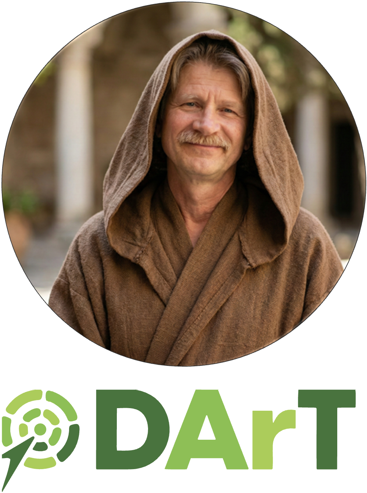
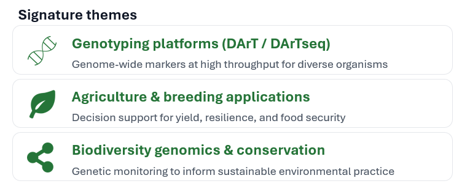

```{r setup, include=FALSE}
library(learnr)
knitr::opts_chunk$set(echo = TRUE, eval = FALSE)
```

## W13 Sequencing Technologies

{.class width="200" height="200"} {.class width="200" height="200"}

### Presentation by Dr Andrzej Kilian

#### Founder & Managing Director, DArT (Diversity Arrays Technology)


