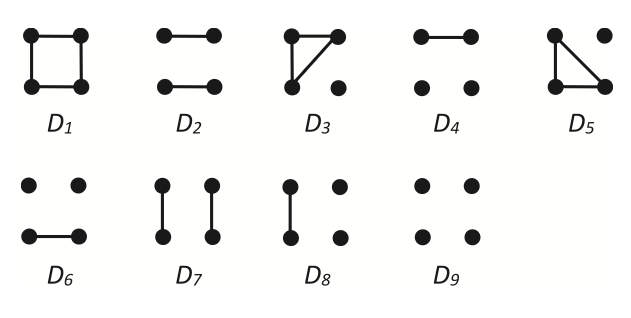
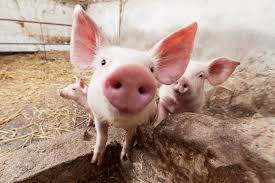
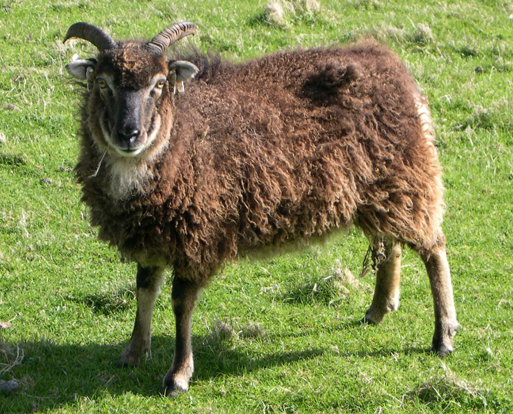

```{r klippy, echo=FALSE, include=TRUE}
klippy::klippy(position = "right", color = "black")
```

::: {style="display:flex; justify-content:space-evenly; flex-wrap:wrap; align-items:center; width:100%;"}
 
:::

```{r setup, include=FALSE}
library(gbRd)
library(tools)
library(dartRverse)
library(related)
library(reshape2)
library(data.table)
library(tidyverse)

knitr::opts_chunk$set(echo = FALSE)

pigTest <- readRDS("data/pigTest.rds")
sheepTest <- readRDS("data/sheepTest.rds")
pigFilterTwoPops <- readRDS("data/Pigtwopops.rds")

setup_item <- readRDS("data/setup_item.rds")
LSWt111Sim <- readRDS("data/LSWt111.rds")

source("scripts/utils.functions.diagnostics.relatedness.r")
source("scripts/utils.classes.diagnostics.relatedness.r")
source("scripts/infer_paternal_genotypes.R")
source("scripts/gl.diagnostics.relatedness.r")
```

## Calculating Relatedness and the concept of Identity by Descent (IBD)

------------------------------------------------------------------------

### Learning outcomes

In this session we will learn the basics of calculating relatedness within the dartRverse.

------------------------------------------------------------------------

## Session overview

-   **Introduction to calculating relatedness and the concept of IBD**
    -   Brief introduction to the concept of genetic relatedness
    -   What it means for individuals to share alleles identical by descent, and how relatedness coefficients are estimated
    -   An overview of common relatedness estimators
-   **Relatedness in dartR**
    -   Calculating relatedness in dartR and the functionality currently available
    -   Main functions and their use
-   **Case Study 1 - Pig breeding dataset**
    -   Introduction to the pig breeding dataset
    -   Cleanup and data preparation
    -   Comparison of methods
-   **Case Study 2 - Soay sheep dataset**
    -   Introduction to the Soay sheep dataset
    -   Cleanup and data preparation
    -   Comparison of methods
-   **Inferring an unknown relative - using COLONY**
    -   Intro to COLONY and the problem at large
    -   Reading in data and basic cleanup
    -   COLONY run and interpretation of output
    -   Matching an unknown SNP profile with an individual in the population
-   **Additional reading**
    -   References and additional reading
-   **Exercises**
    -   Exercises to work through
    -   Input participants' own data

------------------------------------------------------------------------

## Introduction to genetic relatedness

Estimating how related two individuals are is fundamental in ecological restoration, biodiversity conservation, and agricultural settings. It can provide important insights for managing breeding programs, small populations, mating dynamics, inbreeding, and a range of other key parameters.

The basis for most estimators is the concept of identity by descent (IBD), in which two alleles are considered identical if they are inherited from the same ancestral allele. Relatedness between two individuals is therefore a measure of the proportion of their alleles that are shared IBD, relative to a reference population. Kinship, a closely related measure, is the probability that two alleles, one sampled from each individual, are IBD. For non-inbred diploid individuals, the kinship coefficient is equal to half the coefficient of relatedness.

------------------------------------------------------------------------

#### Methods of estimating relatedness

There are many methods for estimating relatedness. Following Oliehoek et al. (2006), we will briefly introduce three broad categories of estimators:

1.  **Estimators based on the relationship between additive genetic relatedness, population genetic coancestry, and molecular coancestry.**
2.  **Estimators based on the relationship between additive genetic relatedness and two-gene and four-gene coefficients of identity in non-inbred populations, including Lynch and Ritland (1999) and Wang (2002).**
3.  **The Queller and Goodnight estimator.**

For the purposes of a general introduction, we will focus mainly on the first two categories, while also mentioning Jinliang Wang's more recent estimator, EMIBD9.

#### 1. Additive genetic relatedness methods

As described above, these estimators make use of estimates of coancestry, or the probability that two alleles drawn at random, one from each individual, are IBD. Coancestry and relatedness are expressed relative to a base population in which no alleles are IBD, so the coancestry among founders is set to 0.

Problems arise when estimating the allele frequencies of the base population, because all subsequent estimates depend on that reference. If the background level of allele sharing is incorrectly estimated, then the resulting relatedness estimates will be biased. If it is underestimated, then setting the base population further back in time tends to increase the estimated relatedness.

The inverse is also true: overestimating background allele sharing will tend to underestimate relatedness. One example is setting the base population equal to the current population, which can result in negative relatedness estimates for some pairs of individuals.

------------------------------------------------------------------------

#### 2. Additive genetic relatedness and two-gene / four-gene coefficients

These estimators instead consider the relationship between relatedness and the two-gene and four-gene coefficients of identity in non-inbred populations. Lynch and Ritland developed an estimator based on the regression of genotype probabilities of one individual on the genotype of the other individual in a pair. These approaches incorporate the probability that, at a given locus, one allele in individual *x* is IBD to one allele in individual *y*, as well as the probability that both alleles in individual *x* are IBD to both alleles in individual *y*.

------------------------------------------------------------------------

#### 3. EMIBD9

The EMIBD9 estimator differs from the methods above in that it uses a maximum-likelihood framework. In particular, it estimates the 9 condensed IBD coefficients originally described by Jacquard (1972), from which inbreeding and relatedness (or kinship) can be derived. Wang's approach is intended to reduce bias that can arise when allele frequencies are estimated from small samples or from samples containing many close relatives. One of its methods jointly estimates both allele frequencies and dyad probabilities from the genotype sample.

Being a continuous and relative measure, all estimates depend on the reference population from which allele frequencies are drawn. As such, we can reasonably expect even accurate estimates to differ from idealised pedigree expectations. In addition, all estimators make assumptions about the populations from which relatedness is being inferred. These may include, but are not limited to, non-overlapping generations, random mating, limited migration, limited admixture, and weak population structure.

Multiple studies have shown that there is no single estimator that performs best across all datasets and species. Estimator performance depends on the population, marker set, and sampling design. This means that relatedness estimation is highly context-dependent, and it is generally good practice to compare multiple estimators for any new dataset.

::: {style="display:flex; justify-content:space-evenly; flex-wrap:wrap; align-items:center; width:100%;"}

:::

## Relatedness in action - methods in dartR

We'll now walk you through some of the methods available in dartR for estimating relatedness.

### gl.grm

The `gl.grm` function calculates a genomic relationship matrix (GRM), described in dartR as an identity by descent matrix. It uses an additive relationship matrix approach implemented in `rrBLUP::A.mat`, following Endelman and Jannink (2012).

A basic output looks like this:

```{r, run_glm}
gl.grm(platypus.gl, plotheatmap = TRUE)
```

### gl.run.EMIBD9

`gl.run.EMIBD9` is a wrapper for Wang's EMIBD9 software, as described in Wang (2025). It requires a path to the EMIBD9 binary.

```{r run_emibd9, eval=FALSE, echo=FALSE, message=FALSE}
# Code not evaluated - can take quite a while to run depending on computing power.
system("chmod +x ./data/EM_IBD_P")

gl.run.EMIBD9(
  gl.filter.callrate(platypus.gl, threshold = 1, mono.rm = TRUE),
  outpath = getwd(),
  emibd9.path = "data",
  ISeed = 42,
  plot.out = TRUE
)
```

### gl.run.colony

This function prepares an input file for Wang's COLONY software for estimating sibship and parentage. Although these methods are somewhat different from those used to calculate pairwise relatedness, they are still highly relevant in this context. For more information on how to run COLONY, see the ZSL software page and Wang and Jones (2010).

```{r, run_colony, eval=FALSE, echo=TRUE}
# Code not evaluated - can take quite a while to run depending on computing power.
system("chmod +x data/colony2s.ifort.out")

gl.run.colony(
  gl.filter.callrate(platypus.gl, threshold = 1, mono.rm = TRUE), 
  colony.path = "data", 
  outfile = "platypus.dat",
  outpath = tempdir()
)
```

### gl.diagnostics.relatedness

For ease of use, we have produced `gl.diagnostics.relatedness`, a wrapper that allows the user to call `gl.grm`, `gl.run.EMIBD9`, and the `coancestry()` function from the `related` package. The `related` package itself provides up to seven estimators, and the wrapper allows several methods to be compared within a single workflow. Users can also run Wright-Fisher simulations using `gl.sim.WF.run()` for broader exploratory analyses, but for our purposes here we will focus on comparing relatedness methods.

A basic run might look like this:

```{r diag-One, eval=FALSE, echo=TRUE, message=FALSE, include=FALSE}
gl.basic.run <- gl.diagnostics.relatedness(
  gl.filter.callrate(platypus.gl, threshold = 1, mono.rm = TRUE),
  cleanup = FALSE,
  which_tests = c("wang", "lynchrd"),
  IncludePlots = TRUE,
  runE9 = TRUE,
  e9Path = "data",
  e9parallel = TRUE,
  includedPed = FALSE,
  verbose = 0
)
```

This includes options to perform basic cleanup on the data (`cleanup = TRUE`), select which estimators to run from `coancestry`, include plots, run EMIBD9 (`runE9 = TRUE`), set the output path for EMIBD9, and specify whether the data include a pedigree. If a pedigree is included, the function can calculate average relatedness for pairwise relationship classes such as parent-offspring, full siblings, half siblings, and first cousins, and use these as a baseline for comparing the outputs of the chosen estimators.

## Example 1 - Peppa Pig gets an SNP panel!



Our first dataset is derived from SNP panels generated for 3,534 pigs sampled from commercial farms across the United States. In addition to extensive genomic records for much of the population, there is also substantial life-history information, including age, sex, and parentage.

We also know that this dataset contains substantial genetic structure, which is unsurprising given its origin. We therefore expect violations of some of the assumptions commonly made by pairwise relatedness estimators, including the assumption of a single, panmictic population with a shared allele-frequency distribution.

#### Data cleanup and QC

We'll start with a simple sweep of the dataset, removing individuals with low call rate and filtering monomorphic loci, loci with excess heterozygosity, and low-frequency alleles.

```{r filter-callrate, echo=TRUE, results="hide", warning=FALSE}
pigFilter <- gl.filter.callrate(pigTest, method = "ind", threshold = 0.5)
```

```{r filter-mono1, echo=TRUE, results="hide"}
pigFilter <- gl.filter.monomorphs(pigFilter, verbose = 5)
```

```{r filter-mono2, echo=TRUE, results="hide"}
pigFilter <- gl.filter.excess.het(pigFilter, recalc = TRUE, verbose = 5)
```

```{r filter-mono3, echo=TRUE, results="hide"}
pigFilter <- gl.filter.maf(pigFilter)
```

Having filtered for a variety of metrics, we will now create a PCA plot to examine the extent of genetic structure within the population.

```{r print-PCA}
pigFilter <- gl.gen2fbm(pigFilter)
pigPCA <- gl.pcoa(pigFilter, verbose = 1, plot.out = FALSE)
pigPCAPlot <- gl.pcoa.plot(pigPCA, pigFilter)
```

There appears to be fairly strong genetic structure within the dataset, with a clear separation of two groups.

Based on this PCA output, we'll quickly assign groups based on their values from the first principal component before running `utils.basic.stats()`. We are doing this so that the calculations for statistics such as $F_{IS}$ and $H_S$ are made with the two inferred groups taken into account. If we ran the analysis with the single population that is currently assigned, the implicit assumption would be that allele frequencies are constant across the whole sample, which is unlikely to be true. We'll show how to assign populations more formally a bit later, but for now just trust us :).

```{r, basic_stats}
basic_stats <- utils.basic.stats(pigFilterTwoPops)
basic_stats$overall
```

These results are broadly consistent with the structure we observed in the PCA. With $F_{IS} < 0$, there is a slight excess of heterozygotes relative to Hardy-Weinberg expectations, suggesting little evidence of inbreeding at this level. An $F_{ST}$ of 0.0406 indicates low but non-zero genetic differentiation. In addition, the total expected heterozygosity ($H_T$) is higher than the average expected heterozygosity within subpopulations ($H_S$), indicating differences in allele frequencies among groups. Taken together, these results suggest that we are not dealing with a single large panmictic population, but rather two subpopulations with distinct allele frequencies.

We will continue our analysis for the purposes of illustration, but our results so far suggest that some relatedness estimators may perform less well unless we account for this structure.

#### Running gl.diagnostics.relatedness

```{r diag-One_three, echo=FALSE, include=FALSE}
diagOne <- readRDS("data/diagOne.rds")
```

```{r diag-One_five, echo=TRUE, eval=FALSE}
gl.diag.pig <- gl.diagnostics.relatedness(
  pigFilter, 
  cleanup = TRUE, 
  which_tests = "wang", 
  IncludePlots = TRUE, 
  varOut = TRUE, 
  rmseOut = TRUE, 
  runE9 = TRUE,
  e9Path = "data",
  e9parallel = TRUE,
  includedPed = TRUE
)
```

```{r diag-One_one, echo=TRUE}
diagOne@plotList$Iteration1[[1]]
```

```{r diag-One_two, echo=TRUE}
diagOne@plotList$Iteration1[[2]]
```

We can now interrogate our outputs. We'll start by comparing the basic outputs of our estimates.

We'll focus on estimates of parent-offspring, full-sib, and half-sib relationships, because the accuracy of most methods declines as relatedness becomes more distant.

The initial plot is a box-and-whisker plot of average relatedness at each relationship level. The red dotted line shows the expected level of relatedness for that group, as derived from the pedigree. The second plot is a density plot displaying the total number of pairwise groupings at each relatedness level.

Interrogating our results, we can see that all methods tend to overestimate expected relatedness for parent-offspring, full siblings, and half siblings. For pairwise estimators such as Wang (2002), a key assumption is that individuals are drawn from a large panmictic population with a single shared allele-frequency distribution. Under strong population structure, individuals from the same subpopulation can share alleles at elevated frequencies even when they are not closely related.

To counter this, we can separate the populations, ensuring that allele frequencies are estimated within a single subpopulation. This should, in theory, reduce inflated relatedness estimates and improve accuracy.

To separate the populations, we will divide them using their scores on PCA axis 1. Individuals with negative PCA1 values will be classed as Group A and those with positive PCA1 values will be classed as Group B. We can then simply re-run the analysis within each subpopulation.

```{r subset-PCA, echo=TRUE}
groupA <- unique(which(pigPCA$scores[, 1] < 0))
groupB <- unique(which(pigPCA$scores[, 1] > 0))

groupA <- pigFilter[groupA]
groupB <- pigFilter[groupB]
```

### Group A

```{r group_A, echo=FALSE, include=FALSE}
diagGroupA <- readRDS("data/diagGroupA.rds")
```

```{r groupA_one, echo=TRUE, include=TRUE, eval=FALSE}
diagGroupA <- gl.diagnostics.relatedness(
  groupA,
  cleanup = TRUE, 
  which_tests = "wang", 
  IncludePlots = TRUE, 
  varOut = TRUE, 
  rmseOut = TRUE, 
  runE9 = TRUE,
  e9Path = "data",
  e9parallel = TRUE,
  includedPed = TRUE
)
```

```{r groupA_four, echo=TRUE}
diagGroupA@plotList$Iteration1[[1]]
```

```{r groupA_two, echo=TRUE}
diagGroupA@plotList$Iteration1[[2]]
```

### Group B

```{r group_B, echo=TRUE}
diagGroupB <- readRDS("data/diagGroupB.rds")
```

```{r groupB_give, echo=TRUE, include=TRUE, eval=FALSE}
diagGroupB <- gl.diagnostics.relatedness(
  groupB,
  cleanup = TRUE, 
  which_tests = "wang", 
  IncludePlots = TRUE, 
  varOut = TRUE, 
  rmseOut = TRUE, 
  runE9 = TRUE,
  e9Path = "data",
  e9parallel = TRUE,
  includedPed = TRUE
)
```

```{r groupB_four, echo=TRUE}
diagGroupB@plotList$Iteration1[[1]]
```

```{r groupB_two, echo=TRUE}
diagGroupB@plotList$Iteration1[[2]]
```

As expected, separating the populations improves the estimates produced by our relatedness methods. The estimates are pulled downward and are more consistent with the pedigree-derived expectations. In addition, there appears to be greater concordance in the number of pairwise relationships identified by each method, as seen in the density plots for both Group A and Group B.

This example highlights the importance of considering population structure when calculating relatedness. In some cases, separating structured populations can be a simple and effective way to improve estimator performance.

## Example 2 - Sean the sheep!

{width="50%"}

The Soay sheep is a primitive breed descended from sheep found on the island of Soay in the St Kilda archipelago, west of mainland Scotland. A population on the island of Hirta has been counted since 1952 and intensively monitored in its present form since 1985, making it a well-known model system for ecology, evolution, and population dynamics. Over time, this long-term study has been complemented by microsatellite, SNP, and whole-genome data, together with an extensive pedigree and rich life-history information.

We've chosen this dataset to provide an example of a population with less obvious large-scale subdivision than the pig dataset, and with unusually rich pedigree and genomic resources. As a result, we expect a better fit to the assumptions of standard relatedness estimators than we saw for the pig data, although the population should not be treated as perfectly panmictic or entirely free of inbreeding.

#### Cleanup

```{r filter-callrate-sheep, echo=TRUE, include=FALSE}
sheepTest <- readRDS("data/sheepTest.rds")
```

As with the pig dataset, we'll start with a simple sweep of the dataset, removing individuals with low call rate and filtering monomorphic loci and low-frequency alleles.

```{r filter-callrate-sheep2, echo=TRUE, results="hide", warning=FALSE}
sheepFilter <- gl.filter.callrate(sheepTest, method = "ind", threshold = 0.5)
```

```{r filter-mono-sheep, echo=TRUE, results="hide"}
sheepFilter <- gl.filter.monomorphs(sheepFilter, verbose = 5)
```

```{r filter-mono11, echo=TRUE, results="hide"}
sheepFilter <- gl.filter.maf(sheepFilter)
```

We can now conduct a PCA to determine what, if any, structure we can detect in the population.

```{r print-PCA-sheep_two, include=FALSE}
sheepFilterPCA <- readRDS("data/sheepFilterPCA.rds")
sheepDiag <- readRDS("data/sheepDiag.rds")
```

```{r print-PCA-sheep, include=TRUE}
sheepFilter <- gl.gen2fbm(sheepFilter)
sheepPCA <- gl.pcoa(sheepFilter, verbose = 1, plot.out = FALSE)
sheepPCAPlot <- gl.pcoa.plot(sheepPCA, sheepFilter)
```

From the PCA, there appears to be little obvious large-scale genetic structure, suggesting weaker subdivision than in the pig dataset. That does not mean the population is perfectly panmictic or free of inbreeding, but it does suggest that population structure may be less problematic for pairwise relatedness estimation here.

Just to be sure, though, we will conduct another `utils.basic.stats()` run.

```{r, basic_stats_sheep}
basic_stats <- utils.basic.stats(sheepFilter)
basic_stats$overall
```

With only one population assigned, we cannot calculate measures of differentiation among subpopulations, but with a relatively low $F_{IS}$ value of 0.0145 there appears to be only a slight heterozygote deficit at the population level. Overall, this suggests that the relatedness estimates may be more consistent here than in the pig dataset.

#### Relatedness analysis

```{r groupB_one, echo=TRUE, include=TRUE, eval=FALSE}
sheepDiag <- gl.diagnostics.relatedness(
  sheepFilter,
  cleanup = TRUE, 
  which_tests = "wang", 
  IncludePlots = TRUE, 
  varOut = TRUE, 
  rmseOut = TRUE, 
  runE9 = TRUE,
  e9Path = "data",
  e9parallel = TRUE,
  includedPed = TRUE
)
```

```{r sheepDiag, echo=TRUE}
sheepDiag@plotList$Iteration1[[1]]
```

```{r sheepDiag_two, echo=TRUE}
sheepDiag@plotList$Iteration1[[2]]
```

As expected, all methods show an improved fit relative to the initial results for the pig dataset. We can, however, still observe a fair degree of variance in estimates of full-sibling relatedness.

## Exercises

Having now learnt the basics of estimating relatedness, you can work through some exercises that mimic the skills introduced above.

{width="20%"}

You have spent the last 6 months in the Murray-Darling studying the platypus. You have been trying to understand the genetic basis of its famous bill, which you suspect may be an indicator of sexual fitness and general health.

To understand the molecular basis of this trait and how it is inherited, you have collected samples from 81 individuals and constructed a pedigree by hand from known crosses observed in the wild. Unfortunately, the pedigree was lost when you spilt a full glass of coffee on your laptop!

As a result, you are now left with just the SNP data from previous samples, from which to reconstruct the pedigree, but you are unsure which method is best. You have faith in the dartR package, however, and decide to use it to try to reconstruct your lost pedigree.

#### 1.1 Data read-in

Let's start by reading in the data. It's stored in the `data` folder, which you can access in the folder for tutorial 16. There is both an `.RDS` file and a `.vcf` file. You can read the data in using base R's `readRDS()` function. For an extra challenge, you can try to read in the VCF file.

```{r, readin, exercise=TRUE, eval=TRUE}
# Reading in the RDS file
platypusSNP <- readRDS("data/platypusSNP.rds")
```

#### 1.2 Data filtering

Next we can do some basic data QC - this should be trivial by now!

```{r, QC, exercise=TRUE, eval=TRUE, exercise.timelimit=120}
# Reading in the RDS file
platypusSNP <- readRDS("data/platypusSNP.rds")

# Do a simple report of basics
# gl.report.allna()
# gl.report.callrate()
# gl.report.monomorphs()
# gl.report.rdepth()
# gl.report.sexlinked()

# Time to do some filtering
platypusSNP <- gl.filter.allna(platypusSNP)
platypusSNP <- gl.filter.callrate(
  platypusSNP
  # The rest is up to you
)
platypusSNP <- gl.filter.monomorphs(platypusSNP)
platypusSNP <- gl.filter.rdepth(
  platypusSNP
  # The rest is up to you
)
platypusSNP <- gl.filter.sexlinked(
  platypusSNP
  # The rest is up to you
)
```

#### 1.3 Data QC

Now we can check the composition of our population - just to ensure nothing is awry!

```{r, PCOA, exercise=TRUE, eval=TRUE}
# Start with basic PCoA plot
platypusSNP <- gl.gen2fbm(platypusSNP)
incaPCOA <- gl.pcoa(platypusSNP, nfactors = 5)
incaPCOAPlot <- gl.pcoa.plot(incaPCOA, platypusSNP)
```

What do you think? Is it worth separating into groups or analysing as one?

Next we can check the heterozygosity / inbreeding coefficient.

```{r, hetCheck, exercise=TRUE, eval=TRUE}
gl.report.heterozygosity(platypusSNP, method = "ind")
```

What do you think? Is heterozygosity low, or is inbreeding elevated?

#### 1.4 Relatedness run

Time to run `gl.diagnostics.relatedness()`! We've written a skeleton; you fill in what you think each value should be.

```{r, gl_diag_run, exercise=TRUE, eval=TRUE}
incaTernrelated <- gl.diagnostics.relatedness(
  platypusSNP, 
  cleanup = "T/F", 
  which_tests = "wang",
  IncludePlots = "T/F",
  plotOut = "T/F",
  varOut = "T/F",
  rmseOut = "T/F", 
  runE9 = "T/F", 
  e9Path = "data"
)
```

Feel free to look at the output. What do you think is the best method for reconstructing your pedigree?

## References

Endelman, J. B., & Jannink, J.-L. (2012). Shrinkage estimation of the realized relationship matrix. *G3: Genes, Genomes, Genetics*, 2(11), 1405-1413. <https://doi.org/10.1534/g3.112.004259>

Hauser, S. S., Galla, S. J., Putnam, A. S., Steeves, T. E., & Latch, E. K. (2022). Comparing genome-based estimates of relatedness for use in pedigree-based conservation management. *Molecular Ecology Resources*, 22(7), 2546-2558. <https://doi.org/10.1111/1755-0998.13630>

Jacquard, A. (1972). Genetic information given by a relative. *Biometrics*, 28(4), 1101-1114. <https://doi.org/10.2307/2528643>

Lynch, M., & Ritland, K. (1999). Estimation of pairwise relatedness with molecular markers. *Genetics*, 152(4), 1753-1766. <https://doi.org/10.1093/genetics/152.4.1753>

Oliehoek, P. A., Windig, J. J., van Arendonk, J. A. M., & Bijma, P. (2006). Estimating relatedness between individuals in general populations with a focus on their use in conservation programs. *Genetics*, 173(1), 483-496. <https://doi.org/10.1534/genetics.105.049940>

Queller, D. C., & Goodnight, K. F. (1989). Estimating relatedness using genetic markers. *Evolution*, 43(2), 258-275. <https://doi.org/10.2307/2409206>

Wang, J. (2002). An estimator for pairwise relatedness using molecular markers. *Genetics*, 160(3), 1203-1215. <https://doi.org/10.1093/genetics/160.3.1203>

Wang, J. (2025). EMIBD9: Estimating 9 condensed IBD coefficients, inbreeding and relatedness from marker genotypes. *Heredity*, 134(3), 155-161. <https://doi.org/10.1038/s41437-024-00739-5>

Wang, J., & Jones, O. R. (2010). COLONY: A program for parentage and sibship inference from multilocus genotype data. *Molecular Ecology Resources*, 10(3), 551-555. <https://doi.org/10.1111/j.1755-0998.2009.02787.x>
