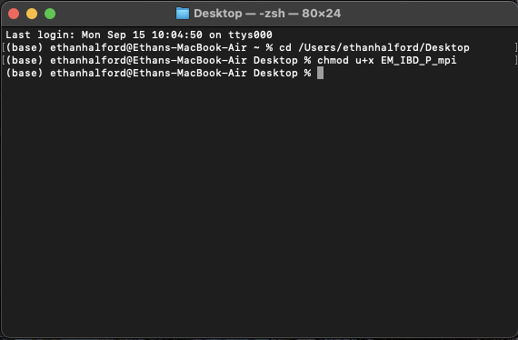
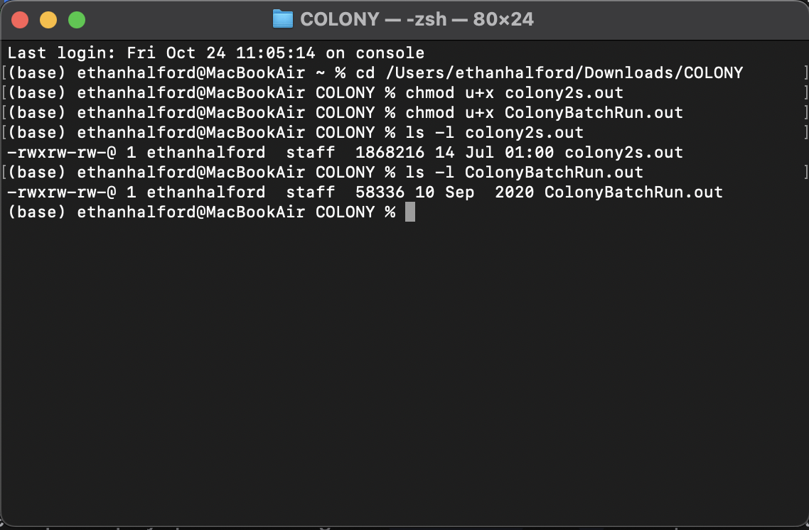

```{r setupa, include=FALSE}
library(learnr)
knitr::opts_chunk$set(echo = TRUE, eval = FALSE)
```

## W16 Relatedness

{.class width="200" height="200"} {.class width="200" height="200"}

```{r setupb, include=FALSE, eval=FALSE}
library(gbRd)
library(tools)
library(semantic.dashboard)
devtools::install_github("https://github.com/green-striped-gecko/dartR.captive/tree/dev_ethan")
library("dartR.captive")
library(dartRverse)
knitr::opts_chunk$set(echo = FALSE)

pigTest <- readRDS("data/pigTest.rds")
sheepTest <- readRDS("data/sheepTest.rds")


setup_item <- readRDS("data/setup_item.rds")
LSWt111Sim <- readRDS("data/LSWt111.rds")


source("scripts/infer_paternal_genotypes.R")

```

## Learning outcomes

In this session we will learn the basics of calculating relatedness within the dartRverse.

------------------------------------------------------------------------

## Session overview

-   **Introduction to Calculating Relatedness and the concept of IBD**
    -   Brief introduction to the concept of genetic relatedness
    -   What does it mean for individuals to be Identical By Descent and how to calculate an IBD coefficient
    -   Specific methods of calculating relatedness - an overview
-   **Relatedness in dartR**
    -   Calculating relatedness in dartR - what functionality currently exists
    -   Main functions and their use
-   **Pedigrees - their use**
    -   What is a pedigree?
    -   Their use in calculating relatedness
    -   Using pedigrees within dartR
-   **Simulation for relatedness - basics**
    -   Brief follow on from Bernd Gruber's session
    -   Overview for inputs and their meaning
    -   Use of simulations to compare methods of calculating relatedness
    -   Interpreting output
-   **Adding complexity - use of EMIDB9**
    -   EMIDB9 - brief recap of introduction
    -   How to install EMIBD9
-   **Case Study 1 - Pig breeding dataset**
    -   Introduction to the pig breeding data set
    -   Cleanup and data preparation
    -   Comparison of methods
-   **Case Study 2 - Soay sheep dataset**
    -   Introduction to the Soay sheep dataset
    -   Cleanup and data preparation
    -   Comparison of methods
-   **Inferring an unknown relative - using COLONY**
    -   Intro to COLONY and problem at large
    -   Reading in data and basic cleanup
    -   Downloading and installing COLONY binaries
    -   COLONY run - interpreting output
    -   Matching unknown SNP with individual in population]
-   **Additional reading**
    -   References and additional reading
-   **Exercises**
    -   Exercises to work through
    -   Input participants own data
-   **Wrap up**

------------------------------------------------------------------------

## Introduction to Genetic relatedness

#### Tutorial introduction

Parentage analysis is highly useful for the estimation of relatedness across a variety of fields including -- conservation, agriculture and human genomics. It provides a succinct and highly accurate way of measuring a variety of forces including sexual selection, effective population size, speciation and natural selection.

The ability to estimate relatedness is a highly useful tool and sees use across a variety of fields, including but not limited to: conservation, agriculture and human genomics. In estimating relatedness, one can succinctly and accurately measure a variety of genetic forces that may be at play within a population, such as: sexual selection, effective population size, speciation and natural selection.

Estimating how related two individuals are is fundamental in ecological restoration, biodiversity conservation and agricultural settings, providing an important metric in the management of breeding programs, small populations, and for providing understanding of mating dynamics, inbreeding and a host of other key parameters.

The basis for the most popular estimators is the concept of identical by descent -- or IBD; in which two alleles are identical if they are copies of the same allele found in a reference population. Relatedness between two individuals is therefore equal to the proportion of alleles shared between them which are IBD. Kinship, which is a similar measure -- is the probability that two alleles, one taken from each individual, are IBD . As such, kinship is equal to half the relatedness value for any two individuals -- given that it considers ..... As described in wang (X year), we summarise....

------------------------------------------------------------------------

#### Methods of estimating relatedness

Oliehoek et al (2005) summarized contemporary methods as being categorized into 3 distinct groups:

There are a variety of methods for estimating relatedness, however we will focus on 3 distinct methods, as described by Oliehoek et al; those being:

1.  **Those using relationship between additive genetic relatedness – r, population genetic co-ancestry and molecular co-ancestry.**\
2.  **Those using the relationship between additive genetic relatedness and two gene and four gene coefficients of identity in “non-inbred” populations and consists of Wang (2002) and Lynch and Ritland (1999) and its associated spin offs**\
3.  **Queller and Goodnight**\

However for the purposes of a general introduction we only focus on the first two, with the addition of Jinliang Wang's most recent estimator - EMIBD9.

#### 1. Additive genetic relatedness methods

As described above -- these estimators make use of estimates of coancestry -- or the probability that two alleles drawn at random, one from each individual, -- are IBD. Coancestry and relatedness are expressed relative to a base population -- in which no alleles are IBD, hence the co-ancestry between founders is 0.

These estimators - make use of the molecular similarity index - referring to a single locus in a pair of individuals - defined as the probability that two marker alleles drawn from two individuals are IBD. Alleles that are molecularly identical in the base population are deemed alike in state (AIS).

Problems arise when estimating the allele frequencies for the base population - from which all other estimates are drawn. If the average level of AIS is incorrectly estimated - the resulting estimate will be biased accordingly. If it is underestimated - then the "further back" in time the base population is set - leading to an increase in estimated relatedness.

The inverse is also true - an overestimation of AIS will result in an underestimating of relatedness. An example is setting the base population equal to the current population - resulting in negative estimates for some pairs of individuals.

------------------------------------------------------------------------

#### 2. Additive genetic relatedness and two and four gene coefficients

These estimators consider instead the relationship between relatedness and the two and four gene coefficients of identity in non-inbred populations. Lynch and Ritland developed an estimator based on regression of genotype probabilities of one individual on genotype of the other individual of a pair. Thus these include the probability that at a certain locus - a single allele in individual x is IBD to a single allele in individual y and also the probability that both alleles in individual x are IBD to both alleles in individual y.

------------------------------------------------------------------------

#### 3. EMIBD9

The EMIBD9 estimator differs from those previously mentioned -- given it use of a maximum likelihood method. In particular it uses the estimation of 9 condensed modes of IBD originally described by Albert Jacquard (1972) -- which present the different methods by which 2 individuals at biallelic loci can share IBD alleles. Wang attempts to counteract the bias inherent in the previously mentioned methods - particulary when dealing with inbred populations. In particular he attempts to counter the assumption oft used - of drawing allele frequencies from the same population for which relatedness is attempting to be estimated. Given the assumptions of highly outbred and unrelated populations are frequently violated in such cases - this results in an underestimate of closely related individuals and an overestimate of unrelated/distantly related individuals. To counteract this - Wang proposes the joint estimation of both allele frequencies and dyad probabilities from a sample of genotypes.

Relatedness is an imperfect measure however, and comes with a few key caveats. Being a continuous and relative measure, all estimates depend on the reference population from which the allele frequencies are drawn. As such we can reasonably expect even the most accurate measure to differ considerably from our expected values. In addition, all estimates make broad assumptions about the populations for which relatedness is being inferred. These include, but are not limited to: non-overlapping generations, random mating, little or no migration, gene flow or admixture - or otherwise heavily pronounced "genetic structure".

In addition, multiple studies have failed to come to a consensus with regards to a "superior" estimator between species, populations etc. This would suggest that there is no "ideal" estimator in this regard. Galla et al (2022), found variable performance of estimators across species - and advocated for an "explicit evaluation of multiple estimators for each new data set and system." Similarly, Harrison et al (2013) found that when comparing 3 common methods - there was broad consensus between that "all three could be applied with confidence". In addition, they found accuracy to increase in relation with number of loci and individuals sampled - particulary in highly polymorphic regions, suggesting accuracy may also be a function of sampling depth

As such it becomes evident that parentage is a complex, and highly subjective subject in many regards, with a variety of estimators providing for a wide degree of accuracy and specificity across varying circumstances.

\begin{center}

\end{center}

## Introduction to relatedness in dartR

### Intro

Welcome to this interactive R tutorial designed to provide you with a brief overview of how to use the gl.relatedness.diagnostics function - found in the dartR.captive package. This function allows for the comparison of various methods for estimating relatedness - with a focus on comparing accuracy and specificity.

We'll start with something basic - loading a github distro. Run the following code to install a dev copy of dartR.captive:

```{r basic, exercise=TRUE}
devtools::install_github("https://github.com/green-striped-gecko/dartR.captive/tree/dev_ethan")
```

## Using pedigrees

### Creating pedigrees

We'll start by reading in some data and sub-setting it - to cut down and run time. There are two possible data sets we've provided which have attached pedigrees - Pig and Sheep. We've already read in the data sets, using your knowledge of dartR and the genlight format - please subset the data frame from its original size to only 200 individuals and 300 loci please. (hint - for loci use gl.subsample.loci())

Load in either the Pig or Sheep data set and then subset to only 200 individuals and 300 loci.

```{r print-pig, exercise=T}
pigTest
```

An example of what the output should look like:

```{r print-limit-hint}
pigTest <- pigTest[1:100] %>%
  {. <- gl.subsample.loci(., 300); .}
print(pigTest)
```

### Generating pedigrees - draft may include may not

We can now run gl.diagnostics.relatedness with an attached pedigree. We will focus particularly on providing output with the Variance and RMSE output for testing the accuracy of various methods of estimating relatedness. To begin we'll provide a little hint with CRAN documentation - providing you a rundown of the inputs for the function.

Brief overview of function from CRAN documentation.

------------------------------------------------------------------------

#### Basic Run

We'll start with a basic - run without use of the RMSE or Var output providing you with the basic output. We'll generate the item and then you can work out how the access the various slots within the object. (Hint - use the \@ accessor)

```{r, include=T}
setup_item <- gl.diagnostics.relatedness(pigTest, 
                           cleanup = T, 
                           run_sim =, 
                           which_tests = c("wang", "lynchli"),
                           IncludePlots = T,
                           rmseOut =F,
                           varOut = F,
                           numberIterations = 1, 
                           numberGenerations = 3,
                           includedPed = T
)

```

```{r access_item, exercise=TRUE, exercise.eval=F}
setup_item 
```

 - Ethan Halford

 - Ethan Halford

#### Generating plots with RMSE and Var

By now you should be able to figure out how to generate plots using your presaved datatset - now try and calculate RMSE and Var using the gl.diagnostics.relatedness, and then access the resulting plots. If in doubt you can check the hint below however please try by yourself first.

```{r, first-excercise-hint, exercise = T, exercise.eval=F}
setup_item <- gl.diagnostics.relatedness(pigTest, 
                           cleanup = T, 
                           run_sim =F, 
                           which_tests = c("wang", "lynchli"),
                           IncludePlots = T,
                           rmseOut =T,
                           varOut = T,
                           includedPed = T
)
setup_item@corOutList
```

 - Ethan Halford

 - Ethan Halford

## Running a simulation

We'll next move on to running simulations - used to compare methods of calculating relatedness. The simulations are conducted using the gl.sim functions found in the dartR.sim package - <https://cran.r-project.org/web/packages/dartR.sim/refman/dartR.sim.html>. First we begin with reading in the reference table - containing the parameters that will encode the simulation. Whilst all this is done for you as a part of the function - we must still read in two important CSV files - ref_variables.csv and sim_variables.csv - used to provide the parameters for the simulation.

We'll begin with reading both sim_variables and ref_variables to check if they exist,

```{r, read-files, exercise=T}
# Reference variables for reference table 
ref_variables <- read.csv("data/ref_variables.csv")

#Simulation variables 
sim_variables <- read.csv("data/sim_variables.csv")
```

### Brief overview of Reference and Simulation parameters.

As defined in the dartR.sim documentation there are more than X parameters one can edit when setting up a simulation. For our purposes we will focusing on those having the most pronounced effects on relatedness.

#### Chromosome length/chunk

-   Chunk Number - \# of chromosome chunks
    -   Chunk_bp - number of base pairs per chromosome chunk
    -   Chunk_cm - number of centimorgans per chromosome chunk

These settings are all functions of chromosome length - defining the number of base pairs found along each chromosome. As discussed above, relatedness is partially a function of chromosome length - such that increasing the average length induces X result and decreasing it induces Y result - take caution in this regard.

#### Simulation variables

-   Replace parents - whether parents reproduce more than once Influences number of offspring found within population - obviously has implications for relatedness .....

-   Chromosome_name - chromosome from which to extract allele frequencies Influences reference allele frequencies - determines reference allele frequency from which estimates of IBD are drawn. As such this choice has an out sized effect on estimates of relatedness.

### Your first simulation run

Having read in the files necessary to run the simulation we will now actually conduct a simulation run - using our ref_variables and sim_variables files read in earlier. Now we will assume you have enough know-how to run a basic simulation using prior knowledge provided to you in the tutorial. We will have however start you off, with the important note being that any simulation must be run for at least 3 generations to allow for the creation of the sufficient parent-offspring relationships to allow for the calculation of relatedness levels.

```{r, first-sim, exercise = T, exercise.eval=F}
firstSim <- gl.diagnostics.relatedness(pigTest, 
                           cleanup = T, 
                           run_sim =F, 
                           #ref_variables = #insert path to ref_variables, 
                           #sim_variables = #insert path to sim_variables, 
                           which_tests = c("wang", "lynchli")
                           #numberGenerations = 3, 
                           # From here include any further options to may want 
)

```

### Accessing your sim object

Having successfully conducted your first simulation run we can now check the slots of our simulation item - with a similar method as above. To find the slot names you can check the CRAN documentation provided on the previous page.

```{r, first-sim-access, exercise=T}
# Access the slots of firstSim
firstSim
```

## Installing EMIBD9

In addition to the tests provided by the related package we provide the option to include EMIBD9 in the suite of tests run. First we must install EMIDB9 and its associated binaries before doing so. Binaries and installation instructions can be find at - <https://www.zsl.org/about-zsl/resources/software/emibd9>.

### Mac

Once installation has been completed we must make the binary accessible to our system - to do access the terminal and input the following commands as seen below.



## Example of comparing methods - Pig datatset

### Introduction to dataset

To illustrate the outcome of using different methods for estimating relatedness, we'll conduct said comparison on an example data set - with an attached pedigree - in this case we'll be using the Pig data set as described in Cleveland et al (2021). This consists of genomic data taken from 3534 pigs found on farms across the United States. In addition to extensive genomic records for a large majority of the population there exists an extensive life history, including age, sex and parentage. As such this data set provides a perfect example for comparing the results of different methods of estimating relatedness - given the possession of an extensive pedigree against which to compare the results. In addition the data set is found to contain high levels of genetic structure - with 2 highly pronounced populations - as such it allows use to analyse the efficacy of different methods at estimating relatedness in the presence of confounding factors - such as inbreeding, assortative mating, etc.

#### Data cleanup and imaging

#### Cleanup

We'll start with a simple sweep of the datatset removing those loci with low read count and filtering on depth.

```{r filter-callrate, echo=T, results="hide", warning=F}
pigFilter <- gl.filter.callrate(pigTest, method = "ind", threshold = 0.5)
```

```{r filter-mono, echo=T, results="hide"}
pigFilter<- gl.filter.monomorphs(pigFilter,verbose = 5)
```

```{r filter-call, echo=T, results="hide"}
pigFilter <- gl.filter.callrate(pigFilter,method = "loc", threshold = 0.95,verbose = 5)
```

Having filtered for a variety of metrics such as call rate and monomorphs we will now create a PCOA plot to examine they extent of genetic structure extent within the population

```{r print-PCA}
pigFilter <- readRDS("data/pigFilter.rds")
pigFilterPCA <- readRDS("data/pigFilterPCA.rds")
pigPCAPlot <- gl.pcoa.plot(pigFilterPCA, pigFilter)

```

As seen, there appears to be quite strong genetic structure within the population - with the clear segregation of two populations. We'll begin with a simple gl.relatedness.diagnostics run without consideration for this genetic structure.

```{r diag-One, echo=TRUE}
diagOne <- readRDS("data/diagOne.rds")
diagOne@plotList$Iteration1[[1]]
```

```{r diag-One_two, echo=TRUE}
diagOne <- readRDS("data/diagOne.rds")
diagOne@plotList$Iteration1[[2]]
```

As we can see certain methods - EMIBD9 and Wang (2002) have a tendency to overestimate the levels of relatedness present - as such its evident that due the aforementioned methods used in calculating relatedness it struggles with genetic structure present in the data set. To compensate we'll separate out the two populations and then perform the analysis separately within each population to see the resulting effects on the estimates.

Returning to the PCA plot, as discussed above we see 2 well-deliminated populations as such we will separate individuals down the middle, either to the left or right of the y axis, being populations A and B respectively.

```{r subset-PCA, echo=T}
groupA <- unique(which(pigFilterPCA$scores[,1] < 0))
groupB <- unique(which(pigFilterPCA$scores[,1] > 0))

groupA <- pigFilter[groupA]
groupB <- pigFilter[groupB]

```

### Group A

```{r groupA, echo=TRUE}
diagGroupA <- readRDS("data/diagGroupA.rds")
diagGroupA@plotList$Iteration1[[1]]
```

```{r groupA_two, echo=TRUE}
diagGroupA@plotList$Iteration1[[2]]
```

### Group B

```{r groupB, echo=TRUE}
diagGroupB <- readRDS("data/diagGroupB.rds")
diagGroupB@plotList$Iteration1[[1]]
```

```{r groupB_two, echo=TRUE}
diagGroupB@plotList$Iteration1[[2]]
```

We can now compare the results for both groupA and groupB running them separately through gl.diagnostics.relatedness

As we can see by separating out the two populations we improved the resulting fit of the estimates - with EMIBD9 having the most improvement - likely a result of the reduction in genetic structure seen.

## Example of comparing methods - Soay Sheep

### Introduction

The Soay sheep is a breed descended from feral sheep found on the island of Soay off the North coast of Scotland, in the St Kilda Archipelago. A population found on the island of Hirta has, since the 1950's, been subject to an extensive study, serving as a model for the research of evolutionary and population dynamics given its feral and unmanaged state. In the last 20 years with the introduction of micro-satellite, SNP and other complexity reduction methods - the study has taken on a new dimension with the addition of whole genome sequencing - allowing scientists to store whole genomic data for individuals within the population. In addition - there exists a large and comprehensive pedigree - providing a surfeit of data on parentage, sex, age and a variety of other characteristics.

#### Cleanup

We'll start with a simple sweep of the datatset removing those loci with low read count and filtering on depth.

```{r filter-callrate-sheep, echo=T, results="hide", warning=F}
sheepFilter <- gl.filter.callrate(sheepTest, method = "ind", threshold = 0.5)
```

```{r filter-mono-sheep, echo=T, results="hide"}
sheepFilter<- gl.filter.monomorphs(sheepFilter,verbose = 5)
```

```{r filter-call-sheep, echo=T, results="hide"}
sheepFilter <- gl.filter.callrate(sheepFilter,method = "loc", threshold = 0.95,verbose = 5)
```

Having filtered for a variety of metrics such as call rate and monomorphs we will now create a PCOA plot to examine they extent of genetic structure extent within the population

```{r print-PCA-sheep}
sheepFilter <- readRDS("data/sheepFilter.rds")
sheepFilterPCA <- readRDS("data/sheepFilterPCA.rds")
sheepPCAPlot <- gl.pcoa.plot(sheepFilterPCA, sheepFilter)

```

As seen by the PCA there appears to be little if any genetic structure evident within the population - that is there appears to be minimal if any sub-populations present within the group at large. As such we can reasonably expect the assumptions of our related estimates to hold - primarily it being that the population is large, outbred and undergoes random mating.

#### Related analysis

```{r sheepDiag, echo=TRUE}
sheepDiag <- readRDS("data/sheepDiag.rds")
sheepDiag@plotList$Iteration1[[1]]
```

```{r sheepDiag_two, echo=TRUE}
sheepDiag@plotList$Iteration1[[2]]
```

As expected - all methods held up to half-siblings, broadly congruent with the manual coding results - as seen by the red dotted line. There is a high degree of variance present for full-sibs (NOT SURE HAVE TO READ UP AS TO WHY). In addition all methods appear to greatly overestimate the general relatedness of the population evidenced by the plots seen for the half first and second cousins.

## Inferring an unknown relative - COLONY

COLONY is a program developed by Jinliang Wang at the ZSL for the inference of parentage and sibship from multilocus genelogical data. Through the use of a full-pedigree approach - COLONY can more accurately infer relatedness, however at the cost of an increase in computational demands. Samples are assumed to be taken from a large randomly mating population. Individuals are then partioned into three subsamples - offspring, candidate father and candidate mother. Offspring are either full-sibs, half-sibs or unrelated. - Come back to it.

### The problem

You have been breeding a small hatch of central bearded Dragons (Pogona Vitticeps), for the purposes of a full genome study. You have a highly fecund female - LSWt111 - who has had a clutch of 24 eggs. The issue arises in that you have no idea who the potential father could be - there are numerous candidate males within the enclosure. As such you need to reconstruct a paternal genotype from the SNP data you have for LSWt111 and her offspring.

### Generating a paternal genotype with COLONY

#### 1. Reading in the data

We'll begin by reading in the RDS data containing the data for LSWt111 and her offspring.

```{r read-rds, echo=T, warning=F}
LSWt111 <- readRDS("data/bella.RData")
LSWt111@other$ind.metrics
```

As expected the dataset contains 25 individuals - which if we investigate the individual metrics section - contains LSWt111 and her 24 offspring - each encoded as Bella_egg\_#. We can now perform some basic filtering as shown previously - focusing on call rate, missingness, sex-linked genes and monomorphs

#### 2. Filtering

##### 1. Call rate

```{r filter-Bella, echo=F, warning=F, results='hide'}
gl.report.callrate(LSWt111, method = "loc")

```

As we can see - callrate across all individuals is 1 - which would suggest there is no need to filter on callrate - even across loci there appears to be a high average callrate.

##### 2. Read depth

```{r reportRdepth-Bella, echo=F, warning=F, results='hide'}
gl.report.rdepth(LSWt111)
getwd()
```

Read depth is quite low across all individuals - average of approximately "X". As such we will set a range for filtering bewteen 10 and the max read depth of the sample - so as to capture the majority of

```{r filterRdepth-Bella, echo=F, warning=F, results='hide'}
LSWt111 <- gl.filter.rdepth(LSWt111, lower = 10, upper = max(LSWt111$other$loc.metrics$rdepth))
```

##### 3. Minor alleles, secondaries, HWE

```{r filterRest-Bella, echo=T, warning=F, results='hide'}
LSWt111 <- gl.filter.maf(LSWt111,threshold = 3,verbose = 5)
LSWt111 <- gl.filter.secondaries(LSWt111,verbose = 5)
LSWt111 <- gl.filter.hwe(LSWt111,verbose = 5)
```

#### 4. Downloading and preparing COLONY

The source for COLONY can be found at the ZSL website - under the "software" banner - <https://www.zsl.org/about-zsl/resources/software/colony>. After downloading the relevant binary for your system you will then have to through the steps outlined in the relevant README.txt file.

For this tutorial will we focus on UNIX systems (Linux/MacOS).

After downloading and unwrapping the relevant folder - we must prepare the binaries for use by R. Step by step instructions can be found in the image below.

\\begin{center} {width="75%"} \\end{center}

First we should navigate to the folder containing the binaries; in this case its found in my downloads, be sure to use the specific directory in which the binary is stored on your computer.

Next we make the binaries executable, using the chmod u+x command, as seen above. On Unix systems (MacOs/Linux) this must be done for both the colony2s.out and ColonyBatchRun.out files.

Having completed these steps, we can check our privileges for the files to ensure our commands have worked. Using ls -l /path/to/file (as above), we can see we have given ourselves read/write access to both files - ensuring they are usable by COLONY.

#### 5. Preparing data

The data must now be prepped for a COLONY run - namely by encoding the metadata file to include 3 columns which encode the parents - ie YES for mother, father or offspring.

```{r, colonyPrep, echo=T}
mother <- rep("no", nrow(LSWt111$other$ind.metrics))
father <- rep("no", nrow(LSWt111$other$ind.metrics))
offspring <- rep("yes", nrow(LSWt111$other$ind.metrics))

LSWt111$other$ind.metrics$mother <- mother
LSWt111$other$ind.metrics$father <- father
LSWt111$other$ind.metrics$offspring <- offspring
LSWt111$other$ind.metrics$mother[25] <- "yes"
LSWt111$other$ind.metrics$offspring[25] <- "no"

tail(LSWt111$other$ind.metrics[,c("id", "mother", "father", "offspring")])


```

We can now run COLONY like so:

```{r, COLONYRUN, echo=T}
paternalinfer <- infer_paternal_genotypes(LSWt111, 
                         mother_id = "LSWt111", 
                         offspring_ids = LSWt111$ind.names[1:24])
```

We can now include the father in the genlight object containing the mother and offspring - like so:

```{r, combineBella, echo=T}
fatherInfer <- as.data.frame(paternalinfer$inferred_father, 
                             row.names = paternalinfer$SNP)
colnames(fatherInfer) <- c("Bella_Father") 
fatherInferGen <- fatherInfer %>%
  {.<- t(.);.} 
bellaRMatrix <- as.matrix(LSWt111)
fatherMat <- as.matrix(fatherInferGen)
combineR <- rbind(bellaRMatrix, fatherMat) %>%
  {. <- as.genlight(.);.}
combineR@other <- LSWt111@other
combineR@pop <- as.factor(rep("A", nInd(combineR)))
combineR <- combineR %>%
  {position(.) <- 1:nLoc(.); .} %>%
  {chromosome(.) <- rep("1", nLoc(.));.}

```

We can now perform a quick PCA to check if the COLONY results are plasuible.

```{r, bellaPCA}
combineR@pop <- as.factor(c(rep("offspring", 24), "mom", "dad"))
bellaPCA <- gl.pcoa(combineR, plot.out = F)
gl.pcoa.plot(bellaPCA, combineR)

```

As expected we see the parents segregate to two separate axis, with the offspring being equidistant from both - as expected in individuals sharing 50% of each parents DNA.

#### 6. Finding the father in the population

Having successfully created an SNP fingerprint for a simulated father within our data set - our goal is now to found said father within the remaining individuals of the population.

Whilst there exists a plethora of potential methods by which we can match an unknown SNP set to an individual within a population - we've elected to use a simple method - hamming distance, as deployed in the find-by-SNP repo github. Hamming distance measures the number of positions at which corresponding strings differ, and as such is an efficient method for comparing SNP sets - being encoded in bits - either 0, 1 or 2.

-   Potential models to use
    -   littleblackfish - find by SNP
    -   cran/hip hop

#### X. Simulation run - dont think is neccessary - might remove

We can now run a simulation and analyse the output using the gl.diagnostics.relatedness function form the dartR.captive package.

```{r, simDisplay, echo=T, eval=FALSE}
LSWt111Sim <- gl.diagnostics.relatedness(combineR, 
                                         cleanup = T, 
                                         ref_variables = "data/ref_variables.csv", 
                                         sim_variables = "data/sim_variables.csv", 
                                         run_sim = T, 
                                         which_tests = c("wang", "lynchli"),
                                         IncludePlots = T,
                                         rmseOut =T,
                                         varOut = F,
                                         runE9 = T, 
                                         e9Path = "data",
                                         e9parallel = T, 
                                         nCores = 4,
                                         numberIterations = 1, 
                                         numberGenerations = 3,
                                         includedPed = F
)
```

```{r LSWT, echo=TRUE}
LSWt111Sim@plotList[[1]][[1]]
```

```{r LSWT_two, echo=TRUE}
LSWt111Sim@plotList[[1]][[2]]
```
