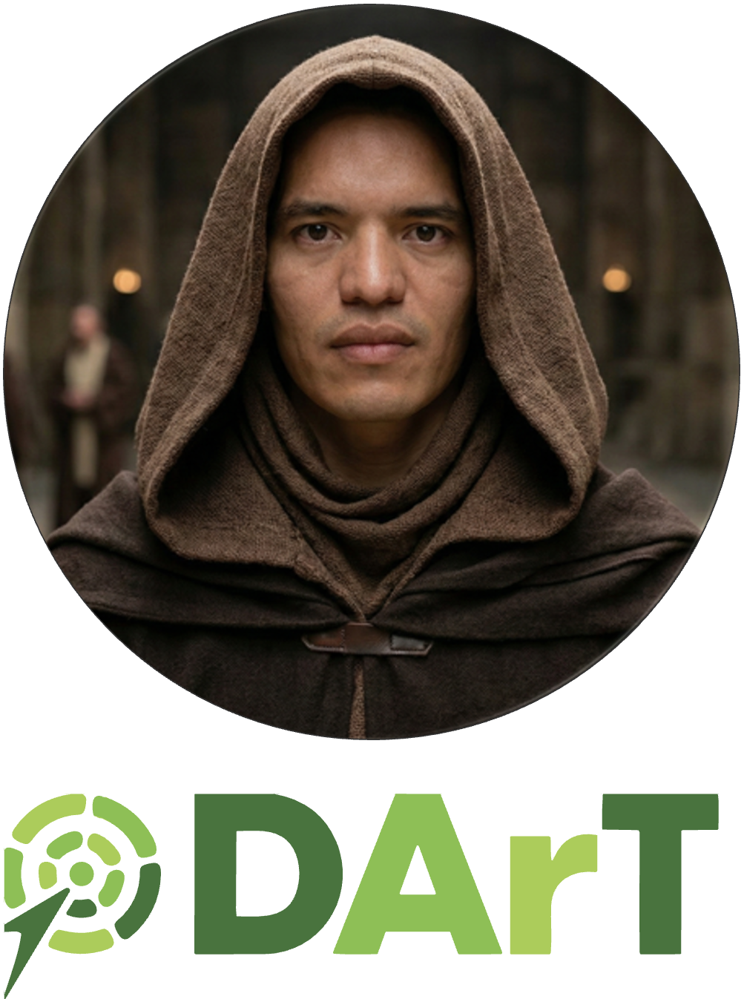
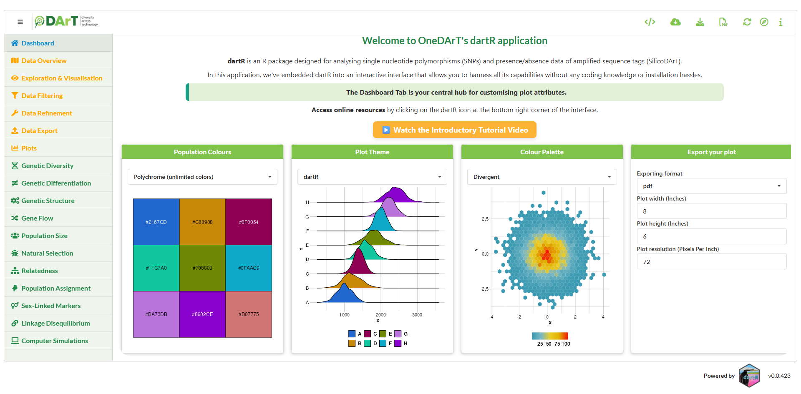

```{r setup, include=FALSE}
library(learnr)
knitr::opts_chunk$set(echo = TRUE, eval = FALSE)
```

{.class width="200" height="200"}

## W17 OneDArT


### Presentation by Dr Luis Mijangos


<iframe width="800" height="533" src="https://www.youtube.com/embed/qzK2EV80leI" title="OneDArT - dartR Overview" frameborder="0" allow="accelerometer; autoplay; clipboard-write; encrypted-media; gyroscope; picture-in-picture; web-share" referrerpolicy="strict-origin-when-cross-origin" allowfullscreen>

</iframe>


{.class width=800}
{.class width=800}


