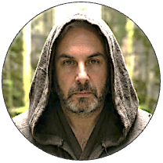
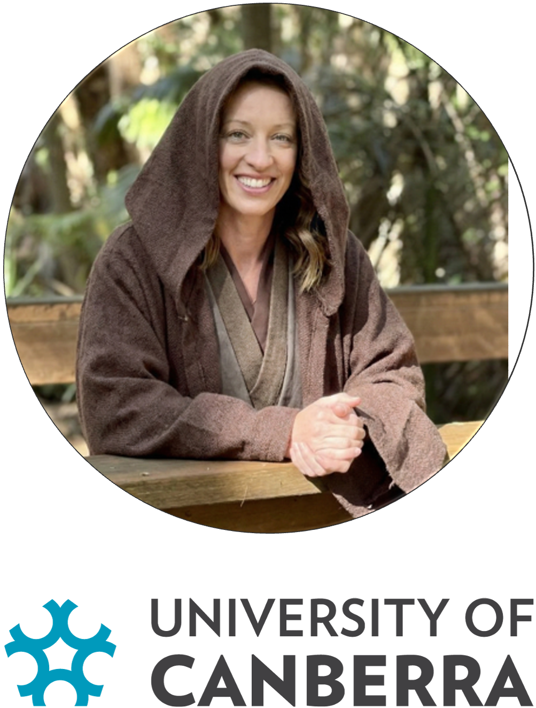
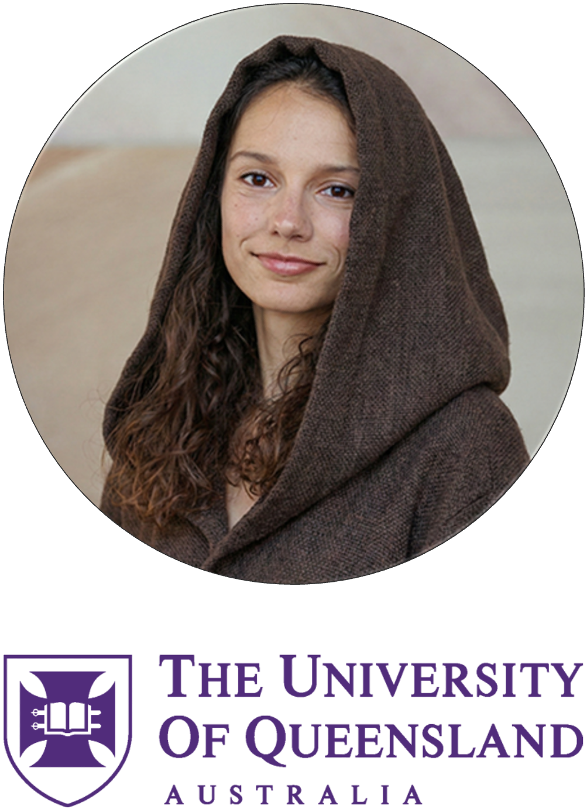
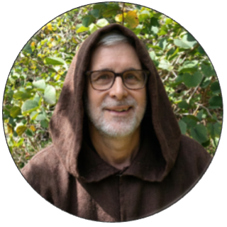
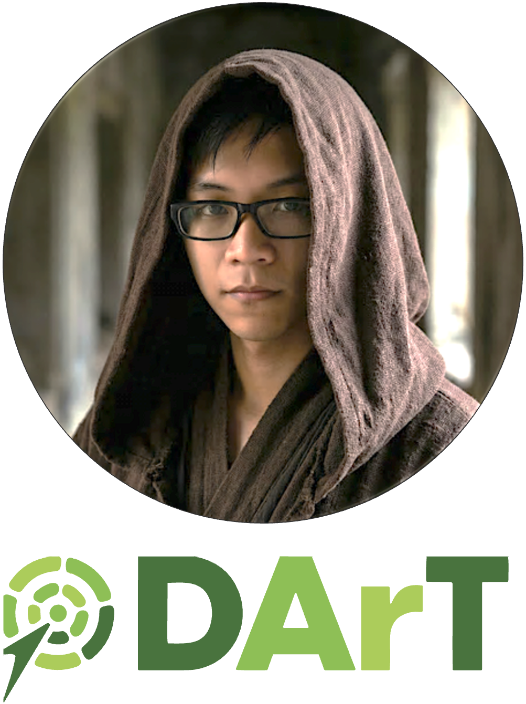

# Presenters {.unnumbered}

## Luciano Beheregaray

{style="float: left" width="200"}

Jedi Master **Luciano Beheregaray** of **Flinders University** channels the Force through conservation genomics and molecular ecology. Armed with next-generation sequencing rather than a lightsaber, he maps hidden population structures, gene flow, and adaptation across marine and freshwater realms to safeguard biodiversity in a changing galaxy. His mission: decode evolutionary resilience, lead interdisciplinary teams, and mentor new Padawans of population genetics. By blending natural history with genomics, Luciano investigates how aquatic life adapts to human impacts, ensuring endangered species do not slip toward the Dark Side of extinction. Trained across the stars—from Brazil (University of Rio Grande) to Sydney (Macquarie University) and Yale (Gaylord Donnelley Environmental Research Fellow)—he moved to Adelaide and established the Molecular Ecology Lab (MELFU) in 2009. A former ARC Future Fellow, his research now shapes government policy, providing a defensive shield for the galaxy’s most vulnerable native species.

## Laura Bertola

{style="float: left" width="200"}

In the galactic quest to defend biodiversity, **Laura Bertola** of **India’s National Centre for Biological Sciences** rises as a Jedi Master of Conservation Genomics. During her PhD at Leiden University, she decoded the Force within lions—sequencing DNA from tissue, hair, and even scat, blending ancient and modern samples like a true archivist of the Jedi Order. As a postdoc at City College of New York, she merged genomic and environmental holocrons to detect local adaptation in Brazil’s Atlantic Forest, later expanding her population genomics missions at Copenhagen University across Africa and Asia. Now at NCBS, she protects large carnivores, while leading the Leo Foundation to turn science into real-world conservation action.

## Chris Brauer

{style="float: left" width="200"}

In the vast Galactic Republic of Conservation Genomics, **Chris Brauer** of **Flinders University** stands as a Jedi Master of population genetics, wielding SNPs like a finely tuned lightsaber. Trained in the ancient arts of evolutionary biology, he charts genetic constellations across fishes and wildlife, revealing structure, gene flow, and adaptive signals hidden deep within the Force of DNA. From mentoring Padawans to co-piloting large-scale genomics missions, he links cutting-edge science to real-world conservation strategy. Calm in statistical hyperspace and precise with every dataset, Chris proves that balance in the Force begins with protecting biodiversity.

## Renee Catullo

{style="float: left" width="200"}

Jedi Knight **Renee Catullo** of **University of Western Australia** wields the Force of conservation and landscape genomics to safeguard Australia’s biodiversity. Armed with SNP arrays instead of a lightsaber, she maps gene flow across fragmented habitats, revealing adaptive potential and hidden population structure in threatened fauna. Rising through the ranks of evolutionary biology, she has led applied genomic programs that translate sequencing data into real-world management strategy. Mentoring a new generation of Padawans in molecular ecology, her mission is clear: strengthen genetic resilience, reconnect populations, and prevent species from slipping to the Dark Side of extinction.

## Floriaan Devloo-Delva

{style="float: left" width="200"}

In the Republic of Conservation Genomics, **Floriaan Devloo-Delva** of **CSIRO** serves as a resourceful Jedi Sentinel, equally fluent in the languages of fieldwork and code. Armed with the twin lightsabers of population genetics and bioinformatics, he navigates vast SNP starfields to uncover structure, gene flow, and evolutionary history in threatened taxa. From assembling robust analytical pipelines to guiding collaborators through the asteroid belts of messy data, he ensures the Force of reproducible science remains strong. Calm, pragmatic, and technically sharp, Jedi Devloo-Delva reminds the Council that true balance lies not only in the Force—but in well-curated datasets and scripts that actually run.

## Celine Frere

{style="float: left" width="200"}

Jedi Master **Celine Frere** of **University of Queensland** channels the Force through marine molecular ecology. With microsatellites and SNPs as her twin lightsabers, she deciphers kinship, social structure, and dispersal in dolphins and other marine fauna, mapping invisible alliances across oceanic star systems. Rising to Professor through pioneering work on population connectivity and behavioural genetics, she leads interdisciplinary crews blending fieldwork and genomics. Her quest: reveal the hidden family trees of the sea and ensure marine species resist the Dark Side of fragmentation and decline.

## Elise Furlan

{style="float: left" width="200"}

Jedi Master **Elise Furlan** of the **University of Canberra**, ARC DECRA Fellow and molecular ecologist, harnesses the Force of genetics to reveal hidden life across Earth’s ecosystems. A pioneer of environmental DNA (eDNA) research in Australia, she helped forge the early methods that allow scientists to detect species from the faintest traces of DNA left in water, soil, and air. Her expertise helped establish the University of Canberra’s trace DNA laboratories, where rigorous methods guide the analysis of even the most elusive molecular signals. Through her research she has developed frameworks for quantifying eDNA detection sensitivity and advanced metabarcoding approaches that reveal entire biological communities from a single sample. Continuously exploring new frontiers, her work now pushes eDNA beyond detection, extracting population genetic insights from environmental samples, ensuring the Force of population genetic evidence guides conservation across Australia.

## Arthur Georges

{style="float: left" width="200"}

Jedi Master **Arthur Georges** of the **University of Canberra** blends Force-like fieldwork with lab-side lore to decode the evolutionary "Force" behind Australia’s reptiles. His primary mission focuses on the genetics of sex determination, revealing how complex thermal nest environments influence sexual outcomes in unexpected ways.\
A veteran of remote worlds and scientific councils alike, Arthur’s foray into SNP-based genomics has reshaped our understanding of phylogeography and species delimitation. As a lead developer of dartR and a joint recipient of the 2025 Eureka Prize for Research Software, his digital holocrons empower the global scientific community.\
A Fellow of the Australian Academy of Science and Behler Turtle Conservation Award winner, he champions species protection with Jedi wisdom and a twinkle in his eye. His work bridges the gap between ancient survival and future climate challenges, ensuring genetics can inform management at the grassroots level to protect our scaled allies. Mission Intel: [georges.biomatix.org](http://georges.biomatix.org)

## Bernd Gruber

{style="float: left" width="200"}

Jedi Master **Bernd Gruber** of the **University of Canberra** steers his starship through the cosmos of spatial ecology and population genetics, crafting force-sensitive models that predict how wildlife populations move and survive across galactic landscapes for conservation management. He’s trained across distant research systems and now leads missions to safeguard endangered species, decode demographic signals, and deploy ecological simulations faster than an X-wing in hyperspace. Whether optimising monitoring tools or revealing boom-and-bust genetic shifts, his work proves that even the trickiest spatial puzzles can be cracked with a bit of Jedi modelling mastery.

## Ethan Halford

{style="float: left" width="200"}

In the bustling shipyards of the dartRverse, Master **Ethan Halford** of **DArT** serves as a vital Chief Engineer for the Genomic Rebellion. Armed with a "High-Throughput Lightsaber," he specialises in the sacred art of R-programming, helping Padawans and Masters alike navigate the hyperspace of complex biological data. As a key guardian at DArT, Ethan deciphers the ancient holocrons of biodiversity, ensuring that the Force of Open-Source software remains strong across the Australian bush. Whether he’s patching a thermal exhaust port in a data pipeline or shielding vulnerable species from the "Dark Side" of extinction, his technical mastery keeps the entire fleet on course.

## Andrzej Kilian

{style="float: left" width="200"}

Jedi Grand Master **Andrzej Kilian**, founder of the **DArT** Order, forged a revolutionary kyber crystal: a high-throughput genotyping method that decodes the midi-chlorians of any species without prior sequence maps. A true champion of the Light Side, he sought to democratize the Force of genomics, bringing vital DNA profiling to the “orphan crops” and forgotten species of the Outer Rim to ensure galaxy-wide food security. Under his wise leadership for over two decades, the DArT Holocron has amassed over 2.5 million genome profiles, empowering farmers and conservationists to bring balance to ecosystems everywhere!

## Ching Ching Lau

{style="float: left" width="200"}

In the hallowed halls of the **Australian National University** Jedi Temple, Master **Ching Ching Lau** serves as a legendary Guardian of the Genomic Archives. A true master of the Molecular Lightsaber, she deciphers the ancient riddles of the wheat pathogen lineage, wielding the profound Force of bioinformatics. She is filtering through the Dark Side, the parasitic blights that threaten to consume entire harvests and shields the galaxy's food supply. From her early Padawan days to her rise as a High-Throughput Hero, she remains the premier protector of the golden wheat fields, ensuring that the hunger of the Empire is forever kept at bay.

## Zoe Mézière

{style="float: left" width="200"}

In the galaxy of conservation genomics, **Zoe Mézière** of the **University of Queensland** rises as a Jedi Knight of the dartRverse Order. Trained in the ways of population genetics, she channels the Force through SNP datasets, guiding endangered species away from the dark side of genetic erosion. From refining analytical workflows in R to mentoring young Padawans at workshops across Australia, she has mastered the lightsaber of reproducible science. Her research bridges field ecology and high-throughput genomics, forging alliances between data and conservation action. Calm, precise, and occasionally amused by messy VCFs, Jedi Mézière proves that balance in the Force—and in allele frequencies—must be maintained.

## Luis Mijangos

{style="float: left" width="200"}

In a galaxy not so far away, Jedi Master **Luis Mijangos** of **DArT** wields a high-throughput sequencer like a lightsaber, slicing through the "Dark Side" of genomic noise. A legendary Guardian of the Population Genetics Temple, he has mastered the art of "WGS filtering," using the Force to identify loci under selection across diverse biomes. From his early Padawan days to his breakthrough career milestones, Luis has decoded the ancient holocrons of biodiversity. When he isn't calibrating the Millennium Falcon’s sensors for genome scans, he’s ensuring his fleet of collaborators thrives in the light of scientific discovery.

## Craig Moritz

{style="float: left" width="200"}

In the halls of the **Australian National University**, Jedi Master **Craig Moritz** wields the Force of phylogeography like a finely tuned lightsaber. Trained across distant star systems (including leadership roles at Berkeley’s Museum of Vertebrate Zoology), he returned to ANU to guide young Padawans through the mysteries of biodiversity, climate change refugia, and conservation genomics. Decoding the midi-chlorians of mitochondrial DNA, he mapped Australia’s evolutionary lineages long before hyperspace travel was cool. A Fellow of the Australian Academy of Science, Moritz has balanced the galaxy of research leadership while reminding us: in conservation, the Force is strong—but only if you sample broadly.

## Kate Rick

{style="float: left" width="200"}

In the conservation galaxy, **Kate Rick** of **Department of Biodiversity, Conservation and Attractions, Western Australia** stands as a wise Jedi Consular of applied genomics, wielding R scripts like finely tuned lightsabers. Trained in the arts of population genetics and biodiversity stewardship, she navigates complex SNP constellations to reveal patterns of connectivity, adaptation, and resilience. A steady presence in collaborative research and training missions, she helps translate genomic intelligence into real-world conservation strategy—because what good is the Force if it doesn’t guide management action? Calm under computational pressure and unafraid of daunting datasets, Jedi Rick keeps both ecosystems and analyses in balance across the Republic of Science.

## Cynthia Riginos

{style="float: left" width="200"}

Jedi Master **Cynthia Riginos** of the **Australian Institute of Marine Science** and the **University of Queensland** channels the Force through marine evolutionary genomics. With population genetics as her lightsaber, she deciphers connectivity, adaptation, and speciation across coral reef galaxies, revealing how marine species persist in warming seas. Rising to Professor through pioneering work on reef biodiversity and climate resilience, she leads interdisciplinary crews of genomic Padawans armed with next-generation sequencing. Her quest: map invisible dispersal routes, forecast evolutionary futures, and keep reef ecosystems from drifting to the Dark Side of collapse.

## Diana Robledo Ruiz

{style="float: left" width="200"}

Jedi Master **Diana Robledo Ruiz** of **Monash University** wields her genomics Force to save endangered species like the Helmeted Honeyeater and Leadbeater’s Possum from the Dark Side of extinction, pioneering genetic rescue strategies and crafting bioinformatic tools to decode wild DNA faster than a speeder bike chase. A decorated conservation genomicist and Eureka Prize finalist, she balances field quests with lightspeed data wizardry, showing the galaxy that even tiny genomes can have epic destinies.

## Robyn Shaw

{style="float: left" width="200"}

Jedi Master **Robyn Shaw**, stationed at the **University of Canberra’s Centre for Conservation Ecology and Genomics**, wields the Force of genetics to protect Australia’s unique fauna. By decoding the “midi-chlorians” of small mammals and arid-zone species, she defends them against the Dark Side of environmental change, invasive species, and climate shifts. Her academic mastery recently culminated in a landmark Nature publication—a true Jedi Council global meta-analysis—proving that swift conservation action is our only hope to halt genetic diversity loss. Through her research, she continues to bring balance to the ecosystem!

## Bill Sherwin

{style="float: left" width="200"}

In the galactic halls of the **University of New South Wales**, Jedi Master **Bill Sherwin** wields the Force of conservation genetics with precision worthy of the High Council. A guardian of biodiversity across Australia, he has decoded the midi-chlorians of koalas, flying foxes, and endangered marsupials—using population genomics to sense disturbances in their genetic fields. Renowned for advancing wildlife forensics and evidence-based conservation policy, he trains young Padawans in the arts of molecular ecology and statistical sorcery. Calm, incisive, and ever strategic, Master Sherwin ensures that balance is restored to ecosystems long before the Empire of extinction strikes.

## Jonathan Ting

{style="float: left" width="200"}

In the Techno-Genomic Outer Rim, **Jonathan Ting** operates as a Jedi Architect in the AI/ML Order at **DArT**. Forged at the University of Queensland in computational chemistry—where he simulated proteins like midichlorians in motion—and later knighted with a PhD in Computer Science from ANU, he mastered applied machine learning for nanomaterials, wielding sampling, labelling, and causal inference like precision lightsabers. Now stationed at the crossroads of software engineering, genomics, and AI, he forges practical tools that power bioinformatics research and breeding programs—proving that in this galaxy, elegant code is the true path to the Force.

## Peter Unmack

{style="float: left" width="200"}

At the **University of Canberra**, Jedi Master **Peter Unmack** commands the currents of evolutionary ichthyology like a true guardian of the Outer Rim. Specialising in freshwater fishes of Australia and beyond, he traces ancient lineages as if reading the Jedi Archives—revealing hidden speciation events and cryptic diversity in desert springs and river systems. Armed with phylogeography and molecular systematics, he maps how tectonics, climate, and time have shaped aquatic life across the continent. A seasoned field explorer and mentor of rising Padawans, Master Unmack ensures that no endangered fish vanishes unnoticed into the dark side of extinction.

## Darya Vanichkina

{style="float: left" width="200"}

Jedi Knight **Darya Vanichkina** of the **University of Sydney** channels the Force through code, algorithms, and high-performance computing. A Master of Bioinformatics and computational genomics, she forges reproducible workflows from raw sequencing reads as if assembling starships from scattered parts. Rising through academia and research leadership, she has championed open science, research software engineering, and rigorous data stewardship across large genomic consortia. With pipelines as precise as a lightsaber strike, she trains Padawans in version control, FAIR data, and scalable analysis—ensuring that complex biological data never drift to the Dark Side of irreproducibility.

## Robin Waples

{style="float: left" width="200"}

In the Pacific Sector of the Conservation Galaxy, **Robin Waples** stands as a retired Jedi Master of NOAA Fisheries and Affiliate Professor at the **University of Washington**. After early quests in marine shorefish taxonomy, he turned his lightsaber toward salmon, leading the charge to define conservation units and recovery strategies under the U.S. Endangered Species Act. A master of effective population size and high-gene-flow enigmas, he reshaped classic population genetics models to fit real-world life histories. Guiding young Padawans through innovation grants and bridging evolution with management, Robin proves the Force is strongest where science meets stewardship.

## Claire Stephens

image needed\
**Claire Stephens** is a Jedi Master of collaboration at the **Australian National University**, serving as Guardian of the Centre for Biodiversity Analysis. She forges powerful alliances across ANU, CSIRO, and the University of Canberra, strengthening the Force of ecological and evolutionary science. With the strategic clarity of a Jedi Council leader, she aligns diverse research talents into a unified mission for biodiversity conservation. Where others see distant star systems of expertise, Claire charts hyperspace routes between them, ensuring knowledge flows, partnerships thrive, and the Republic of conservation science grows ever stronger.
